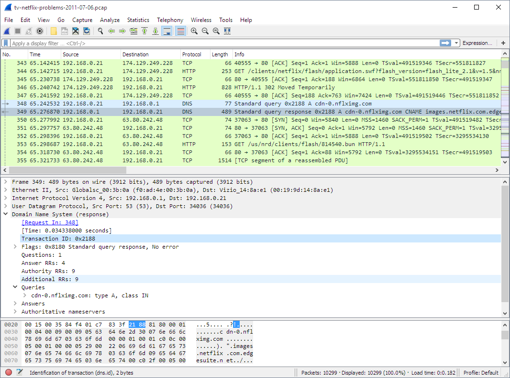
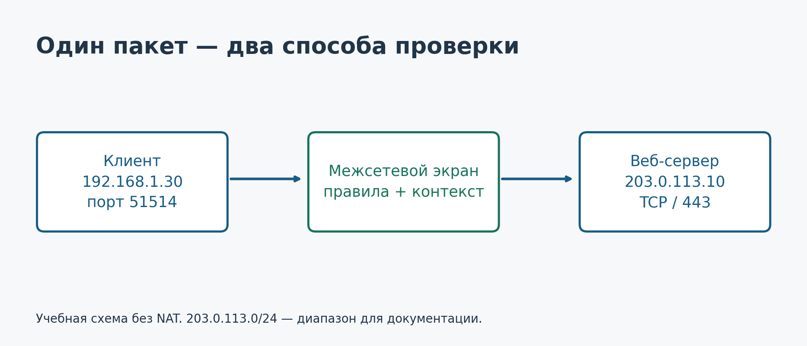
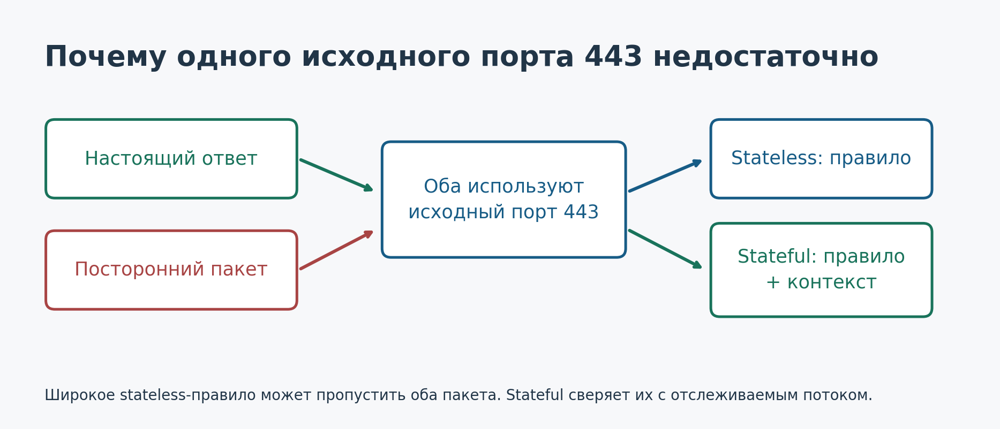
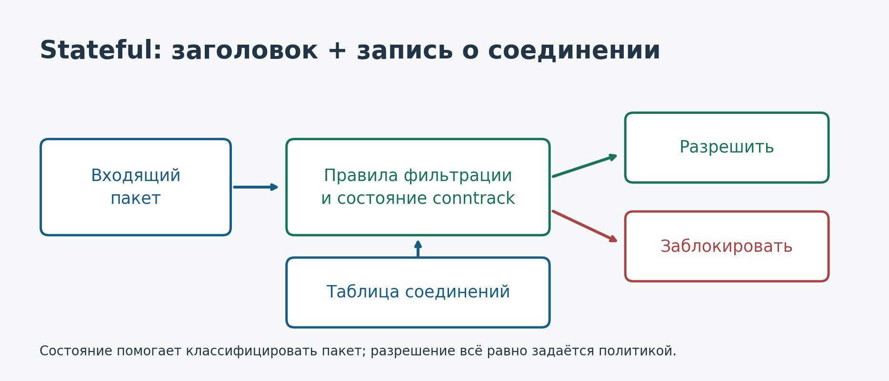
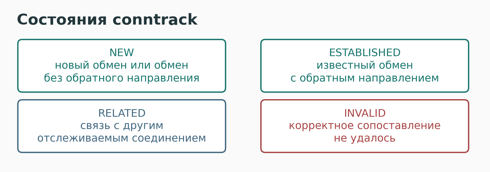
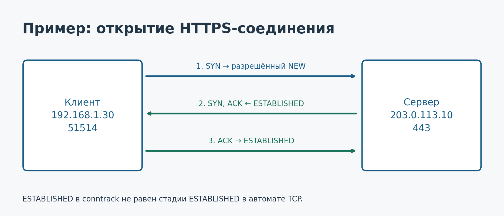
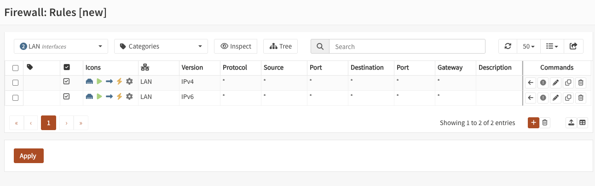
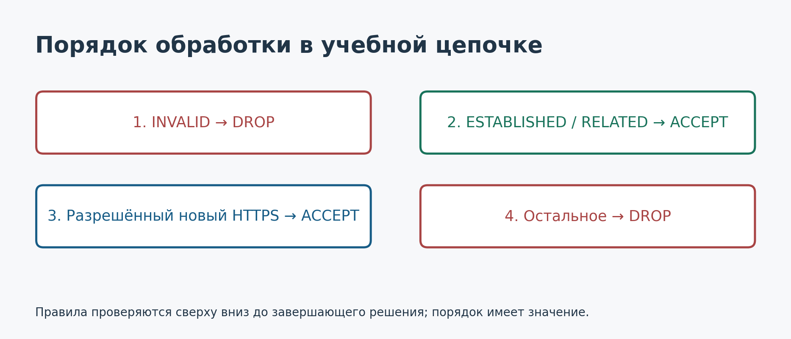
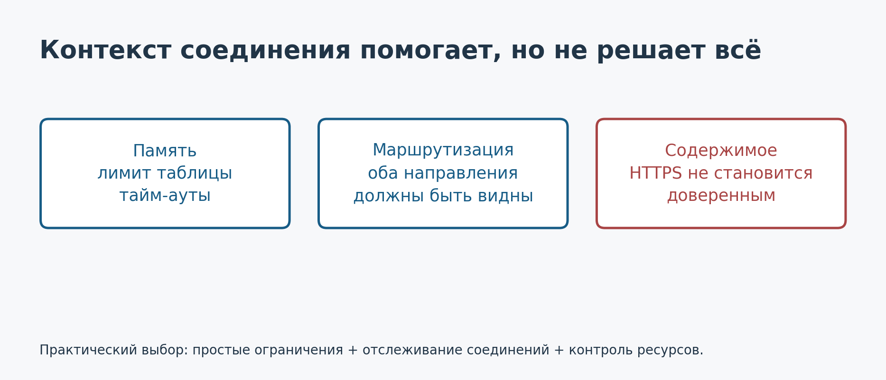

---
author:
  name: Баранов Никита Дмитриевич
title: Простая и контекстная фильтрация пакетов
subtitle: Администрирование сетевых подсистем
license: CC BY
lang: ru-RU
date: '2026-10-06'
date-format: DD.MM.YYYY
format:
  beamer:
    latex-auto-install: false
    pdf-engine: xelatex
    mainfont: DejaVuSerif
    mainfontoptions:
    - Path=../resources/fonts/
    - Extension=.ttf
    - UprightFont=*
    - BoldFont=*-Bold
    - ItalicFont=*-Italic
    - BoldItalicFont=*-BoldItalic
    sansfont: DejaVuSans
    sansfontoptions:
    - Path=../resources/fonts/
    - Extension=.ttf
    - UprightFont=*
    - BoldFont=*-Bold
    - ItalicFont=*-Oblique
    - BoldItalicFont=*-BoldOblique
    monofont: DejaVuSansMono
    monofontoptions:
    - Path=../resources/fonts/
    - Extension=.ttf
    - UprightFont=*
    - BoldFont=*-Bold
    - ItalicFont=*-Oblique
    - BoldItalicFont=*-BoldOblique
    toc: false
    number-sections: false
    colorlinks: false
    slide-level: 2
    aspectratio: 169
    section-titles: false
    theme: metropolis
    themeoptions:
    - progressbar=frametitle
    - sectionpage=progressbar
    - numbering=fraction
    incremental: false
    include-in-header: _resources/tex/slides.tex
  revealjs:
    transition: slide
    margin: 0.06
    smaller: false
    theme: beige
    width: 1280
    height: 720
    slide-number: c/t
    logo: _resources/image/logo_rudn.png
    css: _resources/style.css
---

# Информация

## Докладчик

:::::::::::::: {.columns align=center}
::: {.column width="70%"}

- Баранов Никита Дмитриевич
- Группа НПИбд-02-24
- Российский университет дружбы народов
- [1132242977@pfur.ru](mailto:1132242977@pfur.ru)

:::
::: {.column width="30%"}

{width=90%}

:::
::::::::::::::

::: {.notes}
Тема доклада — простая и контекстная фильтрация пакетов. Я рассмотрю, чем отличаются эти подходы и почему разрешение ответного трафика требует внимания при настройке межсетевого экрана.
:::

# Вводная часть

## Что именно проверяет межсетевой экран?

{height=62%}

Адреса, протоколы, порты и флаги TCP.

::: {.notes}
Это окно Wireshark из официального руководства. В списке пакетов видны адреса отправителя и получателя, протокол и краткое описание. Здесь есть TCP, HTTP и DNS. Для фильтрации важны признаки пакета, а для контекстной фильтрации — ещё и его связь с предыдущим обменом.
:::

## Пример: клиент открывает HTTPS

{width=100%}

Разрешить запрос и его ответы; запретить остальные новые соединения.

::: {.notes}
Клиент 192.168.1.30 обращается к серверу на TCP-порт 443, используя временный порт 51514. Адрес сервера учебный. Экран видит оба направления, трансляции адресов в примере нет. Наша задача — разрешить этот обмен, не открывая произвольный входящий трафик.
:::

# Основная часть

## Stateless: пакет проверяется отдельно

{width=100%}

История соединения не используется.

::: {.notes}
При простой фильтрации правило анализирует текущий пакет: адреса, порты, протокол, интерфейс и при необходимости TCP-флаги. Исходящий запрос и ответ имеют разные направления, поэтому для ответа нужно соответствующее разрешение. Таблица соединений для такого решения не требуется.
:::

## Почему недостаточно исходного порта 443?

{width=100%}

Одинаковые признаки заголовка не подтверждают одинаковое происхождение.

::: {.notes}
Ответ веб-сервера имеет исходный порт 443, но этот же порт может указать посторонний отправитель. Если правило разрешает любые такие пакеты на временные порты клиента, оно может пропустить лишний трафик. Проверка флага ACK сама по себе тоже не доказывает, что пакет отвечает на предыдущий запрос.
:::

## Stateful: учитывается контекст обмена

{width=100%}

В Linux таблицу отслеживаемых потоков поддерживает conntrack.

::: {.notes}
Контекстная фильтрация сопоставляет пакет с известным обменом. В таблице учитываются адреса, порты, протокол и состояние. Пакет настоящего ответа может быть связан с предыдущим запросом. При этом контекст не заменяет правила: конечное решение о разрешении остаётся частью политики администратора.
:::

## Четыре состояния conntrack

{width=100%}

NEW, ESTABLISHED, RELATED и INVALID.

::: {.notes}
NEW означает новый обмен либо обмен, в котором ещё не были замечены пакеты в обоих направлениях. ESTABLISHED относится к известному обмену с наблюдаемым обратным направлением. RELATED — связанный пакет, например ICMP-ошибка для известного потока. INVALID — пакет не удалось корректно сопоставить. Conntrack работает и с UDP, используя признаки потоков и тайм-ауты.
:::

## TCP-рукопожатие и состояние фильтра

{width=100%}

ESTABLISHED в conntrack не равно завершённому рукопожатию TCP.

::: {.notes}
Начальный SYN классифицируется как NEW. Ответ SYN, ACK уже может иметь состояние ESTABLISHED для conntrack, хотя клиент ещё не отправил завершающий ACK. Это важное различие двух систем состояний. Повторный SYN до ответа также может оставаться NEW.
:::

## Как выглядит работа с правилами?

{width=100%}

Протокол → источник → назначение → порты → действие.

::: {.notes}
Это интерфейс правил OPNsense из его документации. В нём хорошо видны основные поля, которые заполняет администратор. Снимок нужен для понимания структуры правил; он не является готовой конфигурацией защиты для нашего Linux-примера. В OPNsense используется другой сетевой стек, но сама задача политики остаётся похожей.
:::

## Порядок правил в учебной политике

{width=100%}

Для пересылаемого трафика в Linux используется цепочка forward.

::: {.notes}
Сначала отбрасываем INVALID, затем разрешаем ESTABLISHED и RELATED, затем разрешаем новый SYN от нашего клиента к серверу на порт 443. Остальное запрещено. Цепочка forward нужна для трафика, проходящего через экран. Полный фрагмент nftables приведён в докладе. Пример относится к отдельному стенду с известной таблицей соединений, а не к произвольной рабочей сети.
:::

# Результаты

## Возможности и ограничения

{width=100%}

Разрешённый обмен не гарантирует безопасное содержимое.

::: {.notes}
Контекст расходует память, поэтому нужно контролировать таблицу и тайм-ауты. Асимметричная маршрутизация мешает экрану видеть обе стороны обмена. Stateful сам по себе не расшифровывает HTTPS и не проверяет смысл запросов приложения. Поэтому он дополняет, а не заменяет остальные меры защиты.
:::

## Источники

- NIST: [Guidelines on Firewalls and Firewall Policy](https://doi.org/10.6028/NIST.SP.800-41r1).
- Netfilter: [nftables](https://www.netfilter.org/projects/nftables/manpage.html) и [conntrack-tools](https://conntrack-tools.netfilter.org/manual.html).
- Linux Kernel: [параметры conntrack](https://www.kernel.org/doc/html/latest/networking/nf_conntrack-sysctl.html).
- Изображения: [Wireshark User’s Guide](https://www.wireshark.org/docs/wsug_html_chunked/ChUseMainWindowSection.html), [OPNsense Documentation](https://docs.opnsense.org/manual/firewall.html).

::: {.notes}
Для подготовки использованы руководство NIST, документация Netfilter и ядра Linux. Скриншоты взяты из руководств Wireshark и OPNsense. Основное сравнение касается признаков пакетов и состояния соединений.
:::

## Главный вывод

**Stateless проверяет пакет.**

**Stateful учитывает, к какому обмену он относится.**

Для точной политики используются ограничения по заголовкам и контекст соединения.

::: {.notes}
Главное различие — наличие контекста. Простая фильтрация проверяет каждый пакет отдельно, а контекстная дополнительно учитывает его связь с известным обменом. На практике эти возможности объединяют, чтобы разрешать нужные запросы и ответы и ограничивать остальные соединения.
:::
