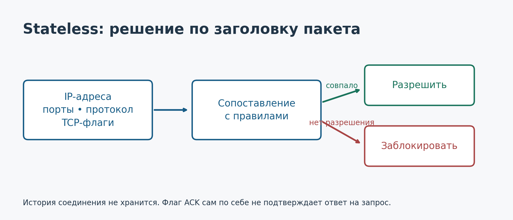

---
author:
  name: Баранов Никита Дмитриевич
title: Простая и контекстная фильтрация пакетов
subtitle: Администрирование сетевых подсистем
license: CC BY
lang: ru-RU
date: '2026-10-06'
date-format: DD.MM.YYYY
number-sections: true
toc: true
toc-title: Содержание
toc-depth: 2
bibliography: bib/cite.bib
csl: _resources/csl/gost-r-7-0-5-2008-numeric.csl
crossref:
  fig-title: Рисунок
  tbl-title: Таблица
format:
  pdf:
    pdf-engine: xelatex
    latex-auto-install: false
    documentclass: scrreprt
    top-level-division: section
    papersize: a4
    fontsize: 14pt
    linestretch: 1.5
    mainfont: DejaVuSerif
    mainfontoptions:
    - Path=../resources/fonts/
    - Extension=.ttf
    - UprightFont=*
    - BoldFont=*-Bold
    - ItalicFont=*-Italic
    - BoldItalicFont=*-BoldItalic
    sansfont: DejaVuSans
    sansfontoptions:
    - Path=../resources/fonts/
    - Extension=.ttf
    - UprightFont=*
    - BoldFont=*-Bold
    - ItalicFont=*-Oblique
    - BoldItalicFont=*-BoldOblique
    monofont: DejaVuSansMono
    monofontoptions:
    - Path=../resources/fonts/
    - Extension=.ttf
    - UprightFont=*
    - BoldFont=*-Bold
    - ItalicFont=*-Oblique
    - BoldItalicFont=*-BoldOblique
    geometry:
    - left=30mm
    - right=15mm
    - top=20mm
    - bottom=20mm
    - includefoot
    - footskip=10mm
    colorlinks: false
    indent: true
    cite-method: citeproc
    include-in-header: _resources/tex/preamble.tex
  docx:
    reference-doc: _resources/reference.docx
    toc: true
    number-sections: true
filters:
- _resources/table-widths.lua
---


# Введение

При настройке межсетевого экрана недостаточно решить, какие порты открыть. Необходимо определить, какие узлы могут начинать обмен и какие ответы следует пропускать. Пакет с исходным портом 443 может быть ответом веб-сервера, но один номер порта ещё не подтверждает эту связь.

Цель доклада — сравнить простую и контекстную фильтрацию пакетов и объяснить их влияние на сетевую политику. Основой сравнения служит один пример HTTPS-соединения. Рассматриваются поля сетевого и транспортного уровней, а не анализ содержимого приложений.

# Пакеты и правила фильтрации

Пакет содержит адреса отправителя и получателя. Для TCP и UDP также используются порты. Межсетевой экран сопоставляет доступные признаки с правилами и принимает решение: пропустить пакет или заблокировать его [@nist].

В Wireshark эти сведения представлены в списке пакетов и дереве протоколов. На рисунке [-@fig-wireshark] видны адреса, протоколы и флаги TCP. Снимок из руководства Wireshark иллюстрирует обычный сетевой обмен: HTTP, TCP и DNS [@wireshark].

{#fig-wireshark width=85%}

Для сравнения используем клиента `192.168.1.30` и сервер `203.0.113.10`. Клиент обращается к TCP-порту 443 с временного порта 51514. Адрес сервера выбран из диапазона для документации; NAT в примере отсутствует. Межсетевой экран видит оба направления обмена.

# Простая фильтрация — stateless

Stateless-фильтр проверяет каждый пакет отдельно. Правило может учитывать IP-адреса, порты, протокол, интерфейс и TCP-флаги. История данного соединения для принятия решения не используется [@nist].

Исходящий запрос имеет порт назначения 443, а у ответа сервера этот порт становится исходным. Для обратного направления необходимо отдельное правило. Если разрешить любые пакеты с исходным портом 443, разрешение может захватить и посторонний трафик.

{#fig-stateless width=100%}

Проверка ACK не превращает фильтр в контекстный: этот флаг присутствует в самом пакете, а не подтверждает наличие записи о предыдущем запросе. Преимущества stateless-подхода — понятные условия и отсутствие необходимости хранить таблицу соединений для самого решения. Он удобен для базовых ограничений по адресам и протоколам.

# Контекстная фильтрация — stateful

Stateful-фильтр дополнительно учитывает состояние обмена. В Linux эту информацию поддерживает подсистема conntrack. Она сопоставляет пакеты с потоками по адресам, портам и протоколу и хранит сведения об их состоянии [@nft; @conntrack].

Первый разрешённый запрос начинает отслеживаемый обмен. Ответ в обратном направлении может быть распознан как часть того же потока. Однако окончательное разрешение по-прежнему задаётся правилами: одна запись в таблице не означает, что любой совпавший пакет должен пройти.

## Состояния conntrack

Для политики фильтрации особенно важны четыре состояния [@nft]:

- **NEW** — новый обмен либо обмен, в котором ещё не наблюдались пакеты в обоих направлениях.
- **ESTABLISHED** — пакет относится к известному обмену, для которого наблюдалось обратное направление.
- **RELATED** — пакет связан с другим отслеживаемым соединением; пример — ICMP-сообщение об ошибке для известного потока.
- **INVALID** — не удалось корректно отнести пакет к отслеживаемому соединению.

Эти состояния не совпадают с полным автоматом TCP. В частности, ответ SYN, ACK уже может быть `ESTABLISHED` для conntrack, хотя TCP-рукопожатие ещё не завершено. Повторный SYN до ответа может оставаться `NEW`.

{#fig-https width=100%}

Отслеживание применяется и к UDP. Хотя у UDP нет TCP-рукопожатия, conntrack связывает пакеты по признакам потока и использует тайм-ауты [@kernel].

## Сравнение подходов

| Признак | Stateless | Stateful |
|:--|:--|:--|
| Основа решения | Текущий пакет | Пакет и контекст обмена |
| Ответы | Отдельные условия | Разрешение по состоянию |
| Таблица соединений | Не нужна для решения | Требуется |
| Типичная роль | Базовые ограничения | Контроль двустороннего обмена |

: Простая и контекстная фильтрация {#tbl-comparison}

Контекстная фильтрация точнее широкого разрешения ответов только по номеру порта. При этом она не является абсолютной защитой от любой подделки пакетов: важны протокольные проверки, параметры conntrack и сама политика.

# Практическая политика администратора

Для учебной сети зададим следующие условия: клиенту разрешено начинать TCP-соединение с указанным сервером на порт 443, ответы пропускаются, остальные пересылаемые пакеты запрещены. Такая политика может быть выражена средствами nftables [@nft].

```{.text}
table inet asp_demo {
  chain forward {
    type filter hook forward priority filter;
    policy drop;

    ct state invalid counter drop
    ct state established,related counter accept

    iifname "lan0" oifname "wan0" \
      ip saddr 192.168.1.30 \
      ip daddr 203.0.113.10 \
      tcp dport 443 ct state new \
      tcp flags & (fin | syn | rst | ack) == syn \
      counter accept
  }
}
```

Используется `forward`, поскольку трафик пересылается через экран к другому узлу. Цепочка `input` относится к пакетам, адресованным самому экрану. Правила проверяются последовательно: сначала `INVALID`, затем разрешённые состояния и новый HTTPS-запрос. В конце действует политика `drop`.

Пример рассчитан на отдельный стенд без других цепочек и с исходно известной таблицей conntrack. В рабочей сети разрешение `ESTABLISHED,RELATED` при необходимости сужают по интерфейсам и адресам. Изменение правила для новых соединений само по себе не прекращает уже отслеживаемые разрешённые сеансы.

В графическом интерфейсе те же признаки видны в столбцах протокола, источника, назначения и портов. Рисунок [-@fig-rules] показывает интерфейс OPNsense, а не конфигурацию приведённого Linux-примера [@opnsense].

{#fig-rules width=100%}

При проверке политики нужно отдельно оценить новый разрешённый запрос, ответ на него и запрещённый запрос. В Linux таблицу можно просматривать через `conntrack -L`, а счётчики nftables позволяют увидеть срабатывания правил.

# Ограничения и выводы

Таблица conntrack расходует память и имеет конечный размер. Для контроля используются число записей, лимит таблицы и тайм-ауты. При асимметричной маршрутизации экран может не видеть обе стороны обмена, что усложняет определение состояния [@kernel].

Разрешённое соединение также не гарантирует безопасность его содержимого. Контекстная фильтрация сама по себе не расшифровывает HTTPS и не заменяет защиту приложения.

Таким образом, stateless-фильтрация проверяет признаки текущего пакета, а stateful добавляет сведения об обмене. В практике администрирования они дополняют друг друга: адреса, порты и интерфейсы ограничивают область доступа, а состояние соединения помогает корректно пропускать ответы.

# Список литературы {.unnumbered}

::: {#refs}
:::
