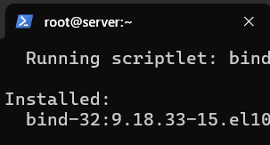
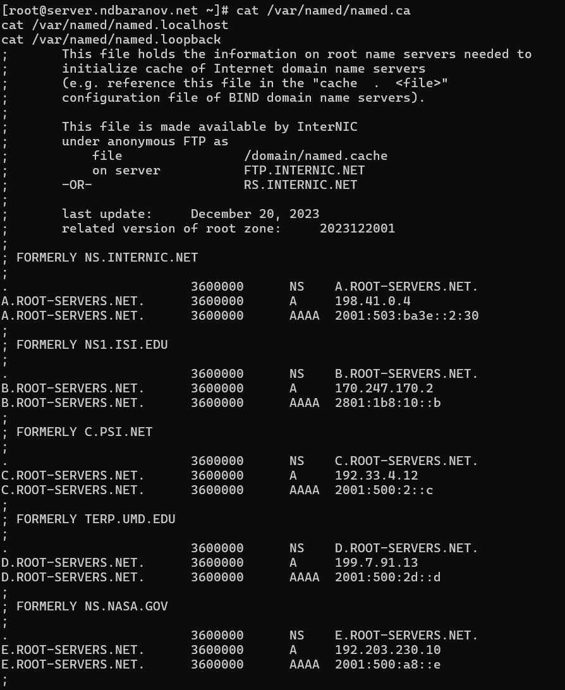
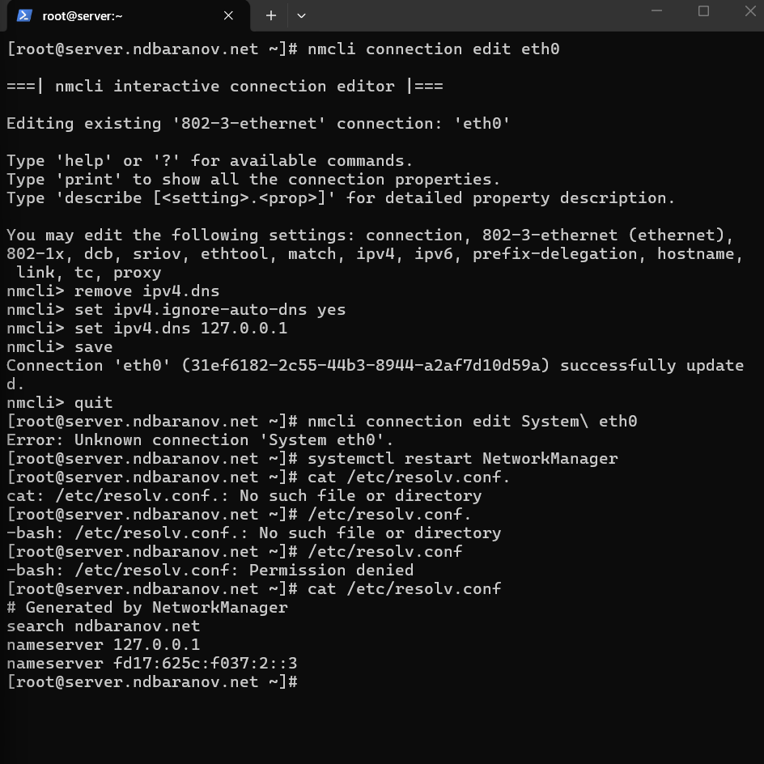
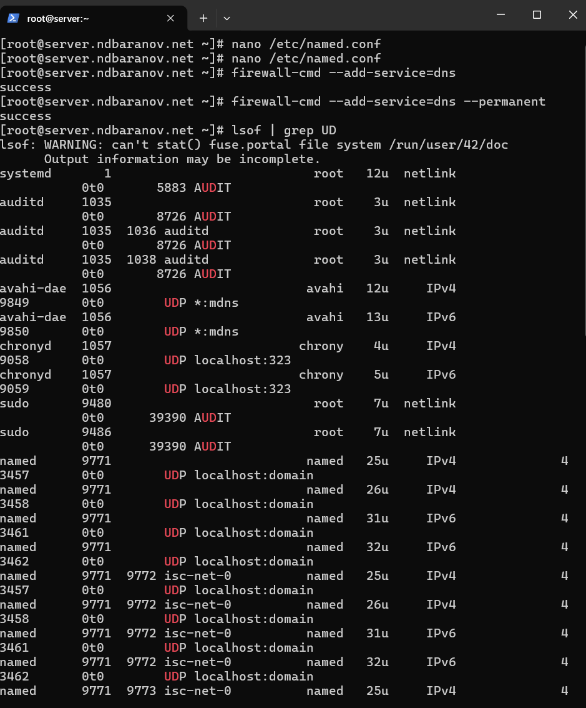
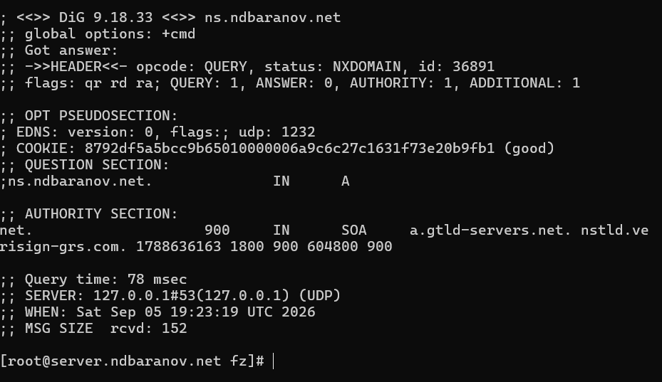
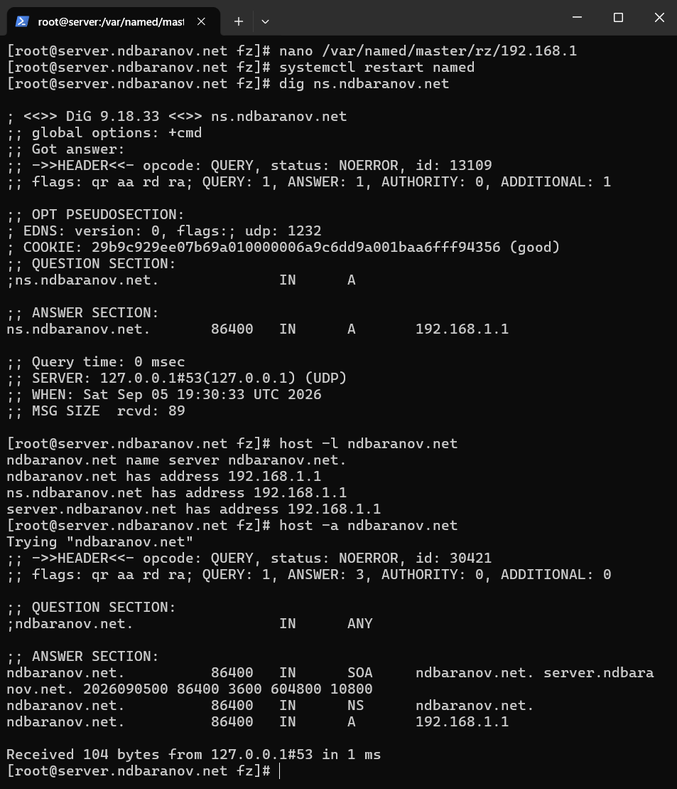

---
author:
  name: Баранов Никита Дмитриевич
  email: 1132242977@rudn.ru
  affiliation:
    - name: Российский университет дружбы народов им. Патриса Лумумбы
      city: Москва
      country: Российская Федерация
title: "Лабораторная работа № 2"
subtitle: "Настройка DNS-сервера"
license: CC BY
date: today
date-format: "YYYY-MM-DD"
---

# Информация

## Докладчик

:::::::::::::: {.columns align=center}
::: {.column width="70%"}

- Баранов Никита Дмитриевич
- Студент РУДН
- [1132242977@rudn.ru](mailto:1132242977@rudn.ru)

:::
::: {.column width="30%"}

:::
::::::::::::::

# Цель и задачи

## Цель работы

- Приобрести навыки установки и конфигурирования DNS-сервера и закрепить принципы работы системы доменных имён.

## Основные этапы

- Установлены BIND и DNS-утилиты.
- Настроены /etc/resolv.conf и /etc/named.conf: прослушивание нужных интерфейсов, рекурсия и доступ к запросам.
- Созданы прямая зона ndbaranov.net и обратная зона 192.168.1.0/24 с SOA, NS, A и PTR-записями.
- Права и SELinux-контексты зон приведены в корректное состояние.
- Служба named включена, для firewalld открыт DNS-сервис.
- Запросы dig и host подтвердили разрешение имён и обратный поиск.

# Ход работы

## Установка BIND

- На сервере установлены пакеты bind и bind-utils.

{width=88%}

## Исходная проверка разрешения имён

- До переключения на локальный DNS выполнен запрос dig к www.yandex.ru.

{width=88%}

## Просмотр исходной конфигурации

- Проверены /etc/resolv.conf и стандартный /etc/named.conf.

{width=88%}

## Корневые подсказки и стандартные зоны

- Просмотрены named.ca, named.localhost и named.loopback.

{width=88%}

## Продолжение проверки файлов BIND

- Вывод показывает оставшуюся часть корневых подсказок и стандартных записей localhost/loopback.

{width=88%}

## Первый запуск локального DNS

- Служба named включена и запущена.

{width=88%}

## Переключение системы на 127.0.0.1

- Через nmcli для eth0 отключено автоматическое получение DNS и задан адрес 127.0.0.1.

{width=88%}

## Разрешение сетевых запросов в named.conf

- В named.conf изменены listen-on и allow-query: серверу разрешено слушать нужные интерфейсы и принимать запросы не только с localhost.

{width=88%}

## Открытие DNS и проверка сокетов

- В firewalld разрешён сервис dns, после чего lsof показывает сокеты процесса named на порту domain.

{width=88%}

## Исправление синтаксиса и запуск named

- named-checkconf обнаружил пропущенную точку с запятой; после исправления конфигурация принята.

{width=88%}

## Подготовка файлов мастер-зон

- Созданы каталоги и заготовки прямой и обратной зон, назначен владелец named, восстановлены SELinux-контексты и включён named_write_master_zones.

{width=88%}

## Промежуточный результат NXDOMAIN

- Повторный вывод dig фиксирует NXDOMAIN от локального сервера.

{width=88%}

## Проверка заполненной прямой зоны

- После редактирования зоны и перезапуска named запрос dig к ns.ndbaranov.net возвращает 192.168.1.1.

{width=88%}

# Результаты

## Итоги работы

- Локальный BIND установлен, открыт для внутренней сети и переведён на обслуживание зоны ndbaranov.net. Итоговые dig и host подтверждают загрузку SOA, NS и A-записей.

## Спасибо за внимание
