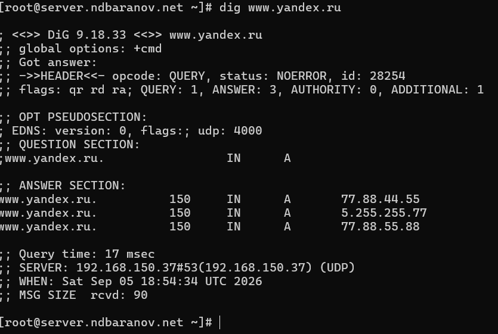
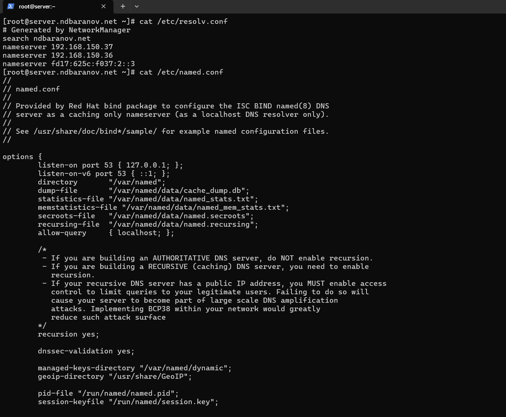
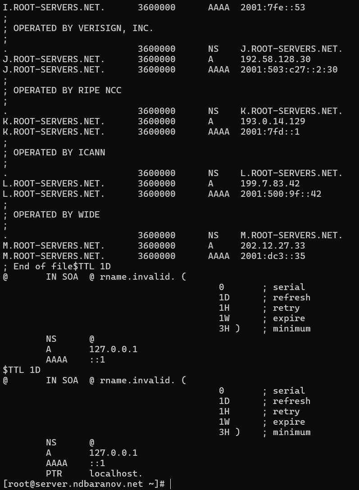
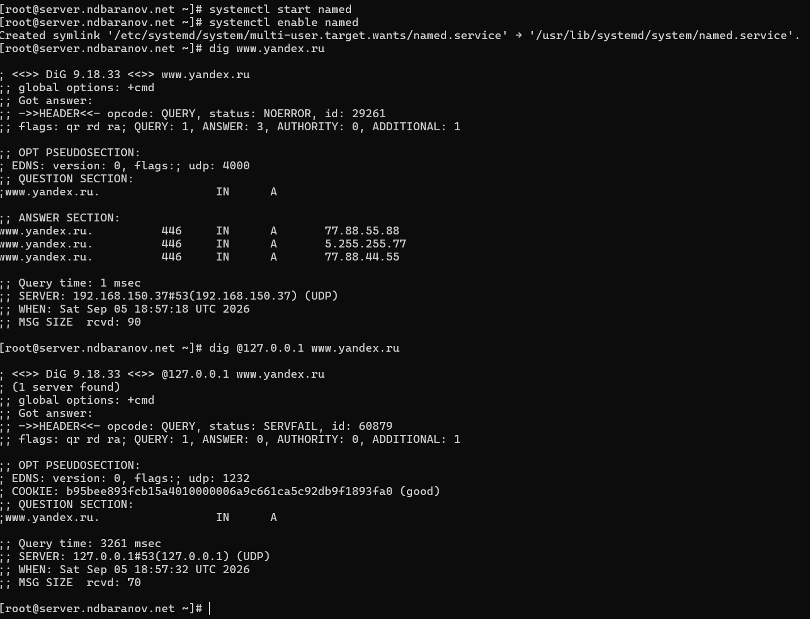
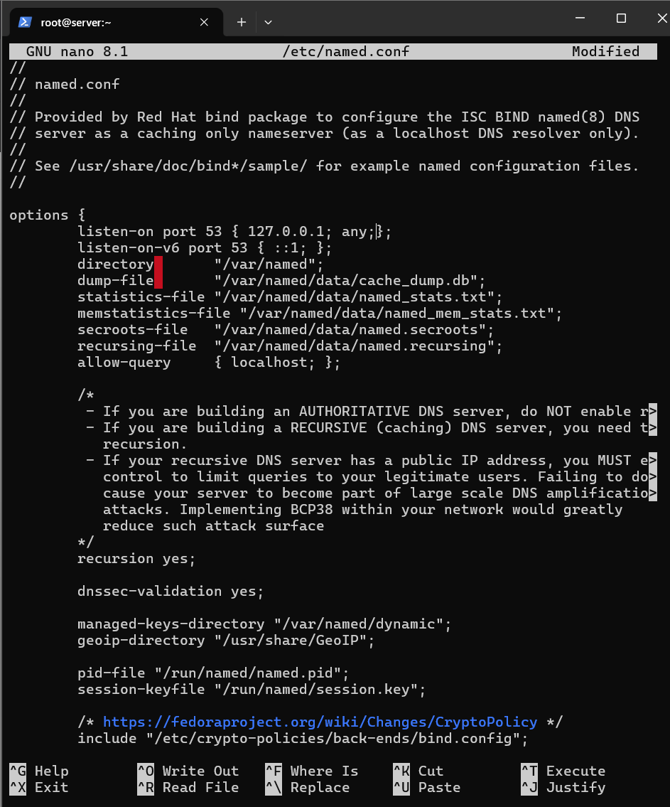
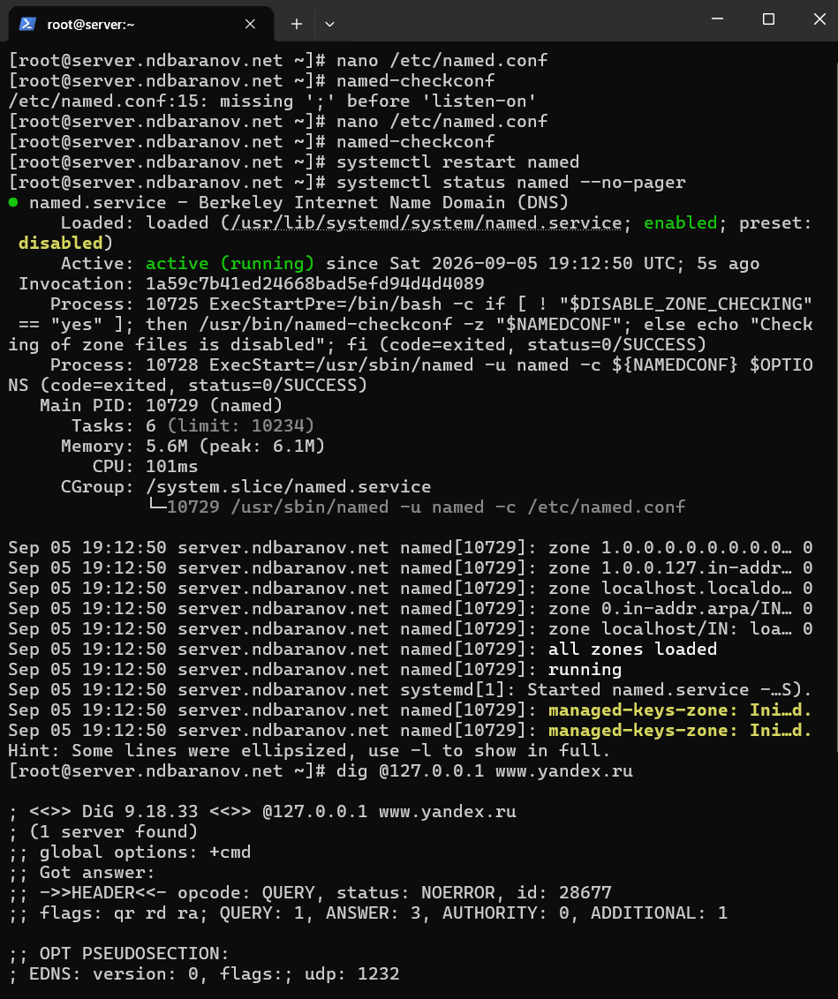
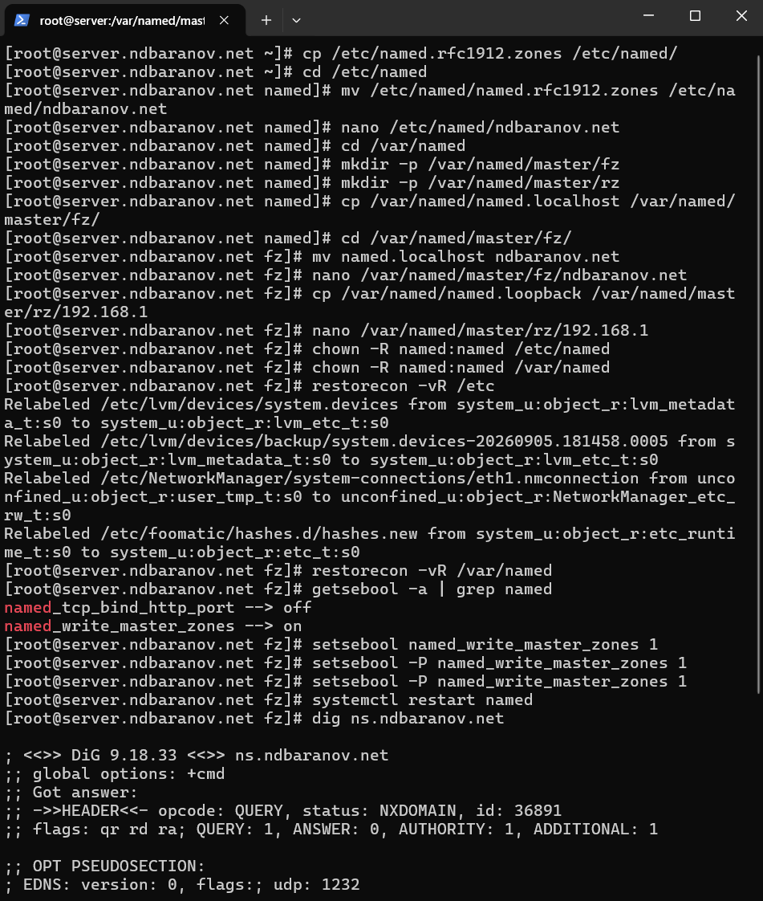

---
author:
  name: Баранов Никита Дмитриевич
  email: 1132242977@rudn.ru
  affiliation:
    - name: Российский университет дружбы народов им. Патриса Лумумбы
      city: Москва
      country: Российская Федерация
title: "Отчёт по лабораторной работе № 2"
subtitle: "Настройка DNS-сервера"
license: CC BY
date: today
date-format: "YYYY-MM-DD"
---

# Цель работы

Приобрести навыки установки и конфигурирования DNS-сервера и закрепить принципы работы системы доменных имён.

# Задание

1. Установлены BIND и DNS-утилиты.
2. Настроены /etc/resolv.conf и /etc/named.conf: прослушивание нужных интерфейсов, рекурсия и доступ к запросам.
3. Созданы прямая зона ndbaranov.net и обратная зона 192.168.1.0/24 с SOA, NS, A и PTR-записями.
4. Права и SELinux-контексты зон приведены в корректное состояние.
5. Служба named включена, для firewalld открыт DNS-сервис.
6. Запросы dig и host подтвердили разрешение имён и обратный поиск.

# Теоретические сведения

DNS связывает имена узлов с IP-адресами. BIND хранит данные в прямой и обратной зонах, а корректность описаний проверяют named-checkconf, named-checkzone и dig.

# Выполнение работы

## Установка BIND

На сервере установлены пакеты bind и bind-utils. В выводе пакетного менеджера видны установленные зависимости, необходимые для службы named и диагностических команд.

{#fig-02-001 width=95%}

## Исходная проверка разрешения имён

До переключения на локальный DNS выполнен запрос dig к www.yandex.ru. Ответ приходит от внешнего резолвера 192.168.150.37 и служит контрольной точкой: сеть работает, но собственный named ещё не используется.

{#fig-02-002 width=95%}

## Просмотр исходной конфигурации

Проверены /etc/resolv.conf и стандартный /etc/named.conf. В начальном состоянии BIND рассчитан преимущественно на локальные запросы и ещё не содержит зоны ndbaranov.net.

{#fig-02-003 width=95%}

## Корневые подсказки и стандартные зоны

Просмотрены named.ca, named.localhost и named.loopback. Первый файл содержит адреса корневых DNS-серверов, а остальные описывают служебные локальные зоны.

{#fig-02-004 width=95%}

## Продолжение проверки файлов BIND

Вывод показывает оставшуюся часть корневых подсказок и стандартных записей localhost/loopback. Эти файлы поставляются пакетом и используются как основа штатной конфигурации.

{#fig-02-005 width=95%}

## Первый запуск локального DNS

Служба named включена и запущена. Обычный dig ещё использует внешний сервер, а запрос к 127.0.0.1 завершается SERVFAIL: локальный демон доступен, но его рабочая конфигурация пока не закончена.

{#fig-02-006 width=95%}

## Переключение системы на 127.0.0.1

Через nmcli для eth0 отключено автоматическое получение DNS и задан адрес 127.0.0.1. Обновлённый /etc/resolv.conf подтверждает, что дальнейшие запросы системы будут направляться локальному named.

{#fig-02-007 width=95%}

## Разрешение сетевых запросов в named.conf

В named.conf изменены listen-on и allow-query: серверу разрешено слушать нужные интерфейсы и принимать запросы не только с localhost. Это подготавливает BIND к обслуживанию внутренней сети.

{#fig-02-008 width=95%}

## Открытие DNS и проверка сокетов

В firewalld разрешён сервис dns, после чего lsof показывает сокеты процесса named на порту domain. Проверка подтверждает одновременно сетевое правило и фактическое прослушивание порта 53.

{#fig-02-009 width=95%}

## Исправление синтаксиса и запуск named

named-checkconf обнаружил пропущенную точку с запятой; после исправления конфигурация принята. Перезапуск завершился состоянием active (running), затем начата проверка запросом dig.

{#fig-02-010 width=95%}

## Подготовка файлов мастер-зон

Созданы каталоги и заготовки прямой и обратной зон, назначен владелец named, восстановлены SELinux-контексты и включён named_write_master_zones. Первый запрос ещё возвращает NXDOMAIN, поскольку записи зоны требуют заполнения.

{#fig-02-011 width=95%}

## Промежуточный результат NXDOMAIN

Повторный вывод dig фиксирует NXDOMAIN от локального сервера. Это не сетевой сбой: named отвечает авторитетно, но запрошенная запись ещё отсутствует в данных зоны.

{#fig-02-012 width=95%}

## Проверка заполненной прямой зоны

После редактирования зоны и перезапуска named запрос dig к ns.ndbaranov.net возвращает 192.168.1.1. Команды host -l и host -a показывают SOA, NS и A-записи, подтверждая корректную загрузку зоны.

{#fig-02-013 width=95%}

# Выводы

Локальный BIND установлен, открыт для внутренней сети и переведён на обслуживание зоны ndbaranov.net. Итоговые dig и host подтверждают загрузку SOA, NS и A-записей.
