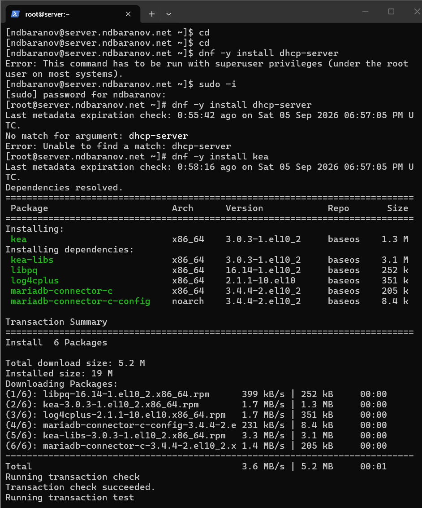
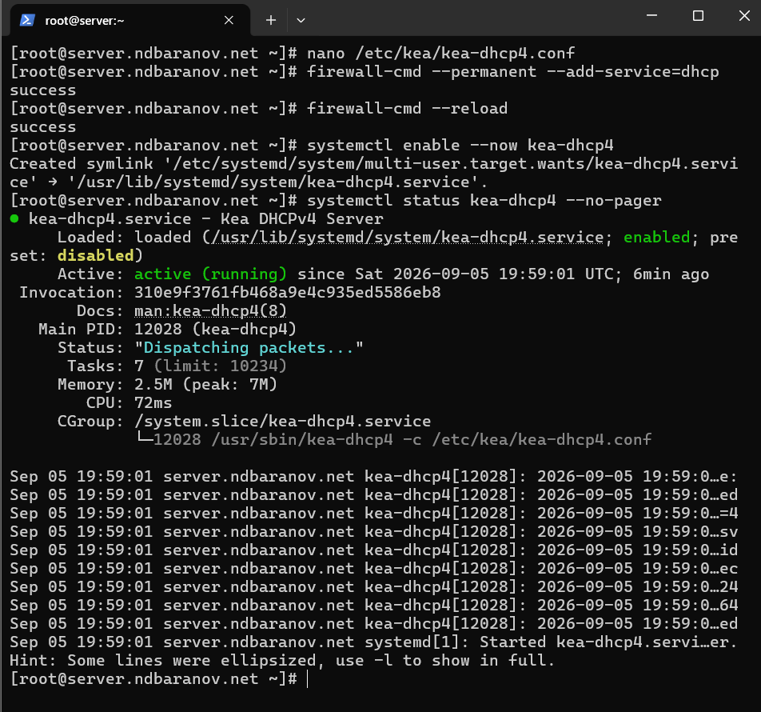
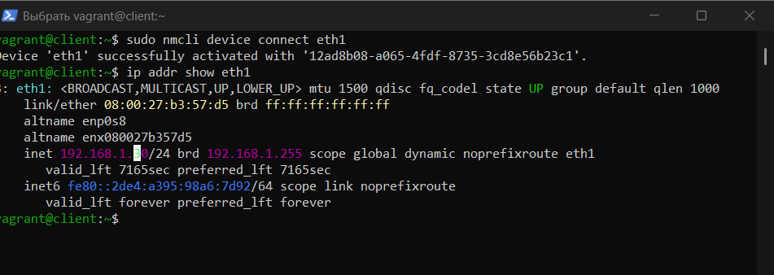

---
author:
  name: Баранов Никита Дмитриевич
  email: 1132242977@rudn.ru
  affiliation:
    - name: Российский университет дружбы народов им. Патриса Лумумбы
      city: Москва
      country: Российская Федерация
title: "Лабораторная работа № 3"
subtitle: "Настройка DHCP-сервера"
license: CC BY
date: today
date-format: "YYYY-MM-DD"
---

# Информация

## Докладчик

:::::::::::::: {.columns align=center}
::: {.column width="70%"}

- Баранов Никита Дмитриевич
- Студент РУДН
- [1132242977@rudn.ru](mailto:1132242977@rudn.ru)

:::
::: {.column width="30%"}

:::
::::::::::::::

# Цель и задачи

## Цель работы

- Приобрести навыки установки и конфигурирования DHCP-сервера.

## Основные этапы

- Установлен Kea DHCP и создан пул адресов для внутренней сети.
- В kea-dhcp4.conf заданы подсеть 192.168.1.0/24, диапазон клиентов, DNS-сервер и домен.
- Открыт сервис DHCP, запущена и включена служба kea-dhcp4.
- На клиенте активирован интерфейс eth1; получен адрес 192.168.1.30/24.
- Настроен Kea DHCP-DDNS и разрешено динамическое обновление зоны BIND.
- Запрос dig к client.ndbaranov.net вернул адрес клиента.
- Команда vagrant validate подтвердила корректность автоматизации.

# Ход работы

## Установка Kea DHCP

- На сервер установлен Kea DHCP4.

{width=88%}

## Описание подсети и пула

- В kea-dhcp4.conf задана сеть 192.168.1.0/24, диапазон динамических адресов и параметры DNS.

{width=88%}

## Запуск DHCP4

- Служба kea-dhcp4 включена и запущена, в firewalld разрешён DHCP.

{width=88%}

## Получение адреса клиентом

- После активации интерфейса client получает динамический адрес 192.168.1.30/24.

{width=88%}

## Параметры DHCP-аренды

- На клиенте просмотрены адрес, маршрут и DNS-параметры, полученные автоматически.

{width=88%}

## Настройка DHCP-DDNS

- Включено взаимодействие Kea DHCP-DDNS с BIND.

{width=88%}

## Динамическая запись клиента

- Запрос dig к client.ndbaranov.net возвращает адрес выданной аренды.

{width=88%}

## Проверка обратного обновления

- Проверена PTR-запись динамического адреса клиента.

{width=88%}

## Диагностика Vagrantfile

- Попытка выполнить provision завершилась сообщением о синтаксической ошибке Vagrantfile.

{width=88%}

# Результаты

## Итоги работы

- Сервер Kea выдаёт клиенту адрес и параметры внутренней сети. DHCP-DDNS автоматически создаёт DNS-запись client.ndbaranov.net, что подтверждено сетевыми проверками.

## Спасибо за внимание
