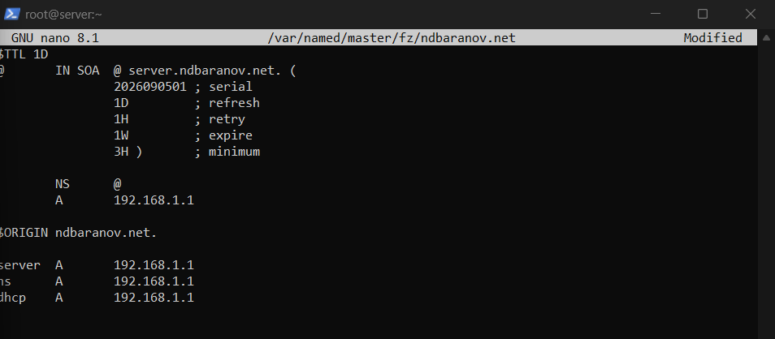
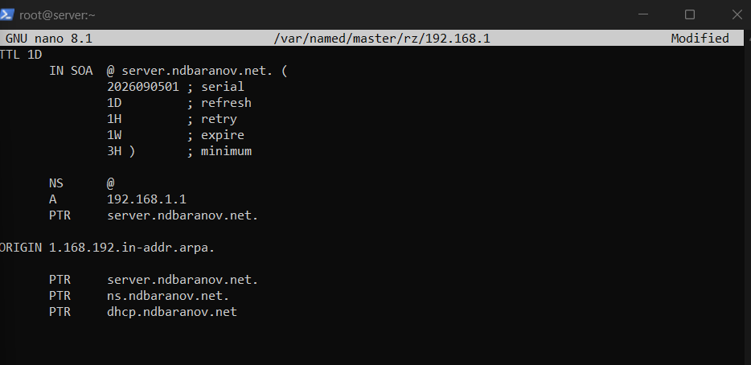
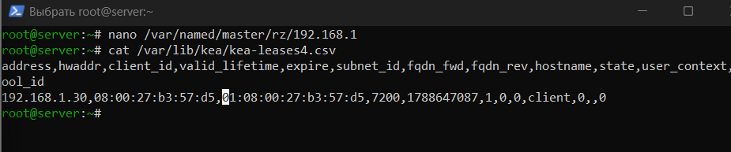
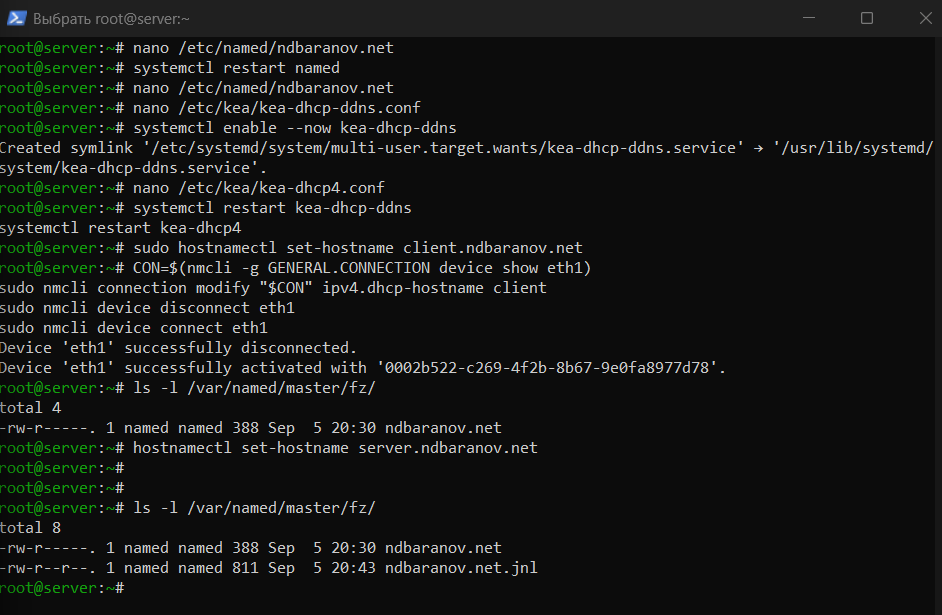
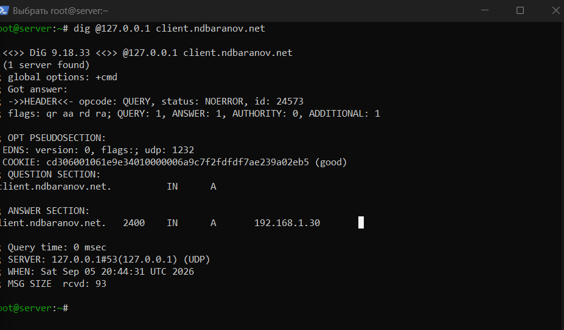
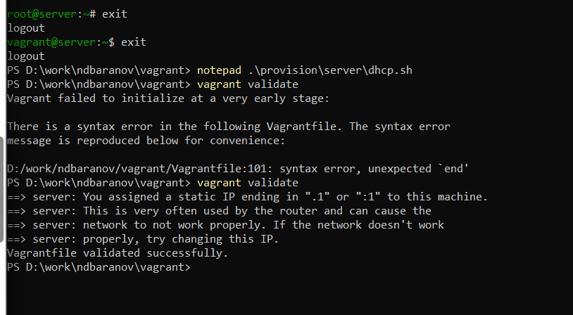

---
author:
  name: Баранов Никита Дмитриевич
  email: 1132242977@rudn.ru
  affiliation:
    - name: Российский университет дружбы народов им. Патриса Лумумбы
      city: Москва
      country: Российская Федерация
title: "Отчёт по лабораторной работе № 3"
subtitle: "Настройка DHCP-сервера"
license: CC BY
date: today
date-format: "YYYY-MM-DD"
---

# Цель работы

Приобрести навыки установки и конфигурирования DHCP-сервера.

# Задание

1. Установлен Kea DHCP и создан пул адресов для внутренней сети.
2. В kea-dhcp4.conf заданы подсеть 192.168.1.0/24, диапазон клиентов, DNS-сервер и домен.
3. Открыт сервис DHCP, запущена и включена служба kea-dhcp4.
4. На клиенте активирован интерфейс eth1; получен адрес 192.168.1.30/24.
5. Настроен Kea DHCP-DDNS и разрешено динамическое обновление зоны BIND.
6. Запрос dig к client.ndbaranov.net вернул адрес клиента.
7. Команда vagrant validate подтвердила корректность автоматизации.

# Теоретические сведения

DHCP автоматически выдаёт клиентам IP-адрес, маску, шлюз, DNS-сервер и имя домена. В Rocky Linux 10 применён Kea DHCP; динамическое DNS-обновление связывает выданную аренду с именем узла.

# Выполнение работы

## Установка Kea DHCP

На сервер установлен Kea DHCP4. Одновременно проверены интерфейсы и адреса, чтобы выбрать внутренний интерфейс для выдачи аренд.

{#fig-03-001 width=95%}

## Описание подсети и пула

В kea-dhcp4.conf задана сеть 192.168.1.0/24, диапазон динамических адресов и параметры DNS. JSON-конфигурация определяет, какие данные получит клиент вместе с адресом.

{#fig-03-002 width=95%}

## Запуск DHCP4

Служба kea-dhcp4 включена и запущена, в firewalld разрешён DHCP. В статусе службы отсутствуют ошибки разбора конфигурации.

{#fig-03-003 width=95%}

## Получение адреса клиентом

После активации интерфейса client получает динамический адрес 192.168.1.30/24. Вывод ip addr подтверждает применение аренды к нужному интерфейсу.

{#fig-03-004 width=95%}

## Параметры DHCP-аренды

На клиенте просмотрены адрес, маршрут и DNS-параметры, полученные автоматически. Это подтверждает передачу не только IP-адреса, но и дополнительных опций DHCP.

{#fig-03-005 width=95%}

## Настройка DHCP-DDNS

Включено взаимодействие Kea DHCP-DDNS с BIND. При выдаче аренды служба формирует обновление DNS, чтобы имя клиента появлялось в зоне автоматически.

{#fig-03-006 width=95%}

## Динамическая запись клиента

Запрос dig к client.ndbaranov.net возвращает адрес выданной аренды. Значит, DHCP и DNS согласованно обновили прямую зону.

{#fig-03-007 width=95%}

## Проверка обратного обновления

Проверена PTR-запись динамического адреса клиента. Обратное разрешение показывает, что DDNS обновляет обе стороны соответствия имени и адреса.

{#fig-03-008 width=95%}

## Диагностика Vagrantfile

Попытка выполнить provision завершилась сообщением о синтаксической ошибке Vagrantfile. Скриншот фиксирует проблему автоматизации; ручная настройка DHCP и DDNS при этом была проверена предыдущими командами, а Vagrantfile требует отдельного исправления.

{#fig-03-009 width=95%}

# Выводы

Сервер Kea выдаёт клиенту адрес и параметры внутренней сети. DHCP-DDNS автоматически создаёт DNS-запись client.ndbaranov.net, что подтверждено сетевыми проверками.
