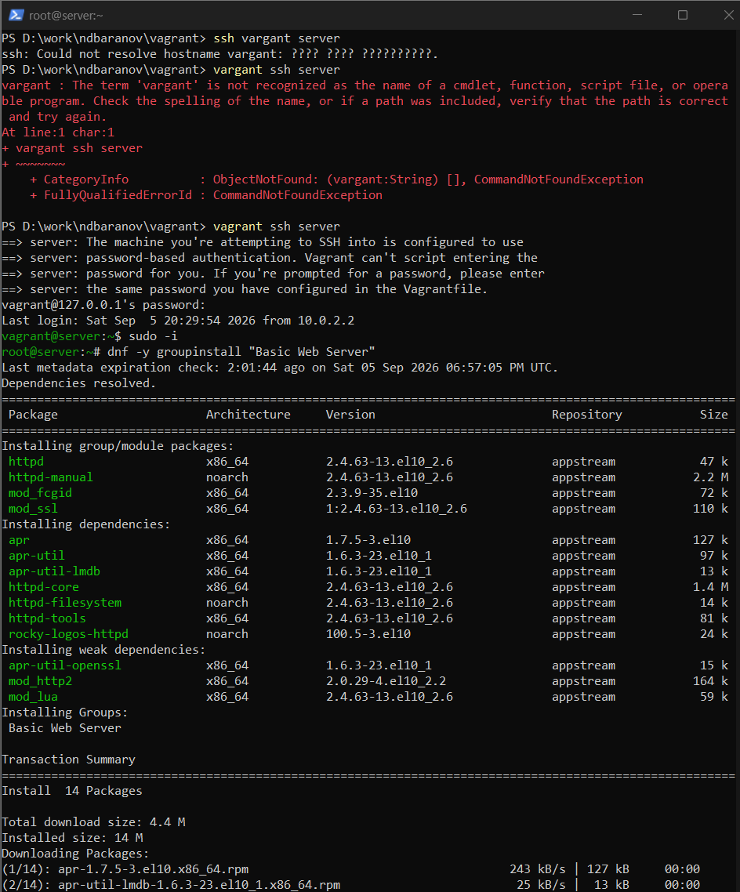
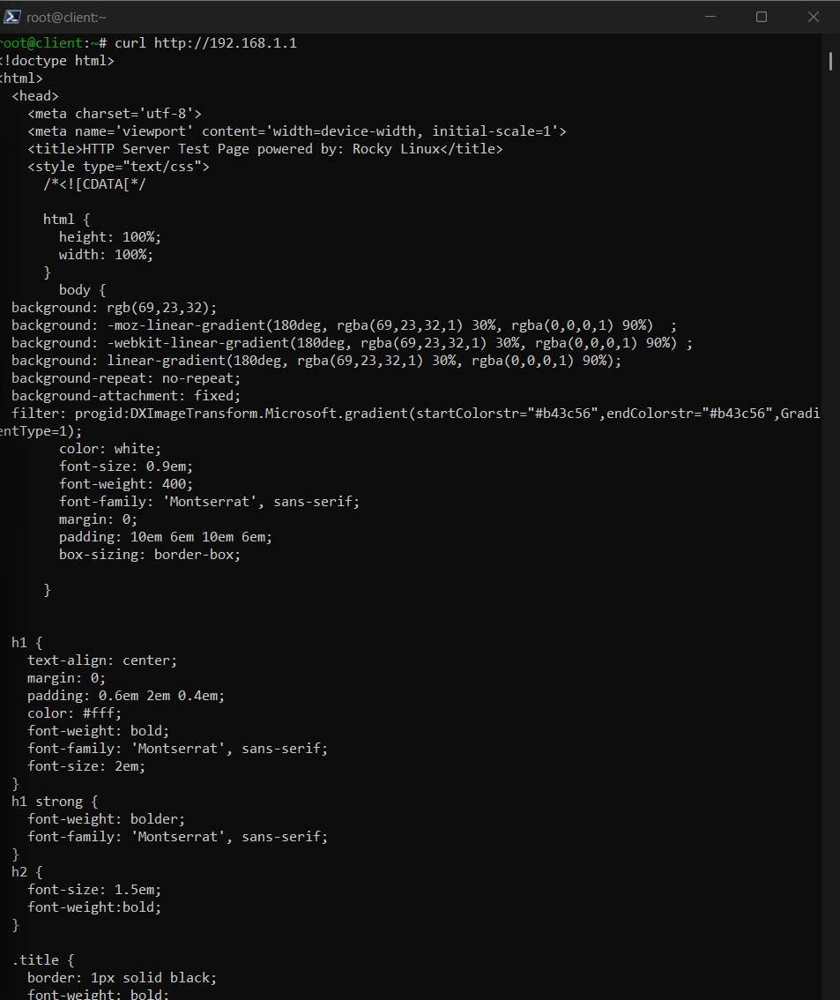
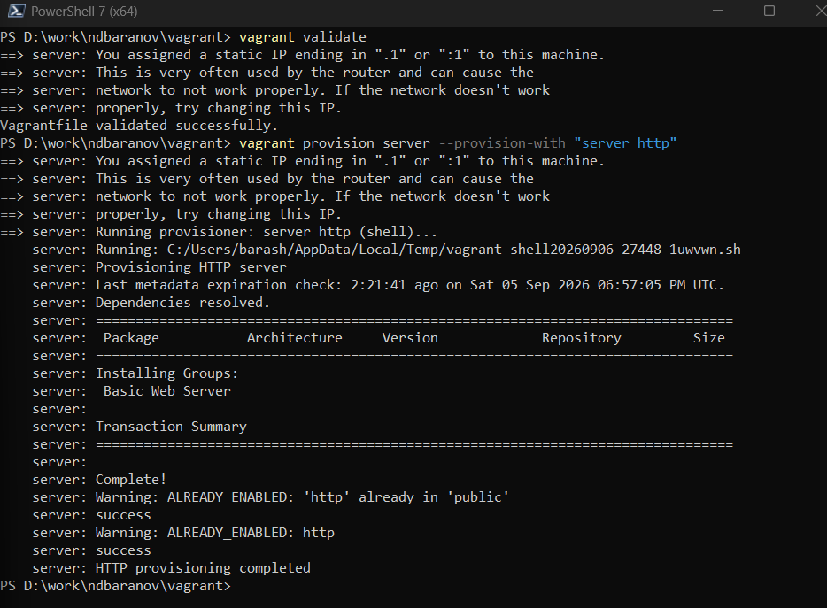

---
author:
  name: Баранов Никита Дмитриевич
  email: 1132242977@rudn.ru
  affiliation:
    - name: Российский университет дружбы народов им. Патриса Лумумбы
      city: Москва
      country: Российская Федерация
title: "Лабораторная работа № 4"
subtitle: "Базовая настройка HTTP-сервера Apache"
license: CC BY
date: today
date-format: "YYYY-MM-DD"
---

# Информация

## Докладчик

:::::::::::::: {.columns align=center}
::: {.column width="70%"}

- Баранов Никита Дмитриевич
- Студент РУДН
- [1132242977@rudn.ru](mailto:1132242977@rudn.ru)

:::
::: {.column width="30%"}

:::
::::::::::::::

# Цель и задачи

## Цель работы

- Получить навыки установки и базового конфигурирования Apache HTTP Server.

## Основные этапы

- Установлен пакет httpd и его зависимости.
- В firewalld открыт HTTP, служба httpd запущена и включена.
- Создан контент для server.ndbaranov.net и www.ndbaranov.net.
- DNS-зона дополнена A-записями server и www.
- Запросы curl с клиента вернули текст обеих веб-страниц.
- Скрипт server-http успешно выполнен через Vagrant provision.

# Ход работы

## Установка Apache HTTP Server

- На server установлен пакет httpd вместе с зависимостями.

{width=88%}

## Запуск и автозапуск httpd

- Apache запущен через systemctl и включён в автозагрузку.

{width=88%}

## Открытие HTTP в firewalld

- В постоянную конфигурацию межсетевого экрана добавлен сервис http.

{width=88%}

## Веб-контент и имена узлов

- Созданы страницы для server.ndbaranov.net и www.ndbaranov.net, а DNS-зона дополнена соответствующими A-записями.

{width=88%}

## Проверка сайтов через curl

- С клиента выполнены HTTP-запросы к обоим доменным именам.

{width=88%}

## Provision-сценарий Apache

- Сценарий server-http автоматизирует установку пакета, открытие порта и создание контента.

{width=88%}

# Результаты

## Итоги работы

- Apache запущен и доступен по HTTP; страницы двух доменных имён открываются с клиентского узла. DNS, firewalld и веб-сервер работают как единая цепочка.

## Спасибо за внимание
