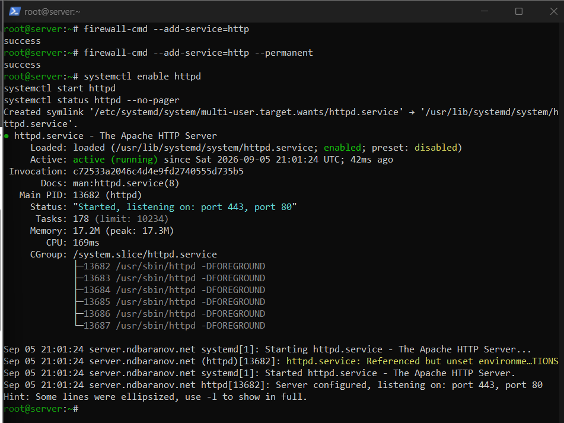
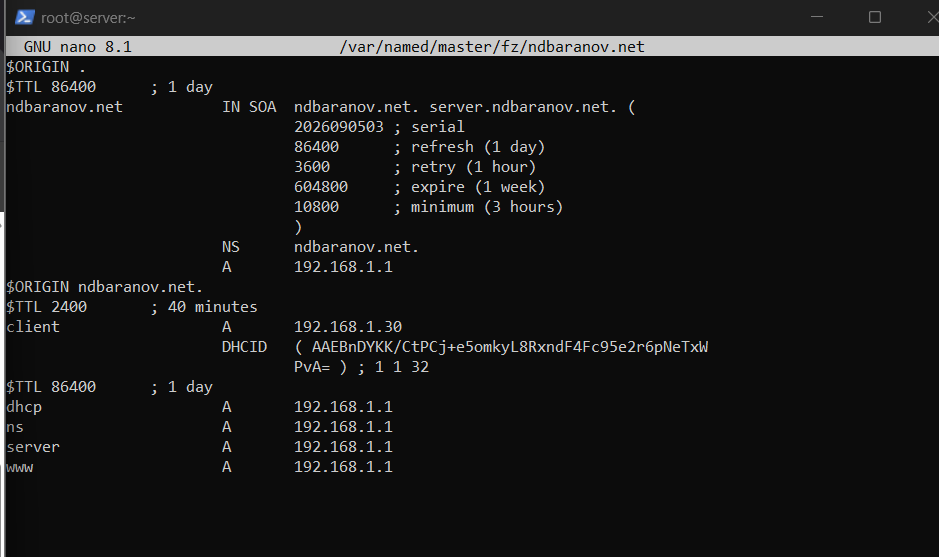
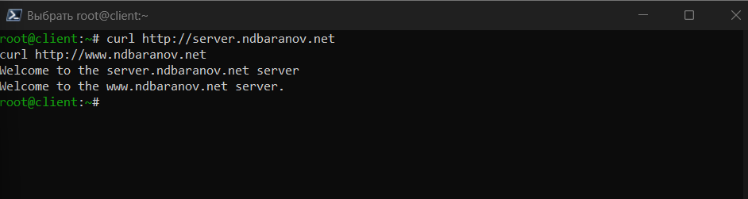

---
author:
  name: Баранов Никита Дмитриевич
  email: 1132242977@rudn.ru
  affiliation:
    - name: Российский университет дружбы народов им. Патриса Лумумбы
      city: Москва
      country: Российская Федерация
title: "Отчёт по лабораторной работе № 4"
subtitle: "Базовая настройка HTTP-сервера Apache"
license: CC BY
date: today
date-format: "YYYY-MM-DD"
---

# Цель работы

Получить навыки установки и базового конфигурирования Apache HTTP Server.

# Задание

1. Установлен пакет httpd и его зависимости.
2. В firewalld открыт HTTP, служба httpd запущена и включена.
3. Создан контент для server.ndbaranov.net и www.ndbaranov.net.
4. DNS-зона дополнена A-записями server и www.
5. Запросы curl с клиента вернули текст обеих веб-страниц.
6. Скрипт server-http успешно выполнен через Vagrant provision.

# Теоретические сведения

Apache httpd принимает HTTP-запросы на TCP-порту 80. Виртуальные хосты позволяют обслуживать несколько имён на одном узле; DNS направляет имена на адрес сервера.

# Выполнение работы

## Установка Apache HTTP Server

На server установлен пакет httpd вместе с зависимостями. После установки проверено наличие исполняемых файлов и системного unit-файла службы.

{#fig-04-001 width=95%}

## Запуск и автозапуск httpd

Apache запущен через systemctl и включён в автозагрузку. Статус active (running) подтверждает успешную загрузку конфигурации.

{#fig-04-002 width=95%}

## Открытие HTTP в firewalld

В постоянную конфигурацию межсетевого экрана добавлен сервис http. После reload порт 80 доступен клиентскому узлу.

{#fig-04-003 width=95%}

## Веб-контент и имена узлов

Созданы страницы для server.ndbaranov.net и www.ndbaranov.net, а DNS-зона дополнена соответствующими A-записями. Имена обоих сайтов указывают на один сервер.

{#fig-04-004 width=95%}

## Проверка сайтов через curl

С клиента выполнены HTTP-запросы к обоим доменным именам. В ответ получено содержимое созданных страниц, следовательно DNS, сеть и Apache работают совместно.

{#fig-04-005 width=95%}

## Provision-сценарий Apache

Сценарий server-http автоматизирует установку пакета, открытие порта и создание контента. Повторный запуск завершён без ошибок.

{#fig-04-006 width=95%}

# Выводы

Apache запущен и доступен по HTTP; страницы двух доменных имён открываются с клиентского узла. DNS, firewalld и веб-сервер работают как единая цепочка.
