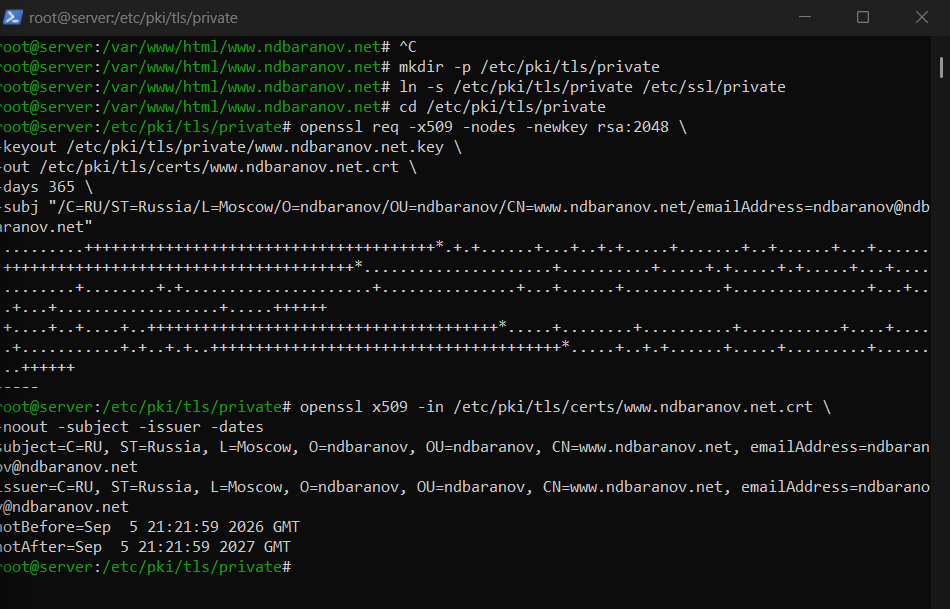
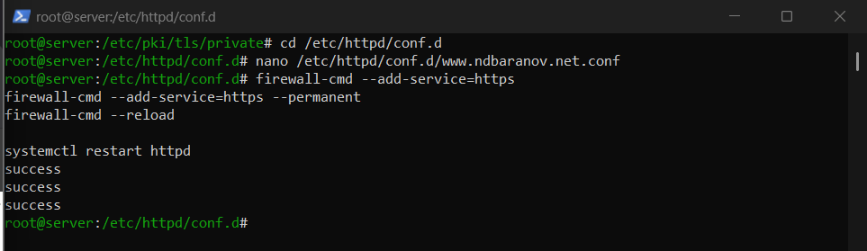
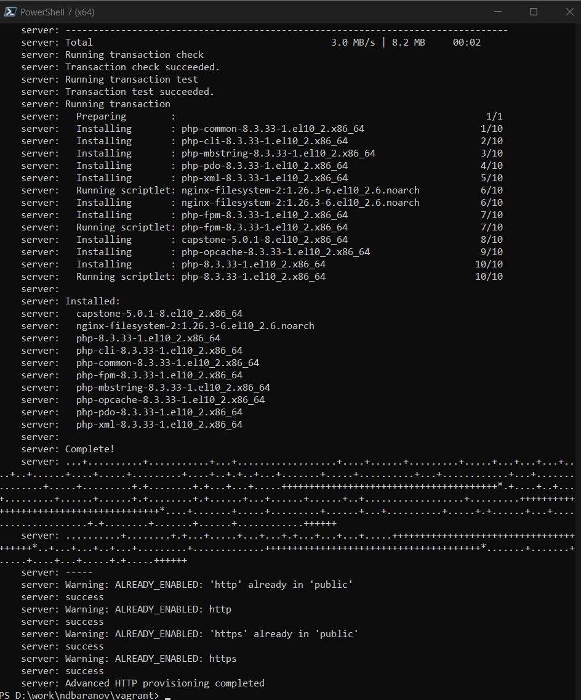

---
author:
  name: Баранов Никита Дмитриевич
  email: 1132242977@rudn.ru
  affiliation:
    - name: Российский университет дружбы народов им. Патриса Лумумбы
      city: Москва
      country: Российская Федерация
title: "Лабораторная работа № 5"
subtitle: "Расширенная настройка HTTP-сервера"
license: CC BY
date: today
date-format: "YYYY-MM-DD"
---

# Информация

## Докладчик

:::::::::::::: {.columns align=center}
::: {.column width="70%"}

- Баранов Никита Дмитриевич
- Студент РУДН
- [1132242977@rudn.ru](mailto:1132242977@rudn.ru)

:::
::: {.column width="30%"}

:::
::::::::::::::

# Цель и задачи

## Цель работы

- Настроить HTTPS, виртуальные хосты и обработку PHP в Apache.

## Основные этапы

- Создан закрытый RSA-ключ и самоподписанный X.509-сертифик для www.ndbaranov.net.
- Для Apache подготовлен HTTPS VirtualHost, пути к ключу и сертификату.
- В firewalld открыт HTTPS, конфигурация применена после перезапуска httpd.
- Запрос curl -I по HTTP показал перенаправление на HTTPS.
- Установлены PHP и модули; тестовый запрос подтвердил обработку PHP веб-сервером.
- Расширенная настройка закреплена в provision-сценарии.

# Ход работы

## Создание TLS-ключа и сертификата

- Командой openssl сформированы закрытый RSA-ключ и самоподписанный сертификат для www.ndbaranov.net.

{width=88%}

## HTTPS VirtualHost

- В конфигурации Apache создан виртуальный хост на порту 443 и указаны пути к сертификату и закрытому ключу.

{width=88%}

## Разрешение HTTPS

- В firewalld открыт сервис https, после чего Apache перезапущен.

{width=88%}

## Перенаправление HTTP на HTTPS

- Заголовки ответа curl показывают перенаправление запроса с HTTP на защищённый адрес.

{width=88%}

## Обработка PHP

- Установлен PHP и создана тестовая страница.

{width=88%}

# Результаты

## Итоги работы

- Веб-сервер переведён на HTTPS, настроено перенаправление с HTTP и подтверждена обработка PHP. Сертификат самоподписанный, поэтому он подходит для лабораторного стенда, но не заменяет доверенный сертификат.

## Спасибо за внимание
