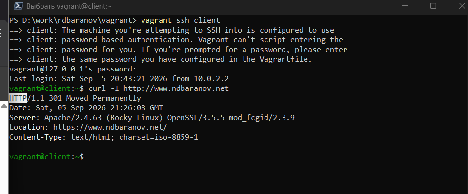
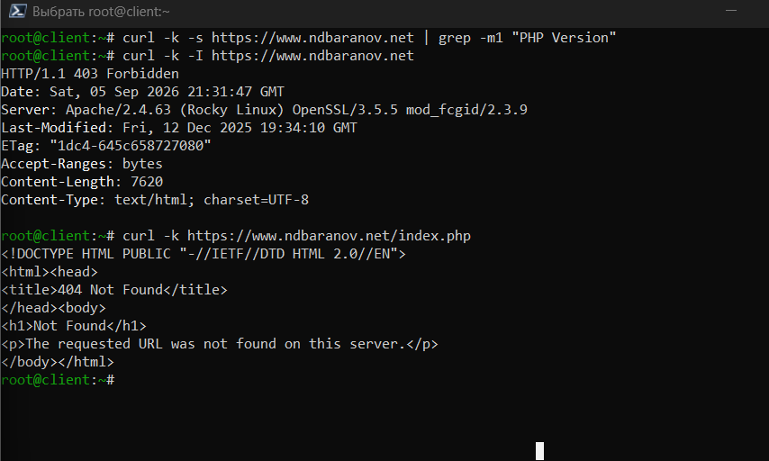

---
author:
  name: Баранов Никита Дмитриевич
  email: 1132242977@rudn.ru
  affiliation:
    - name: Российский университет дружбы народов им. Патриса Лумумбы
      city: Москва
      country: Российская Федерация
title: "Отчёт по лабораторной работе № 5"
subtitle: "Расширенная настройка HTTP-сервера"
license: CC BY
date: today
date-format: "YYYY-MM-DD"
---

# Цель работы

Настроить HTTPS, виртуальные хосты и обработку PHP в Apache.

# Задание

1. Создан закрытый RSA-ключ и самоподписанный X.509-сертифик для www.ndbaranov.net.
2. Для Apache подготовлен HTTPS VirtualHost, пути к ключу и сертификату.
3. В firewalld открыт HTTPS, конфигурация применена после перезапуска httpd.
4. Запрос curl -I по HTTP показал перенаправление на HTTPS.
5. Установлены PHP и модули; тестовый запрос подтвердил обработку PHP веб-сервером.
6. Расширенная настройка закреплена в provision-сценарии.

# Теоретические сведения

TLS защищает HTTP-трафик шифрованием и подтверждением подлинности сервера. Конфигурация VirtualHost связывает имя, каталог контента, журналы и сертификат.

# Выполнение работы

## Создание TLS-ключа и сертификата

Командой openssl сформированы закрытый RSA-ключ и самоподписанный сертификат для www.ndbaranov.net. Права на ключ ограничены, чтобы его не могли читать обычные пользователи.

{#fig-05-001 width=95%}

## HTTPS VirtualHost

В конфигурации Apache создан виртуальный хост на порту 443 и указаны пути к сертификату и закрытому ключу. Проверка httpd -t подтверждает корректный синтаксис.

{#fig-05-002 width=95%}

## Разрешение HTTPS

В firewalld открыт сервис https, после чего Apache перезапущен. Проверка списка разрешённых сервисов показывает доступность TCP-порта 443.

{#fig-05-003 width=95%}

## Перенаправление HTTP на HTTPS

Заголовки ответа curl показывают перенаправление запроса с HTTP на защищённый адрес. Код 301/302 и Location подтверждают работу правила перенаправления.

{#fig-05-004 width=95%}

## Обработка PHP

Установлен PHP и создана тестовая страница. Ответ веб-сервера содержит результат выполнения PHP-кода, а не исходный текст сценария.

{#fig-05-005 width=95%}

# Выводы

Веб-сервер переведён на HTTPS, настроено перенаправление с HTTP и подтверждена обработка PHP. Сертификат самоподписанный, поэтому он подходит для лабораторного стенда, но не заменяет доверенный сертификат.
