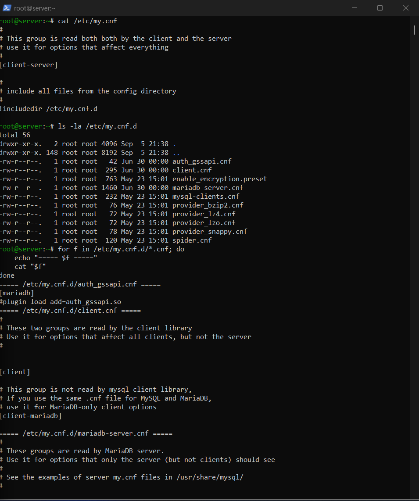
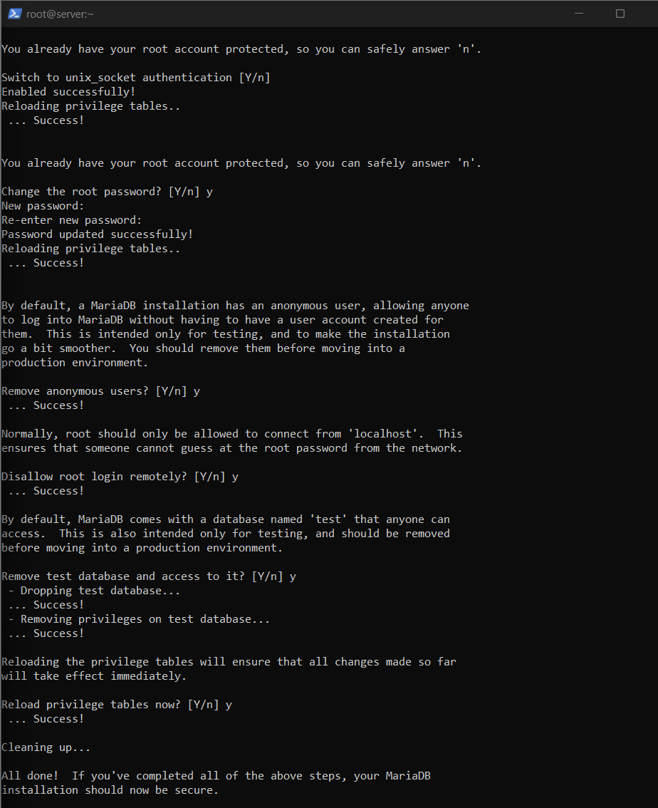
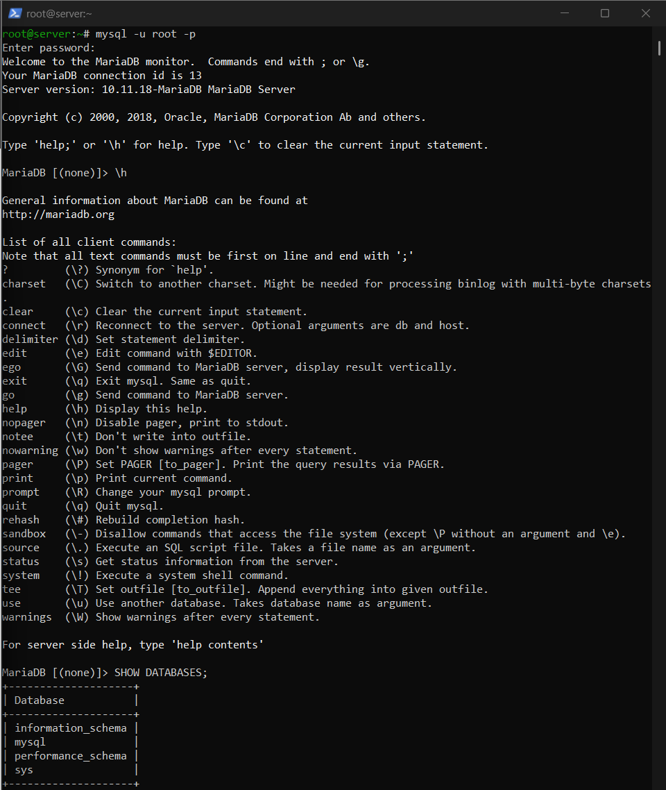
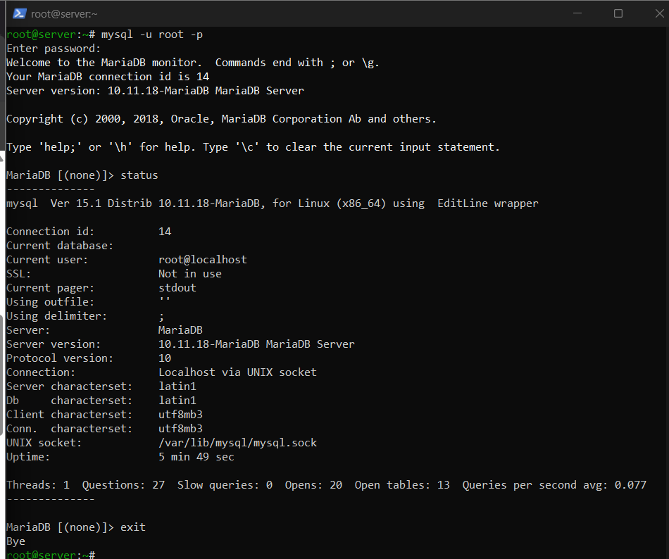
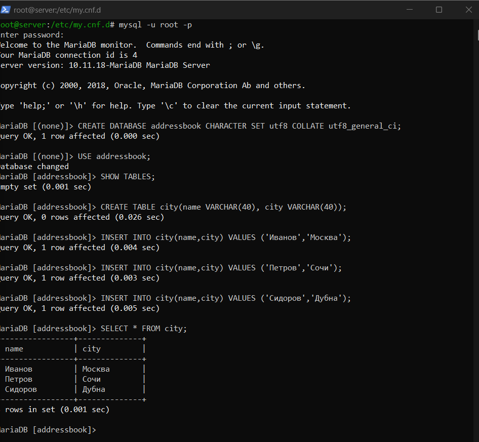
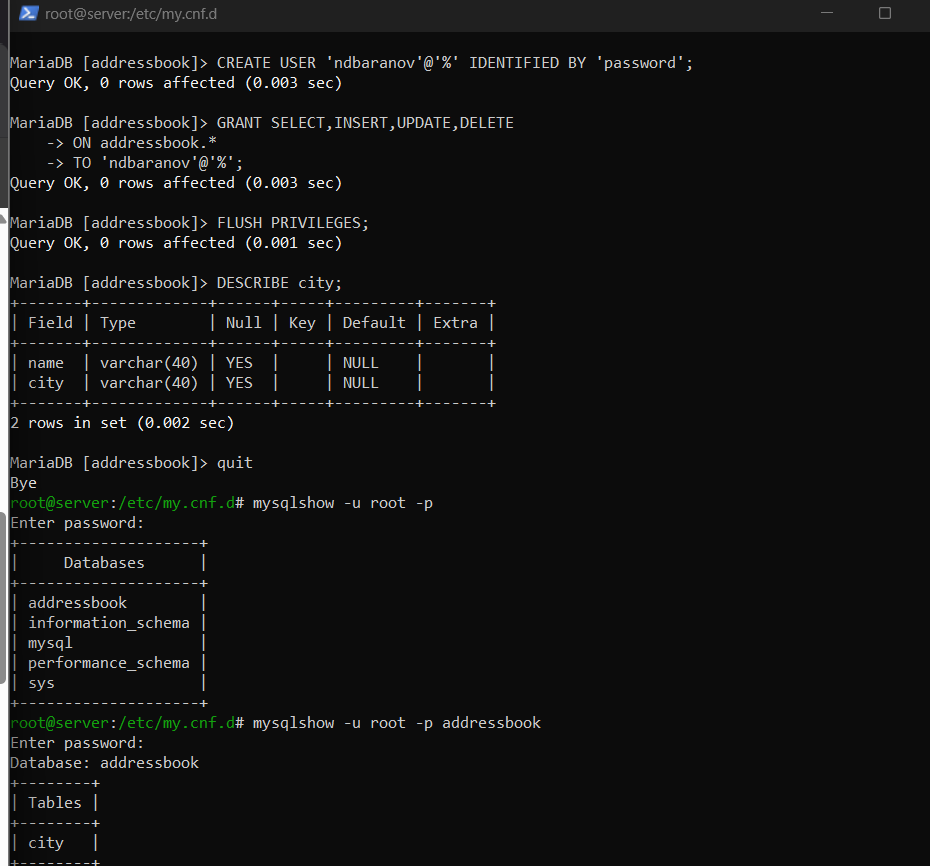
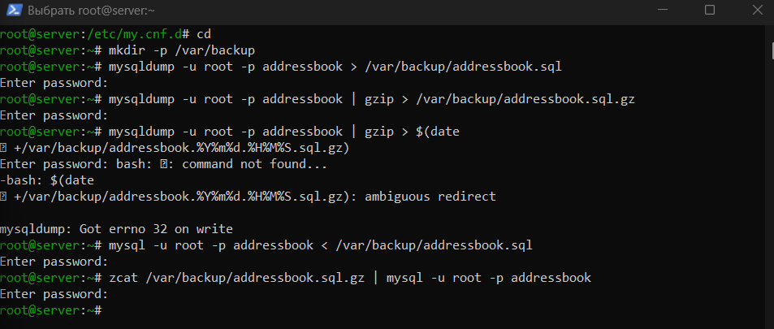
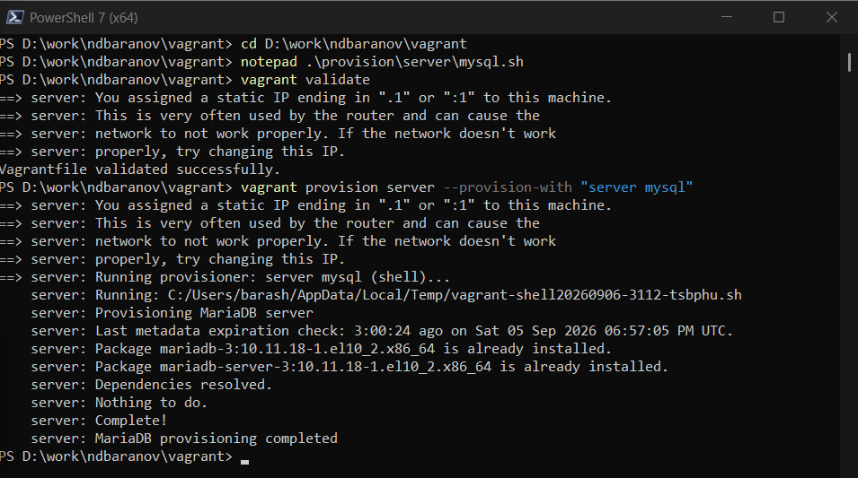

---
author:
  name: Баранов Никита Дмитриевич
  email: 1132242977@rudn.ru
  affiliation:
    - name: Российский университет дружбы народов им. Патриса Лумумбы
      city: Москва
      country: Российская Федерация
title: "Лабораторная работа № 6"
subtitle: "Установка и настройка MySQL"
license: CC BY
date: today
date-format: "YYYY-MM-DD"
---

# Информация

## Докладчик

:::::::::::::: {.columns align=center}
::: {.column width="70%"}

- Баранов Никита Дмитриевич
- Студент РУДН
- [1132242977@rudn.ru](mailto:1132242977@rudn.ru)

:::
::: {.column width="30%"}

:::
::::::::::::::

# Цель и задачи

## Цель работы

- Получить навыки установки, настройки и резервного копирования MariaDB/MySQL.

## Основные этапы

- Установлены mariadb-server и клиент, служба mariadb запущена и включена.
- Процедура mariadb-secure-installation удалила анонимные учётные записи и тестовую базу.
- Проверены соединение, версия сервера и кодировка utf8mb3.
- Создана база addressbook, таблица city и три тестовые записи.
- Создан отдельный пользователь и выданы права SELECT, INSERT, UPDATE и DELETE на addressbook.
- Созданы обычная и сжатая резервные копии; проверено восстановление потока SQL.
- Vagrant provision успешно воспроизвёл установку и настройку.

# Ход работы

## Установка MariaDB

- Установлены серверные и клиентские пакеты MariaDB, служба запущена и включена.

{width=88%}

## Первичная защита СУБД

- Запущена процедура mariadb-secure-installation: удалены анонимные пользователи, тестовая база и небезопасные варианты удалённого доступа.

{width=88%}

## Проверка соединения

- Выполнено подключение к серверу и просмотрены версия MariaDB, набор символов и параметры службы.

{width=88%}

## Создание базы addressbook

- Создана база данных addressbook и выбрана для дальнейшей работы.

{width=88%}

## Создание таблицы city

- В базе создана таблица city с ключевым полем и названием города.

{width=88%}

## Добавление тестовых данных

- В таблицу внесены несколько городов, после чего SELECT вывел сохранённые строки.

{width=88%}

## Изменение и удаление строк

- Команды UPDATE и DELETE изменили тестовый набор.

{width=88%}

## Отдельный пользователь БД

- Создан пользователь приложения и назначены права только на базу addressbook.

{width=88%}

## Проверка выданных привилегий

- Под новой учётной записью выполнены разрешённые операции с таблицей.

{width=88%}

## Логическая резервная копия

- Утилита mysqldump выгрузила структуру и данные addressbook в SQL-файл.

{width=88%}

## Сжатие и проверка копии

- Дамп сжат, затем его содержимое проверено без ручного редактирования.

{width=88%}

# Результаты

## Итоги работы

- MariaDB защищена базовыми настройками, создана база addressbook и пользователь с ограниченными правами. Логическая резервная копия позволяет восстановить структуру и данные.

## Спасибо за внимание
