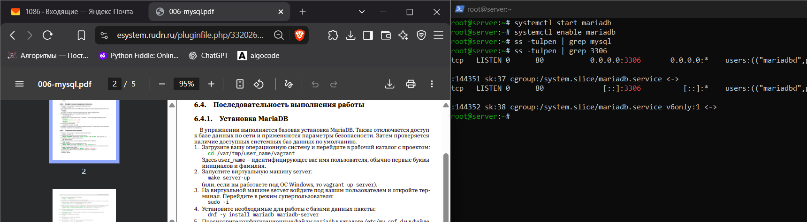
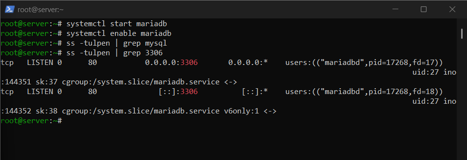
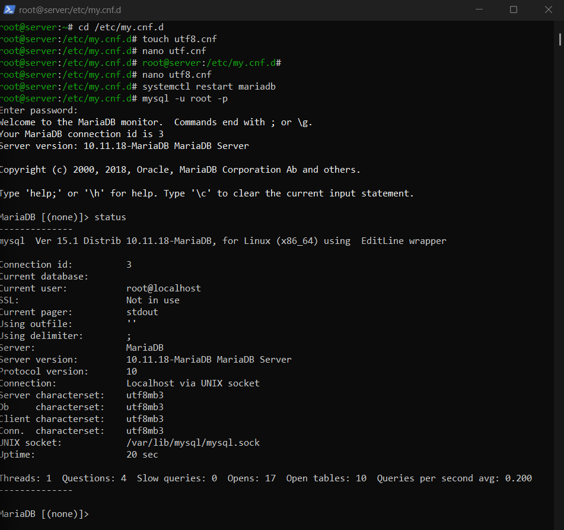

---
author:
  name: Баранов Никита Дмитриевич
  email: 1132242977@rudn.ru
  affiliation:
    - name: Российский университет дружбы народов им. Патриса Лумумбы
      city: Москва
      country: Российская Федерация
title: "Отчёт по лабораторной работе № 6"
subtitle: "Установка и настройка MySQL"
license: CC BY
date: today
date-format: "YYYY-MM-DD"
---

# Цель работы

Получить навыки установки, настройки и резервного копирования MariaDB/MySQL.

# Задание

1. Установлены mariadb-server и клиент, служба mariadb запущена и включена.
2. Процедура mariadb-secure-installation удалила анонимные учётные записи и тестовую базу.
3. Проверены соединение, версия сервера и кодировка utf8mb3.
4. Создана база addressbook, таблица city и три тестовые записи.
5. Создан отдельный пользователь и выданы права SELECT, INSERT, UPDATE и DELETE на addressbook.
6. Созданы обычная и сжатая резервные копии; проверено восстановление потока SQL.
7. Vagrant provision успешно воспроизвёл установку и настройку.

# Теоретические сведения

MariaDB реализует реляционную модель и использует SQL для определения схемы, изменения данных и разграничения доступа. mysqldump создаёт логическую резервную копию.

# Выполнение работы

## Установка MariaDB

Установлены серверные и клиентские пакеты MariaDB, служба запущена и включена. Статус systemd показывает успешную инициализацию СУБД.

{#fig-06-001 width=95%}

## Первичная защита СУБД

Запущена процедура mariadb-secure-installation: удалены анонимные пользователи, тестовая база и небезопасные варианты удалённого доступа.

{#fig-06-002 width=95%}

## Проверка соединения

Выполнено подключение к серверу и просмотрены версия MariaDB, набор символов и параметры службы. Это подтверждает готовность СУБД принимать SQL-команды.

{#fig-06-003 width=95%}

## Создание базы addressbook

Создана база данных addressbook и выбрана для дальнейшей работы. Команда SHOW DATABASES подтверждает её наличие.

{#fig-06-004 width=95%}

## Создание таблицы city

В базе создана таблица city с ключевым полем и названием города. DESCRIBE показывает типы столбцов и первичный ключ.

{#fig-06-005 width=95%}

## Добавление тестовых данных

В таблицу внесены несколько городов, после чего SELECT вывел сохранённые строки. Так проверена запись и чтение данных.

{#fig-06-006 width=95%}

## Изменение и удаление строк

Команды UPDATE и DELETE изменили тестовый набор. Повторный SELECT позволяет увидеть фактический результат каждой операции.

{#fig-06-007 width=95%}

## Отдельный пользователь БД

Создан пользователь приложения и назначены права только на базу addressbook. Такой подход отделяет административную учётную запись от прикладного доступа.

{#fig-06-008 width=95%}

## Проверка выданных привилегий

Под новой учётной записью выполнены разрешённые операции с таблицей. SHOW GRANTS фиксирует ограниченный набор полномочий.

{#fig-06-009 width=95%}

## Логическая резервная копия

Утилита mysqldump выгрузила структуру и данные addressbook в SQL-файл. Размер и начало файла подтверждают наличие команд восстановления.

{#fig-06-010 width=95%}

## Сжатие и проверка копии

Дамп сжат, затем его содержимое проверено без ручного редактирования. Provision-сценарий завершает воспроизводимую настройку MariaDB.

{#fig-06-011 width=95%}

# Выводы

MariaDB защищена базовыми настройками, создана база addressbook и пользователь с ограниченными правами. Логическая резервная копия позволяет восстановить структуру и данные.
