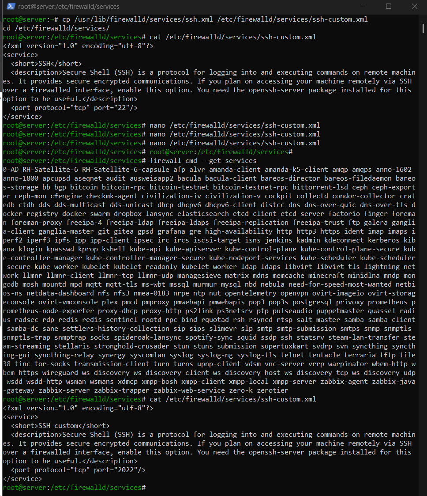
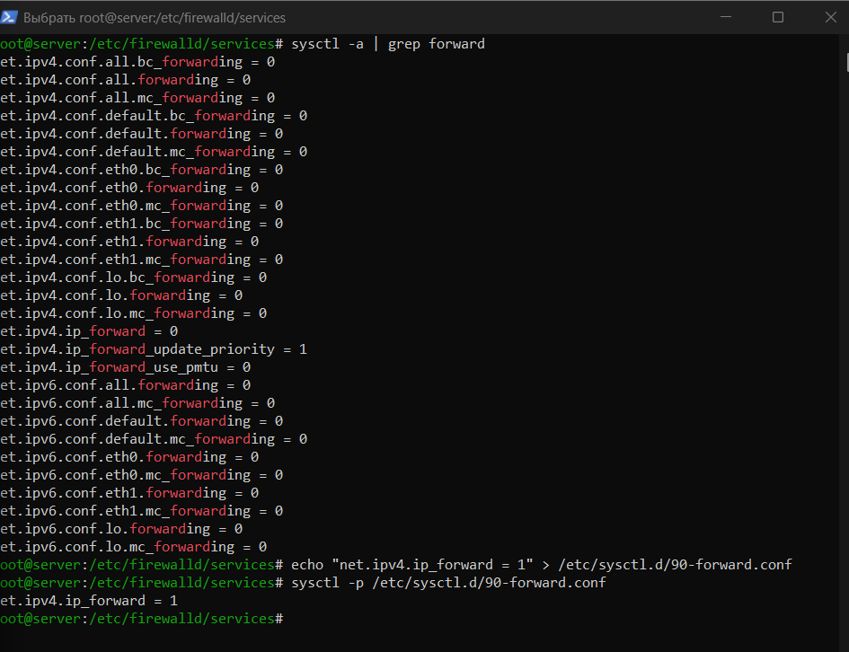

---
author:
  name: Баранов Никита Дмитриевич
  email: 1132242977@rudn.ru
  affiliation:
    - name: Российский университет дружбы народов им. Патриса Лумумбы
      city: Москва
      country: Российская Федерация
title: "Лабораторная работа № 7"
subtitle: "Настройка межсетевого экрана"
license: CC BY
date: today
date-format: "YYYY-MM-DD"
---

# Информация

## Докладчик

:::::::::::::: {.columns align=center}
::: {.column width="70%"}

- Баранов Никита Дмитриевич
- Студент РУДН
- [1132242977@rudn.ru](mailto:1132242977@rudn.ru)

:::
::: {.column width="30%"}

:::
::::::::::::::

# Цель и задачи

## Цель работы

- Получить навыки настройки firewalld, перенаправления портов и маршрутизации.

## Основные этапы

- Создано описание сервиса ssh-custom для TCP-порта 2022.
- Сервисы HTTP, HTTPS и ssh-custom добавлены в постоянную конфигурацию.
- Настроено перенаправление 2022/tcp на 22/tcp.
- Включена IPv4-маршрутизация и маскарадинг для внутренней сети.
- Клиент успешно подключился к SSH через порт 2022 и получил доступ во внешнюю сеть.
- Сценарий server-firewall закрепил настройки.

# Ход работы

## Пользовательский сервис ssh-custom

- Создано описание firewalld-сервиса ssh-custom для TCP-порта 2022.

{width=88%}

## Разрешённые сетевые сервисы

- В постоянную конфигурацию зоны добавлены HTTP, HTTPS и ssh-custom.

{width=88%}

## Перенаправление порта

- Настроено перенаправление входящих соединений с 2022/tcp на стандартный SSH-порт 22.

{width=88%}

## Маршрутизация IPv4

- Параметр net.ipv4.ip_forward включён через sysctl.

{width=88%}

## Маскарадинг и доступ клиента

- В зоне включён masquerade, после чего клиент получил доступ через сервер.

{width=88%}

## Финальная проверка firewalld

- Выведена итоговая конфигурация зоны и выполнен provision-сценарий.

{width=88%}

# Результаты

## Итоги работы

- firewalld фильтрует доступ к службам, перенаправляет порт 2022 на SSH и обеспечивает маршрутизацию внутренней сети через маскарадинг.

## Спасибо за внимание
