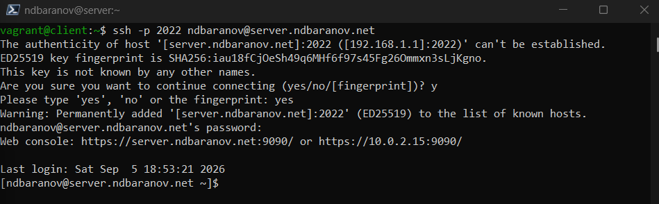
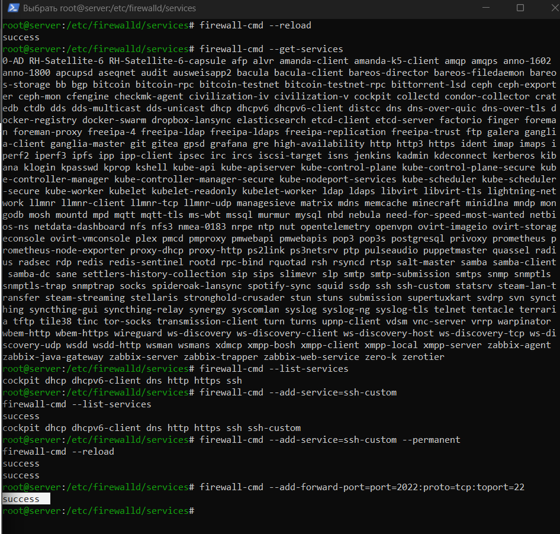
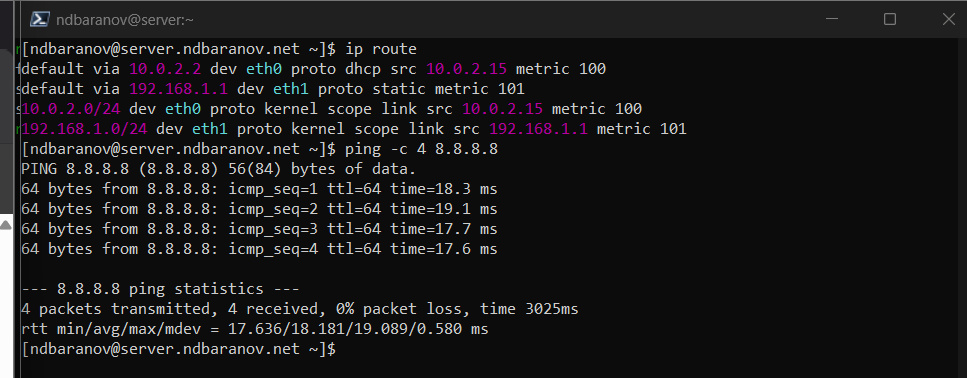
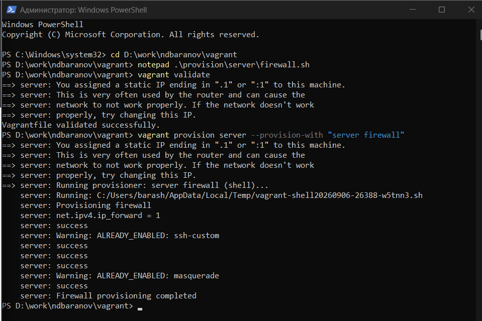

---
author:
  name: Баранов Никита Дмитриевич
  email: 1132242977@rudn.ru
  affiliation:
    - name: Российский университет дружбы народов им. Патриса Лумумбы
      city: Москва
      country: Российская Федерация
title: "Отчёт по лабораторной работе № 7"
subtitle: "Настройка межсетевого экрана"
license: CC BY
date: today
date-format: "YYYY-MM-DD"
---

# Цель работы

Получить навыки настройки firewalld, перенаправления портов и маршрутизации.

# Задание

1. Создано описание сервиса ssh-custom для TCP-порта 2022.
2. Сервисы HTTP, HTTPS и ssh-custom добавлены в постоянную конфигурацию.
3. Настроено перенаправление 2022/tcp на 22/tcp.
4. Включена IPv4-маршрутизация и маскарадинг для внутренней сети.
5. Клиент успешно подключился к SSH через порт 2022 и получил доступ во внешнюю сеть.
6. Сценарий server-firewall закрепил настройки.

# Теоретические сведения

firewalld управляет правилами фильтрации по зонам и сервисам. Маскарадинг подменяет исходный адрес пакетов, а ip_forward разрешает ядру маршрутизацию между интерфейсами.

# Выполнение работы

## Пользовательский сервис ssh-custom

Создано описание firewalld-сервиса ssh-custom для TCP-порта 2022. XML-файл позволяет управлять правилом по понятному имени.

{#fig-07-001 width=95%}

## Разрешённые сетевые сервисы

В постоянную конфигурацию зоны добавлены HTTP, HTTPS и ssh-custom. После reload они отображаются в списке services.

{#fig-07-002 width=95%}

## Перенаправление порта

Настроено перенаправление входящих соединений с 2022/tcp на стандартный SSH-порт 22. Правило позволяет изменить внешний порт без перенастройки sshd.

{#fig-07-003 width=95%}

## Маршрутизация IPv4

Параметр net.ipv4.ip_forward включён через sysctl. Сервер теперь может пересылать пакеты между своими интерфейсами.

{#fig-07-004 width=95%}

## Маскарадинг и доступ клиента

В зоне включён masquerade, после чего клиент получил доступ через сервер. Проверка соединения показывает работу трансляции исходных адресов.

{#fig-07-005 width=95%}

## Финальная проверка firewalld

Выведена итоговая конфигурация зоны и выполнен provision-сценарий. В результате правила сохраняются после перезагрузки и воспроизводятся автоматически.

{#fig-07-006 width=95%}

# Выводы

firewalld фильтрует доступ к службам, перенаправляет порт 2022 на SSH и обеспечивает маршрутизацию внутренней сети через маскарадинг.
