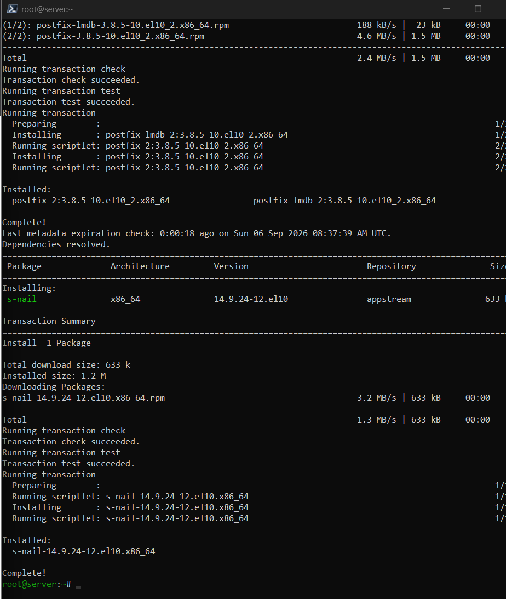
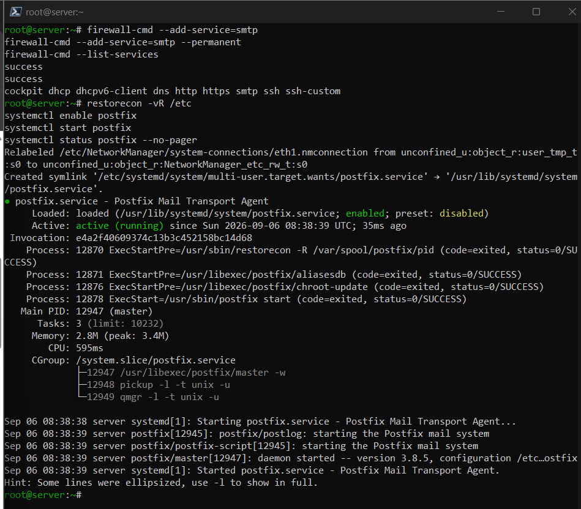
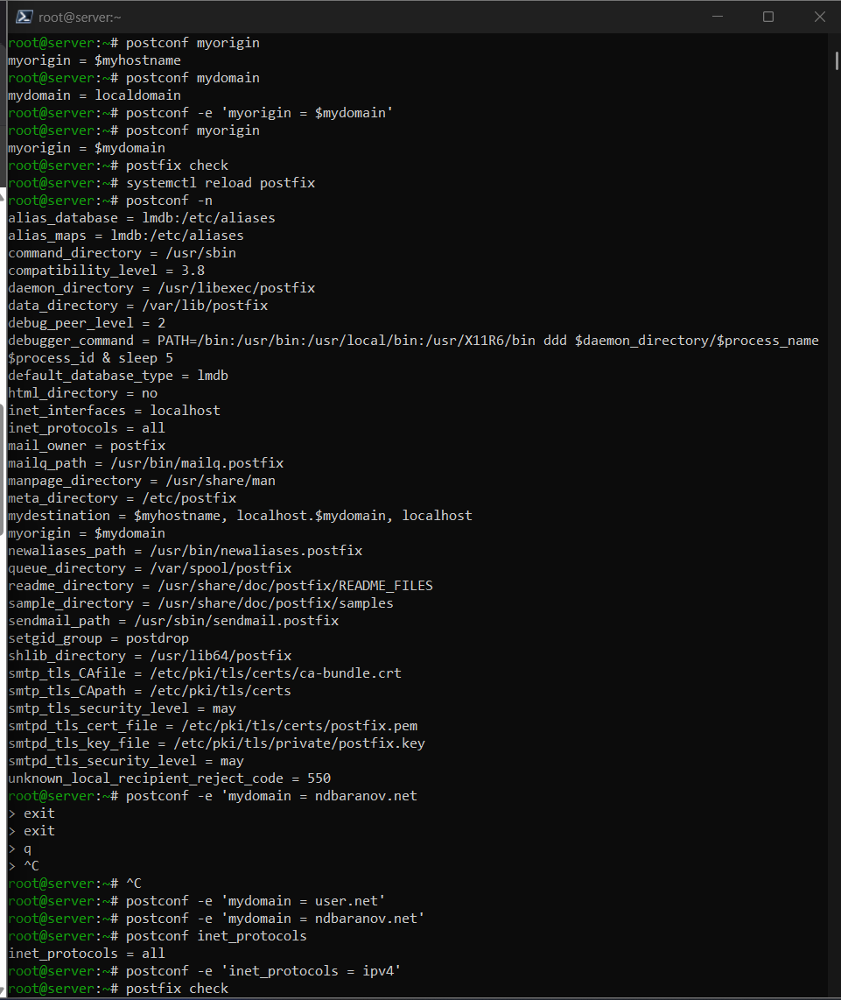
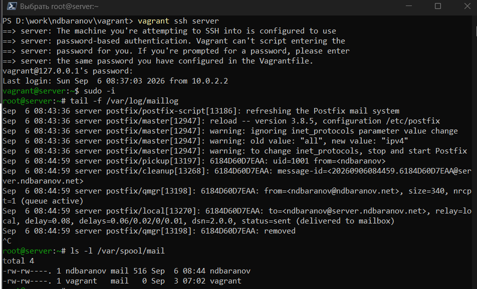
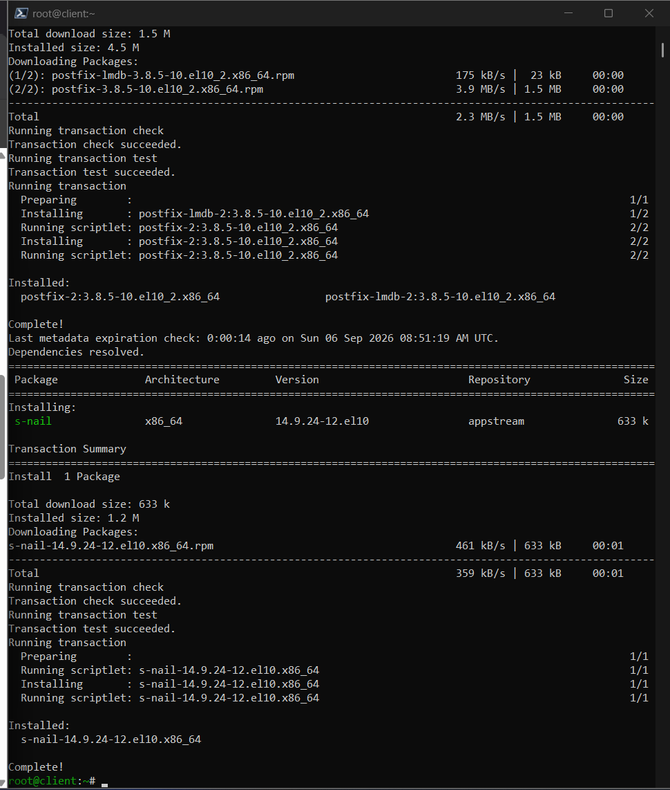
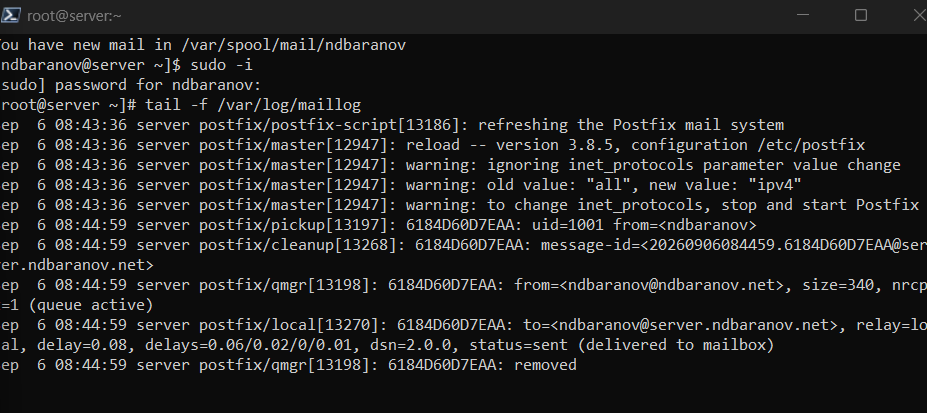
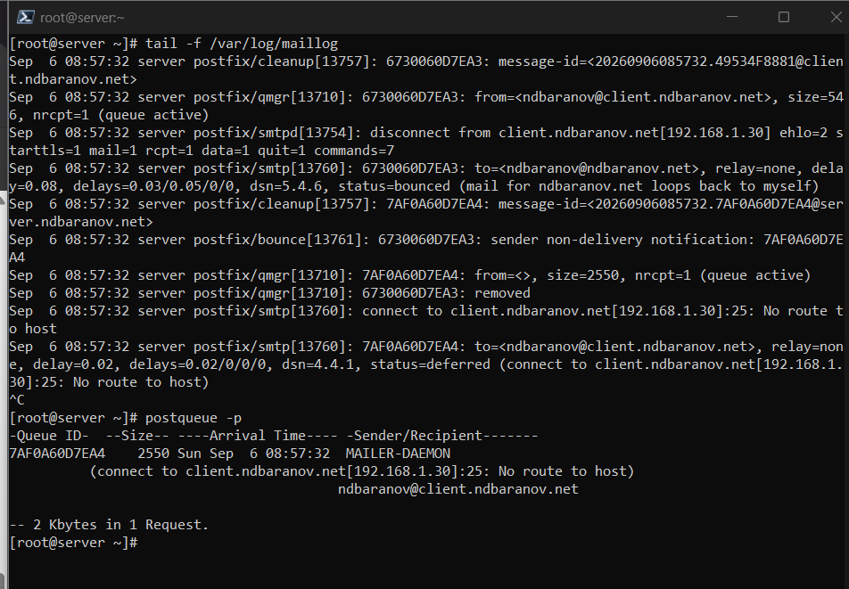
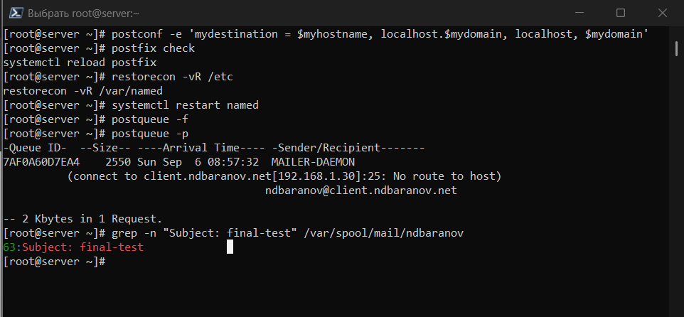

---
author:
  name: Баранов Никита Дмитриевич
  email: 1132242977@rudn.ru
  affiliation:
    - name: Российский университет дружбы народов им. Патриса Лумумбы
      city: Москва
      country: Российская Федерация
title: "Лабораторная работа № 8"
subtitle: "Настройка SMTP-сервера"
license: CC BY
date: today
date-format: "YYYY-MM-DD"
---

# Информация

## Докладчик

:::::::::::::: {.columns align=center}
::: {.column width="70%"}

- Баранов Никита Дмитриевич
- Студент РУДН
- [1132242977@rudn.ru](mailto:1132242977@rudn.ru)

:::
::: {.column width="30%"}

:::
::::::::::::::

# Цель и задачи

## Цель работы

- Получить навыки установки и базовой настройки SMTP-сервера Postfix.

## Основные этапы

- Установлены Postfix и s-nail, в firewalld открыт SMTP.
- Заданы myhostname=server.ndbaranov.net, mydomain=ndbaranov.net, myorigin=$mydomain и IPv4.
- Конфигурация проверена postconf и postfix check.
- Локальное письмо доставлено в /var/spool/mail/ndbaranov; доставка отразилась в /var/log/maillog.
- Postfix настроен на приём из внутренней сети; письмо с client доставлено на server.
- Ошибочная попытка доставки на client показала отсутствие SMTP-службы на клиенте; очередь была очищена.
- Настройки перенесены в server-mail и client-mail provisioners.

# Ход работы

## Установка Postfix

- На сервер установлены Postfix и консольный почтовый клиент s-nail; SMTP разрешён в firewalld.

{width=88%}

## Имя почтового сервера

- В main.cf заданы myhostname и mydomain.

{width=88%}

## Источник и локальные домены

- Параметры myorigin и mydestination настроены для домена ndbaranov.net.

{width=88%}

## Сетевые интерфейсы Postfix

- Сервер переведён на IPv4 и настроен на приём соединений с внутренних интерфейсов.

{width=88%}

## Проверка конфигурации

- Команда postfix check завершилась без сообщений об ошибках, после чего служба перезапущена.

{width=88%}

## Отправка локального письма

- Через s-nail отправлено тестовое письмо локальному пользователю.

{width=88%}

## Запись о локальной доставке

- В maillog видна цепочка обработки письма и статус delivered/sent.

{width=88%}

## Приём SMTP из внутренней сети

- В mynetworks добавлена лабораторная подсеть.

{width=88%}

## Отправка письма с client

- С client отправлено письмо пользователю на server.ndbaranov.net.

{width=88%}

## Диагностика неуспешной доставки

- Попытка отправить письмо на узел без SMTP-службы оставила сообщение в очереди.

{width=88%}

## Очистка почтовой очереди

- После анализа ошибочное сообщение удалено из очереди.

{width=88%}

## Автоматизация почтовой настройки

- Provision-сценарии server-mail и client-mail устанавливают пакеты и применяют параметры Postfix.

{width=88%}

# Результаты

## Итоги работы

- Postfix принимает и доставляет локальную и сетевую почту. Анализ очереди и журнала позволил отличить успешную доставку от ошибки соединения с узлом без SMTP-службы.

## Спасибо за внимание
