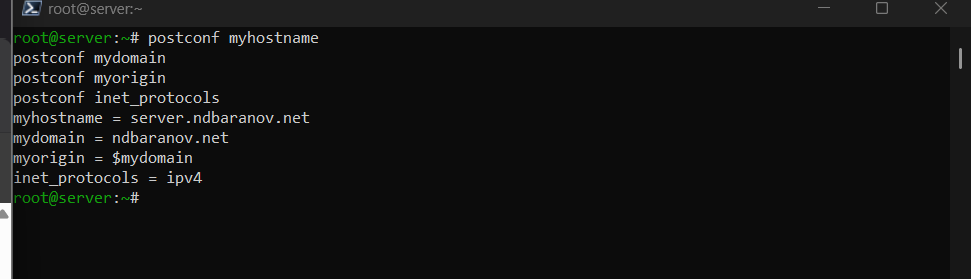
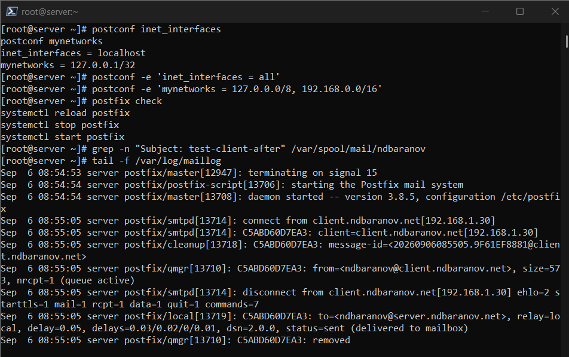
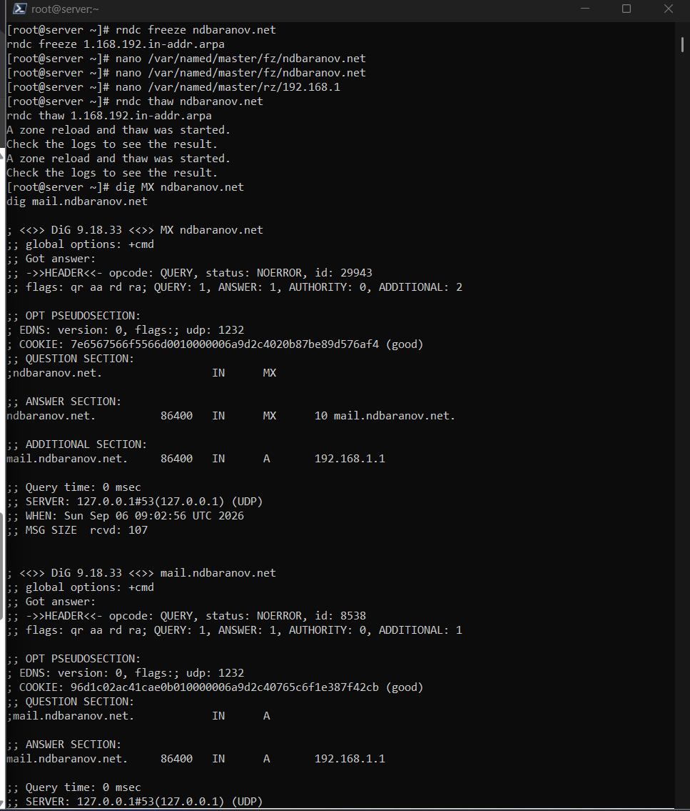
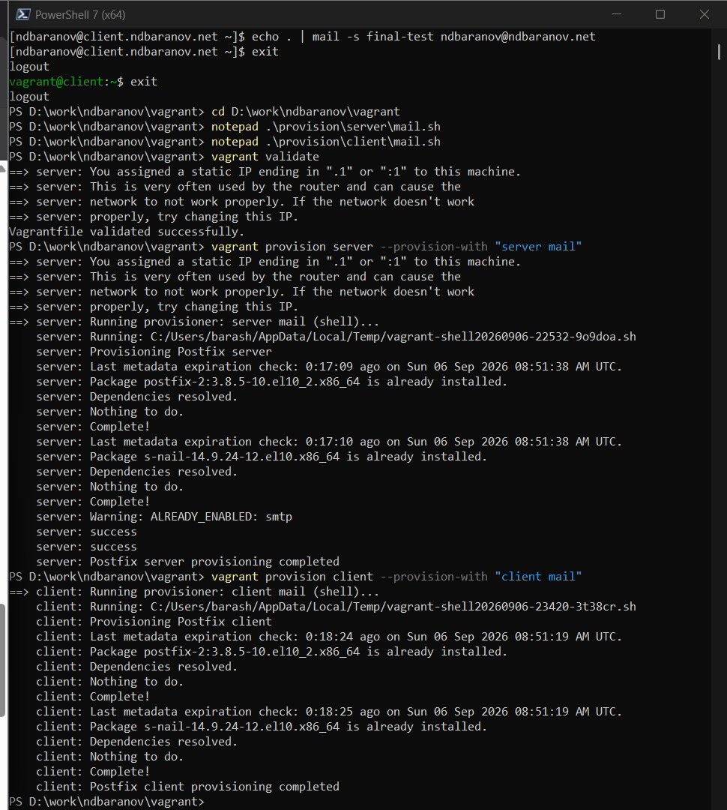

---
author:
  name: Баранов Никита Дмитриевич
  email: 1132242977@rudn.ru
  affiliation:
    - name: Российский университет дружбы народов им. Патриса Лумумбы
      city: Москва
      country: Российская Федерация
title: "Отчёт по лабораторной работе № 8"
subtitle: "Настройка SMTP-сервера"
license: CC BY
date: today
date-format: "YYYY-MM-DD"
---

# Цель работы

Получить навыки установки и базовой настройки SMTP-сервера Postfix.

# Задание

1. Установлены Postfix и s-nail, в firewalld открыт SMTP.
2. Заданы myhostname=server.ndbaranov.net, mydomain=ndbaranov.net, myorigin=$mydomain и IPv4.
3. Конфигурация проверена postconf и postfix check.
4. Локальное письмо доставлено в /var/spool/mail/ndbaranov; доставка отразилась в /var/log/maillog.
5. Postfix настроен на приём из внутренней сети; письмо с client доставлено на server.
6. Ошибочная попытка доставки на client показала отсутствие SMTP-службы на клиенте; очередь была очищена.
7. Настройки перенесены в server-mail и client-mail provisioners.

# Теоретические сведения

SMTP передаёт почту между клиентами и серверами. Postfix состоит из набора специализированных процессов, а main.cf задаёт имя узла, домен, сетевые интерфейсы и локальные назначения.

# Выполнение работы

## Установка Postfix

На сервер установлены Postfix и консольный почтовый клиент s-nail; SMTP разрешён в firewalld. Служба postfix запущена и включена.

{#fig-08-001 width=95%}

## Имя почтового сервера

В main.cf заданы myhostname и mydomain. Эти параметры определяют полное имя сервера и домен, используемый в почтовых адресах.

{#fig-08-002 width=95%}

## Источник и локальные домены

Параметры myorigin и mydestination настроены для домена ndbaranov.net. Postfix понимает, какие адреса считать локальными.

{#fig-08-003 width=95%}

## Сетевые интерфейсы Postfix

Сервер переведён на IPv4 и настроен на приём соединений с внутренних интерфейсов. postconf выводит применённые значения.

{#fig-08-004 width=95%}

## Проверка конфигурации

Команда postfix check завершилась без сообщений об ошибках, после чего служба перезапущена. Это подтверждает корректность main.cf.

{#fig-08-005 width=95%}

## Отправка локального письма

Через s-nail отправлено тестовое письмо локальному пользователю. Команда mail показывает появление сообщения в системном почтовом ящике.

{#fig-08-006 width=95%}

## Запись о локальной доставке

В maillog видна цепочка обработки письма и статус delivered/sent. Журнал подтверждает прохождение сообщения через процессы Postfix.

{#fig-08-007 width=95%}

## Приём SMTP из внутренней сети

В mynetworks добавлена лабораторная подсеть. Клиентский узел теперь может передавать письма серверу без превращения его в открытый ретранслятор.

{#fig-08-008 width=95%}

## Отправка письма с client

С client отправлено письмо пользователю на server.ndbaranov.net. На сервере сообщение появилось в локальном почтовом ящике.

{#fig-08-009 width=95%}

## Диагностика неуспешной доставки

Попытка отправить письмо на узел без SMTP-службы оставила сообщение в очереди. mailq показывает причину и идентификатор отложенного письма.

{#fig-08-010 width=95%}

## Очистка почтовой очереди

После анализа ошибочное сообщение удалено из очереди. Повторная команда mailq сообщает, что очередь пуста.

{#fig-08-011 width=95%}

## Автоматизация почтовой настройки

Provision-сценарии server-mail и client-mail устанавливают пакеты и применяют параметры Postfix. Финальный вывод подтверждает их успешное выполнение.

{#fig-08-012 width=95%}

# Выводы

Postfix принимает и доставляет локальную и сетевую почту. Анализ очереди и журнала позволил отличить успешную доставку от ошибки соединения с узлом без SMTP-службы.
