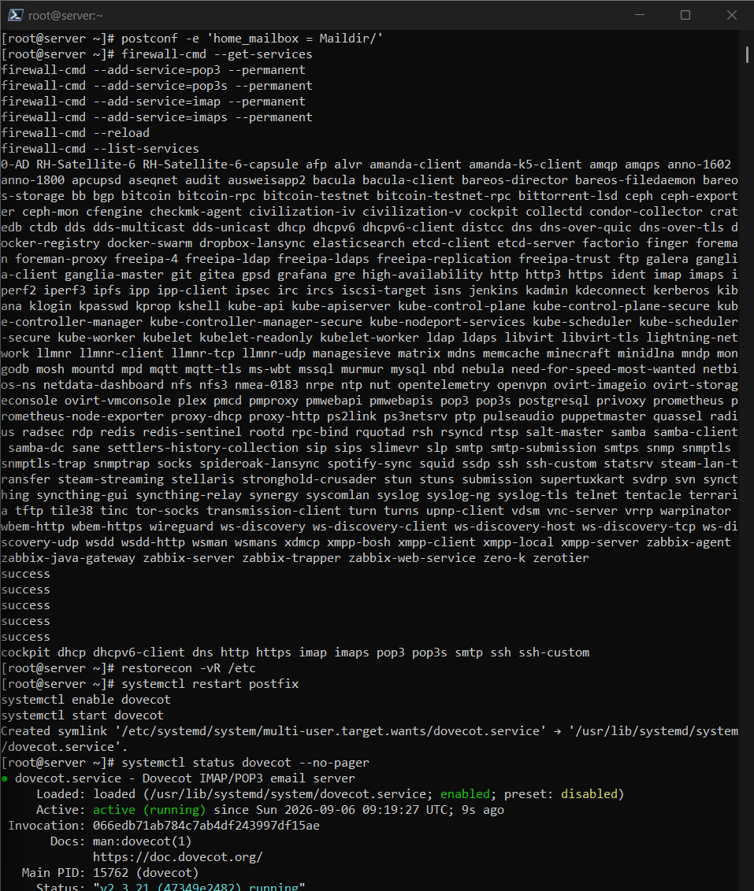
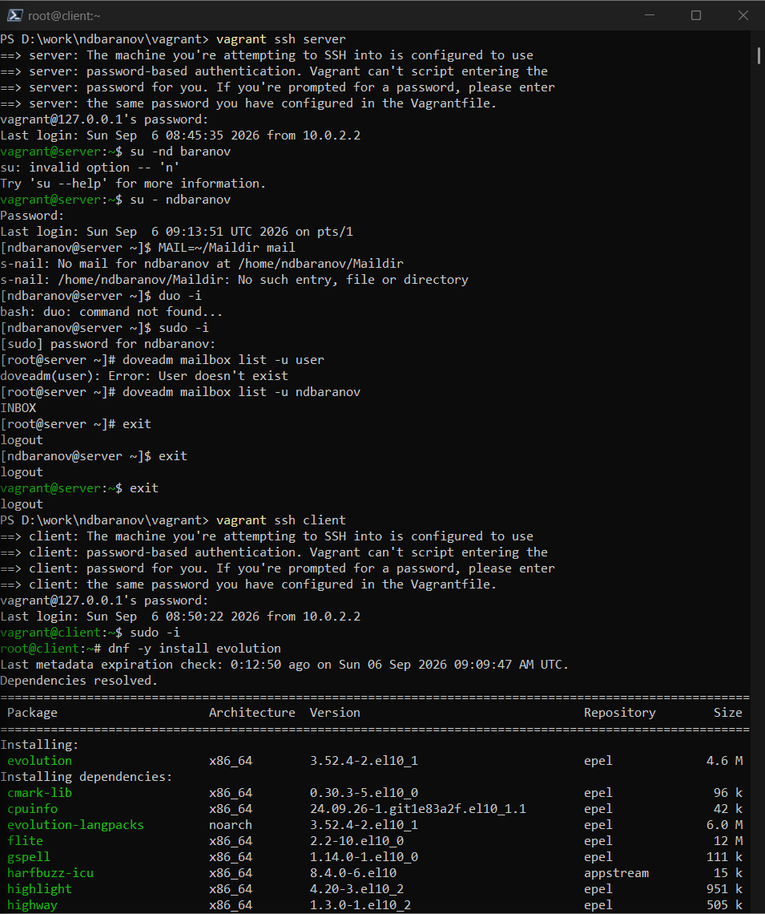
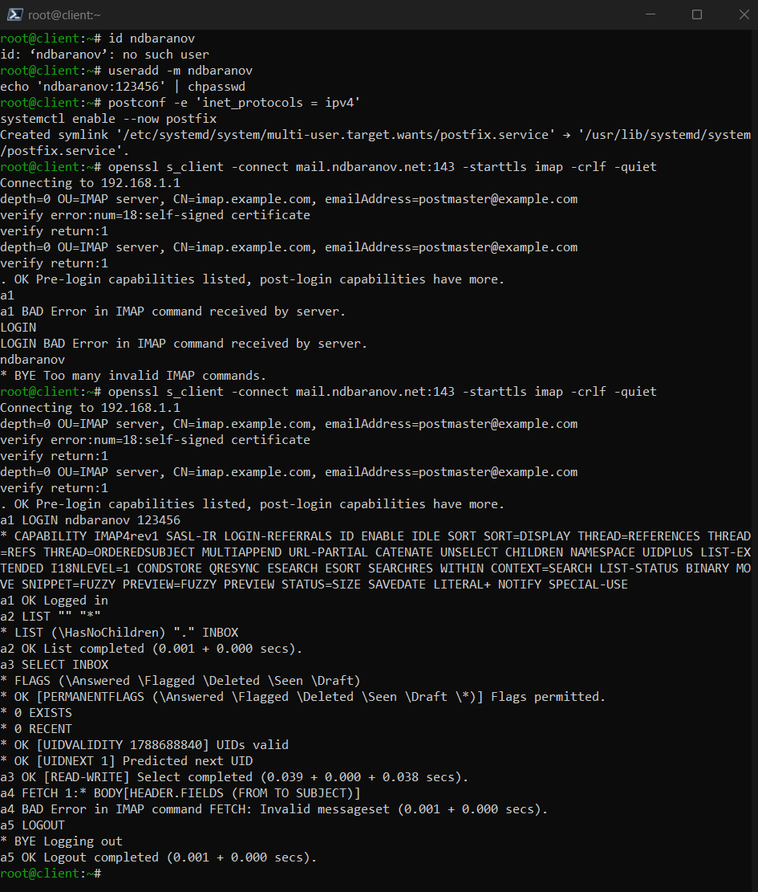
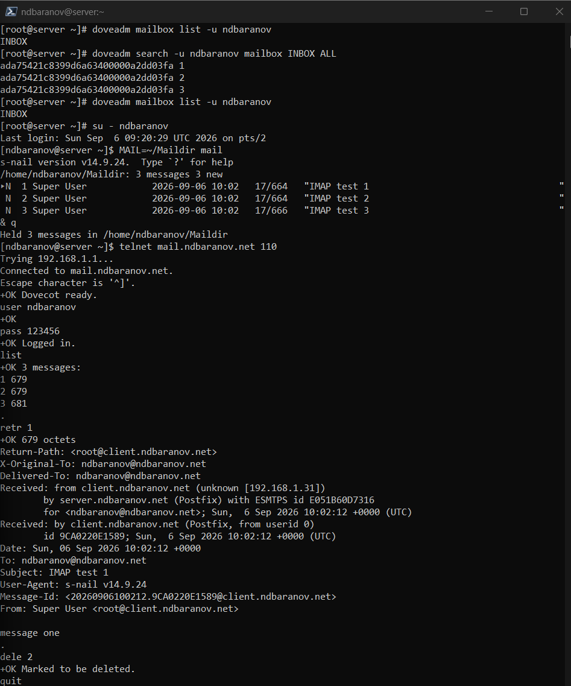

---
author:
  name: Баранов Никита Дмитриевич
  email: 1132242977@rudn.ru
  affiliation:
    - name: Российский университет дружбы народов им. Патриса Лумумбы
      city: Москва
      country: Российская Федерация
title: "Лабораторная работа № 9"
subtitle: "Настройка IMAP-сервера"
license: CC BY
date: today
date-format: "YYYY-MM-DD"
---

# Информация

## Докладчик

:::::::::::::: {.columns align=center}
::: {.column width="70%"}

- Баранов Никита Дмитриевич
- Студент РУДН
- [1132242977@rudn.ru](mailto:1132242977@rudn.ru)

:::
::: {.column width="30%"}

:::
::::::::::::::

# Цель и задачи

## Цель работы

- Получить навыки установки и настройки Dovecot для доступа к почте по IMAP.

## Основные этапы

- Установлены Dovecot и telnet; заданы механизмы аутентификации и mail_location=maildir:~/Maildir.
- В firewalld открыты imap, imaps, pop3 и pop3s; служба dovecot активна.
- После создания Maildir письма показаны утилитой s-nail.
- Сеанс telnet на порту 143 подтвердил аутентификацию, LIST, SELECT, FETCH, STORE и LOGOUT.
- Письма успешно удаляются через IMAP-флаг Deleted и EXPUNGE.

# Ход работы

## Установка Dovecot

- На сервер установлен Dovecot, включены IMAP/POP3-службы и проверен статус процесса.

{width=88%}

## Параметры протоколов

- В конфигурации включены imap и pop3, настроены механизмы обычной системной аутентификации.

{width=88%}

## Переход на Maildir

- Параметр mail_location указывает на ~/Maildir.

{width=88%}

## Создание структуры Maildir

- Для пользователя созданы каталоги cur, new и tmp.

{width=88%}

## Подключение к IMAP

- Через telnet установлено соединение с портом 143 и выполнена команда LOGIN.

{width=88%}

## Работа с папкой INBOX

- Команды LIST, SELECT и FETCH вывели папки и содержимое письма.

{width=88%}

## Удаление письма через IMAP

- Флаг Deleted назначен командой STORE, а EXPUNGE окончательно удалил сообщение.

{width=88%}

# Результаты

## Итоги работы

- Dovecot хранит сообщения в Maildir и предоставляет доступ по IMAP. Проверены аутентификация, просмотр папок, чтение, установка флагов и удаление письма.

## Спасибо за внимание
