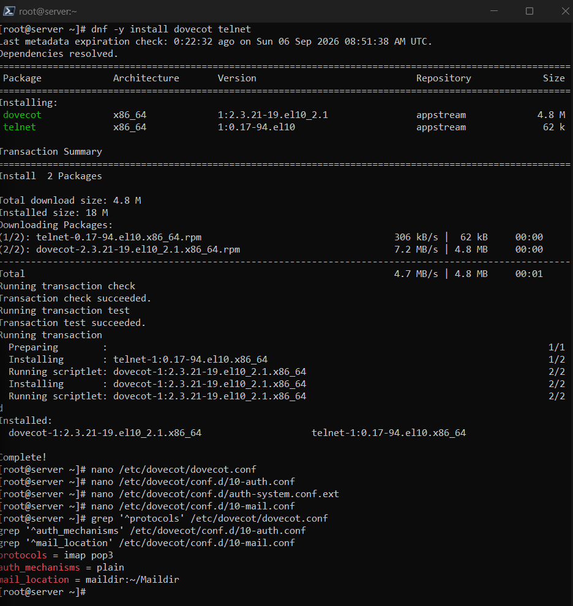
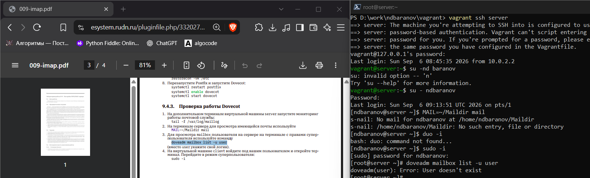
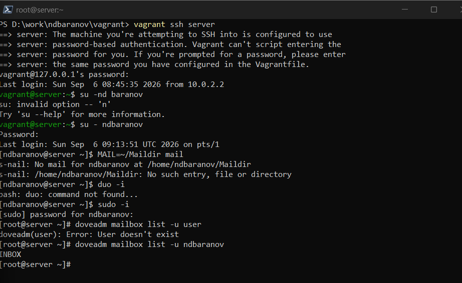

---
author:
  name: Баранов Никита Дмитриевич
  email: 1132242977@rudn.ru
  affiliation:
    - name: Российский университет дружбы народов им. Патриса Лумумбы
      city: Москва
      country: Российская Федерация
title: "Отчёт по лабораторной работе № 9"
subtitle: "Настройка IMAP-сервера"
license: CC BY
date: today
date-format: "YYYY-MM-DD"
---

# Цель работы

Получить навыки установки и настройки Dovecot для доступа к почте по IMAP.

# Задание

1. Установлены Dovecot и telnet; заданы механизмы аутентификации и mail_location=maildir:~/Maildir.
2. В firewalld открыты imap, imaps, pop3 и pop3s; служба dovecot активна.
3. После создания Maildir письма показаны утилитой s-nail.
4. Сеанс telnet на порту 143 подтвердил аутентификацию, LIST, SELECT, FETCH, STORE и LOGOUT.
5. Письма успешно удаляются через IMAP-флаг Deleted и EXPUNGE.

# Теоретические сведения

IMAP хранит письма на сервере и позволяет клиенту управлять папками и флагами. Dovecot обслуживает IMAP/POP3 и использует Maildir как надёжный формат хранения.

# Выполнение работы

## Установка Dovecot

На сервер установлен Dovecot, включены IMAP/POP3-службы и проверен статус процесса. Firewalld разрешает необходимые почтовые сервисы.

{#fig-09-001 width=95%}

## Параметры протоколов

В конфигурации включены imap и pop3, настроены механизмы обычной системной аутентификации. doveconf выводит фактически применённые значения.

{#fig-09-002 width=95%}

## Переход на Maildir

Параметр mail_location указывает на ~/Maildir. В отличие от единого mbox каждое письмо хранится отдельным файлом.

{#fig-09-003 width=95%}

## Создание структуры Maildir

Для пользователя созданы каталоги cur, new и tmp. Новое письмо появляется в new, что подтверждает правильное место доставки.

{#fig-09-004 width=95%}

## Подключение к IMAP

Через telnet установлено соединение с портом 143 и выполнена команда LOGIN. Ответ OK показывает успешную аутентификацию пользователя.

{#fig-09-005 width=95%}

## Работа с папкой INBOX

Команды LIST, SELECT и FETCH вывели папки и содержимое письма. Сервер корректно обрабатывает основные операции IMAP.

{#fig-09-006 width=95%}

## Удаление письма через IMAP

Флаг Deleted назначен командой STORE, а EXPUNGE окончательно удалил сообщение. Повторная проверка показывает пустую папку.

{#fig-09-007 width=95%}

# Выводы

Dovecot хранит сообщения в Maildir и предоставляет доступ по IMAP. Проверены аутентификация, просмотр папок, чтение, установка флагов и удаление письма.
