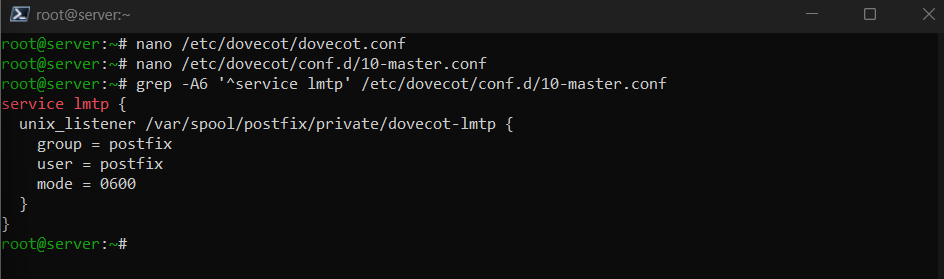
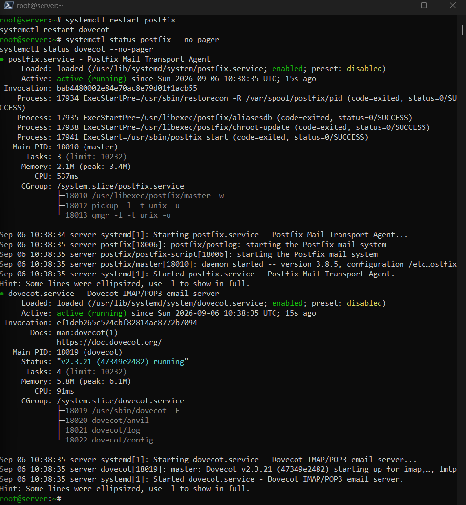
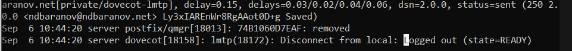
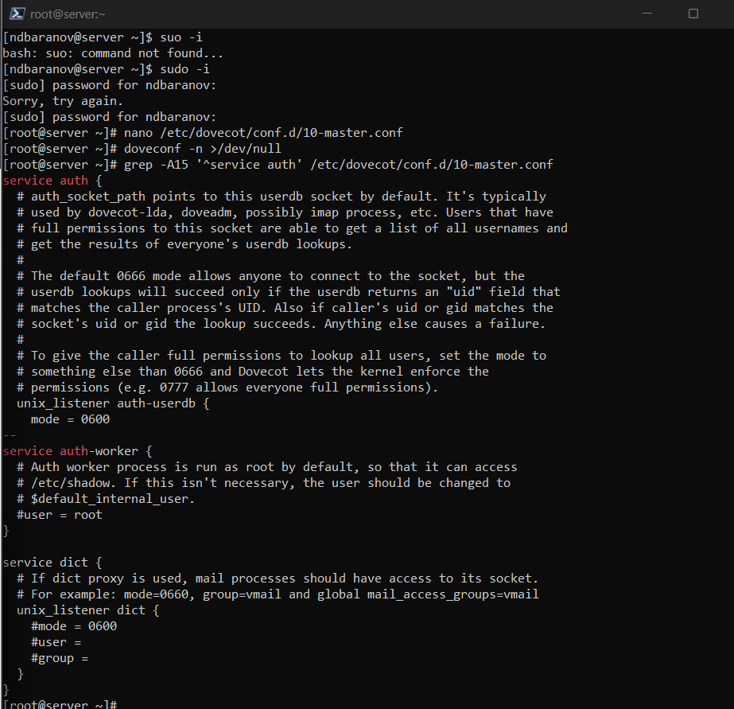
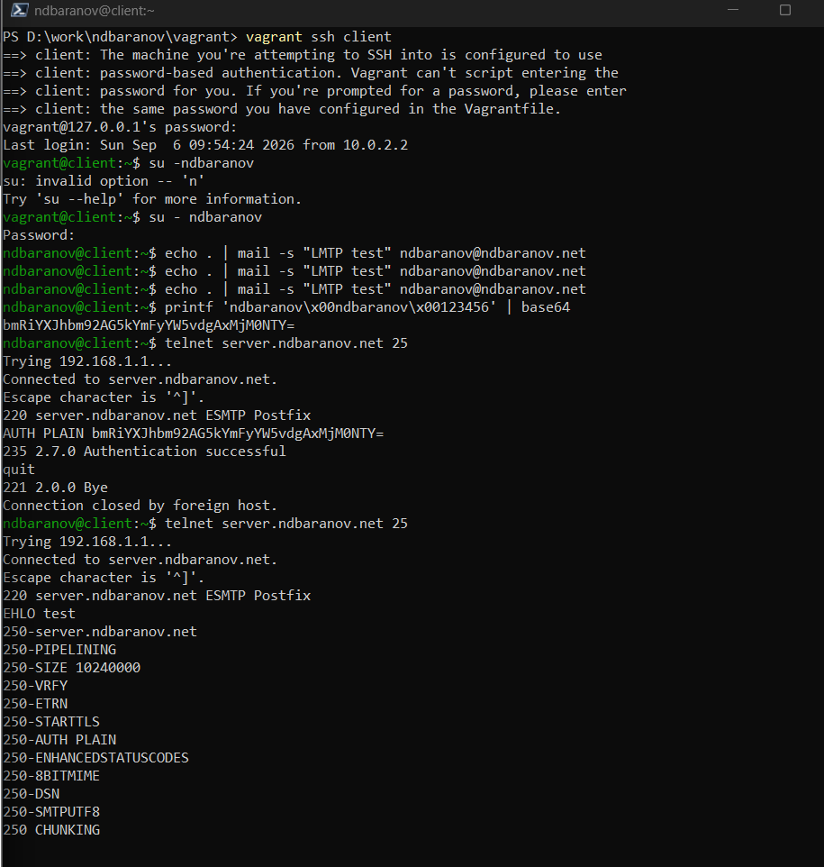
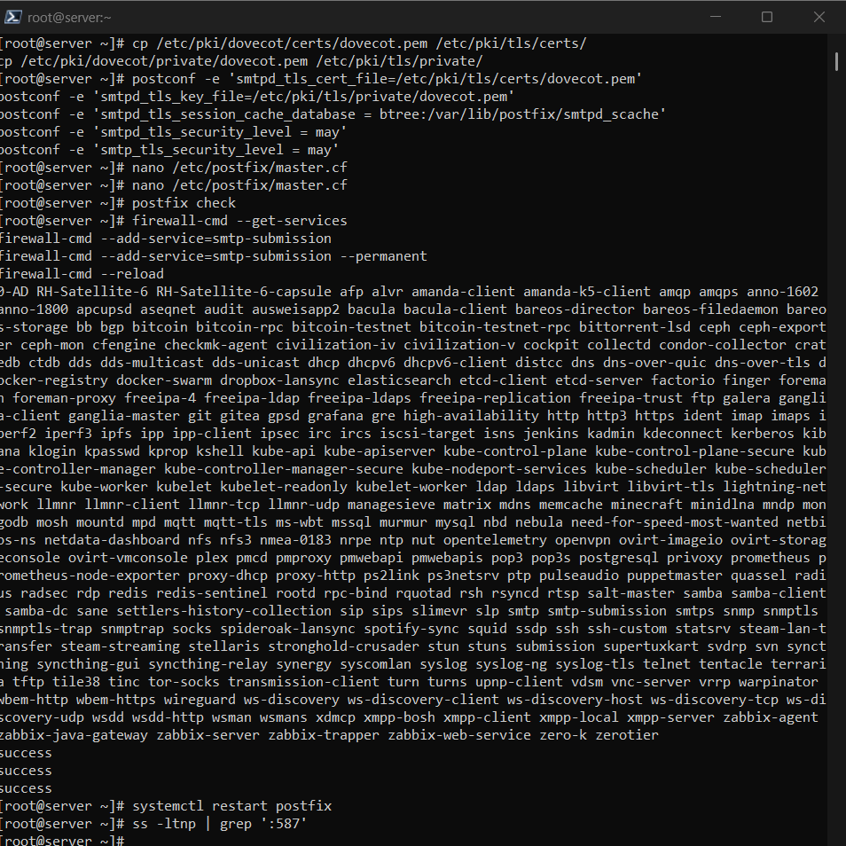
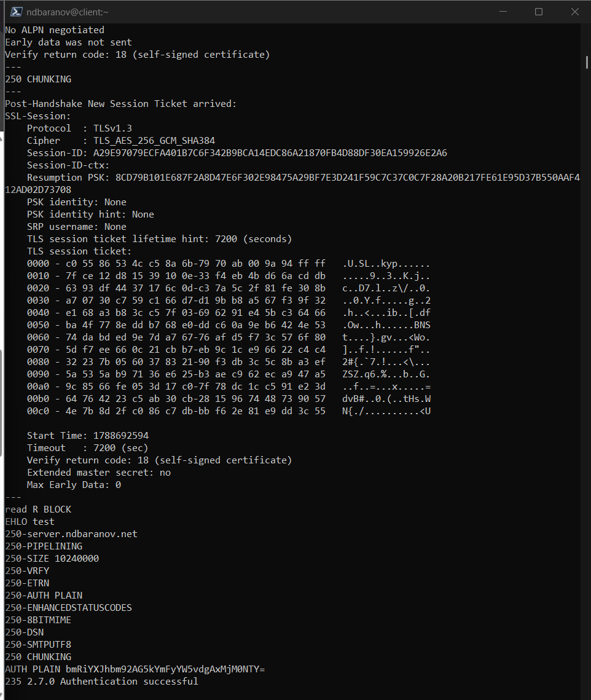
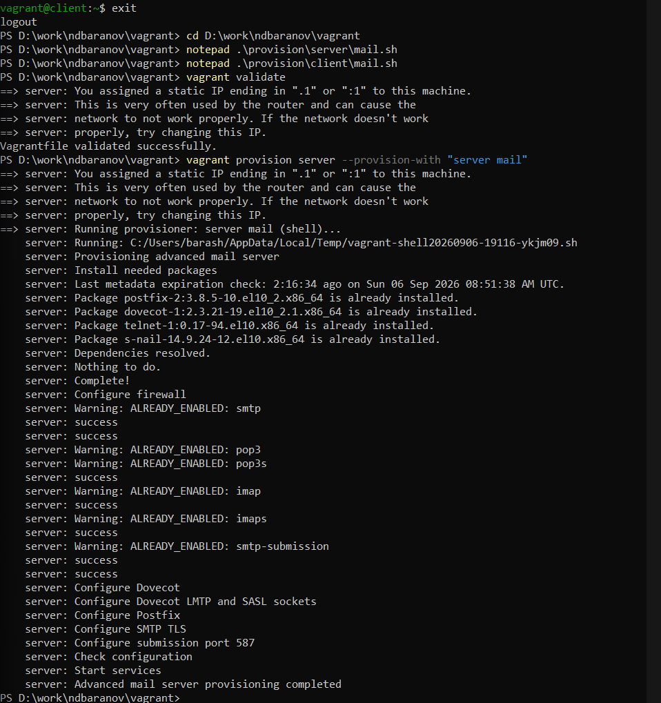

---
author:
  name: Баранов Никита Дмитриевич
  email: 1132242977@rudn.ru
  affiliation:
    - name: Российский университет дружбы народов им. Патриса Лумумбы
      city: Москва
      country: Российская Федерация
title: "Лабораторная работа № 10"
subtitle: "Расширенная настройка SMTP-сервера"
license: CC BY
date: today
date-format: "YYYY-MM-DD"
---

# Информация

## Докладчик

:::::::::::::: {.columns align=center}
::: {.column width="70%"}

- Баранов Никита Дмитриевич
- Студент РУДН
- [1132242977@rudn.ru](mailto:1132242977@rudn.ru)

:::
::: {.column width="30%"}

:::
::::::::::::::

# Цель и задачи

## Цель работы

- Настроить интеграцию Postfix с Dovecot, LMTP, SMTP AUTH и TLS.

## Основные этапы

- В Dovecot включён LMTP и сокет /var/spool/postfix/private/dovecot-lmtp.
- Postfix переведён на доставку через LMTP; журнал показал status=sent.
- Письмо LMTP появилось в Maildir пользователя.
- В Dovecot настроен auth-сокет для Postfix.
- В Postfix включены SASL, TLS, сертификаты Dovecot и submission-сервис на 587/tcp.
- Проверка openssl s_client показала TLS-рукопожатие и SMTP AUTH LOGIN.
- Сценарий advanced-mail-server успешно завершил настройку.

# Ход работы

## Сокет Dovecot LMTP

- В Dovecot включён протокол LMTP и создан сокет внутри каталога Postfix.

{width=88%}

## Передача доставки в LMTP

- В main.cf Postfix параметр mailbox_transport переключён на dovecot-lmtp.

{width=88%}

## Успешная LMTP-доставка

- В почтовом журнале для тестового сообщения указан status=sent и транспорт LMTP.

{width=88%}

## Письмо в Maildir

- Файл доставленного сообщения появился в каталоге Maildir пользователя.

{width=88%}

## Auth-сокет для Postfix

- Dovecot создаёт private/auth с правами пользователя postfix.

{width=88%}

## Включение SMTP AUTH

- В Postfix активирован SASL через Dovecot и запрещена анонимная аутентификация.

{width=88%}

## TLS-сертификаты

- Для SMTP указаны сертификат и закрытый ключ Dovecot, включён STARTTLS.

{width=88%}

## Сервис submission

- В master.cf включён submission на порту 587 с обязательной аутентификацией.

{width=88%}

## TLS-рукопожатие openssl

- openssl s_client установил зашифрованное соединение и вывел сертификат сервера.

{width=88%}

## Проверка AUTH LOGIN

- В тестовом SMTP-сеансе сервер принял корректные учётные данные.

{width=88%}

## Автоматизация расширенной почты

- Сценарий advanced-mail-server последовательно применяет LMTP, SASL, TLS и submission.

{width=88%}

# Результаты

## Итоги работы

- Postfix и Dovecot объединены через LMTP и SASL, а submission защищён TLS. Проверка openssl подтверждает шифрованное SMTP-соединение и объявление AUTH.

## Спасибо за внимание
