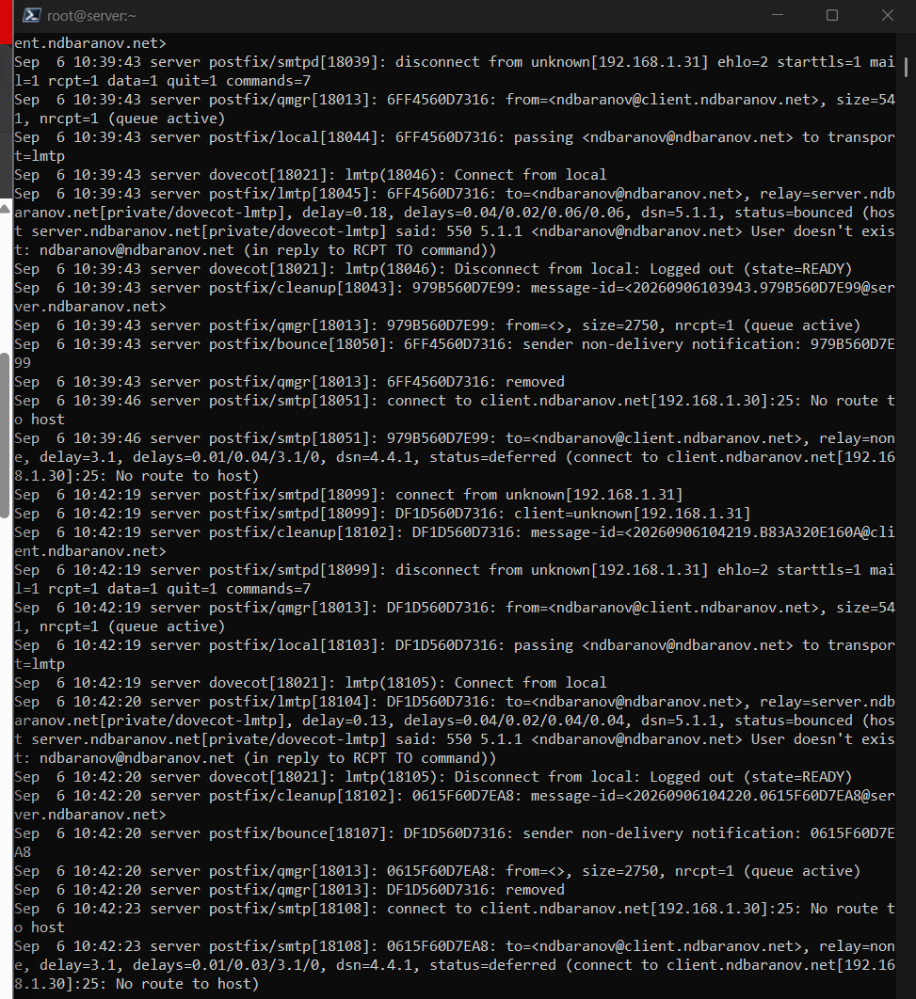
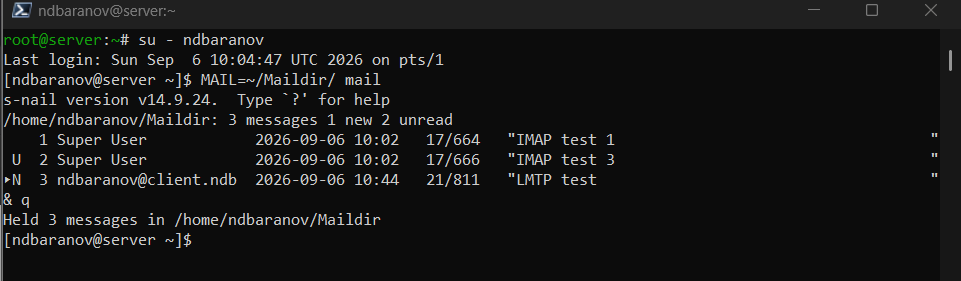
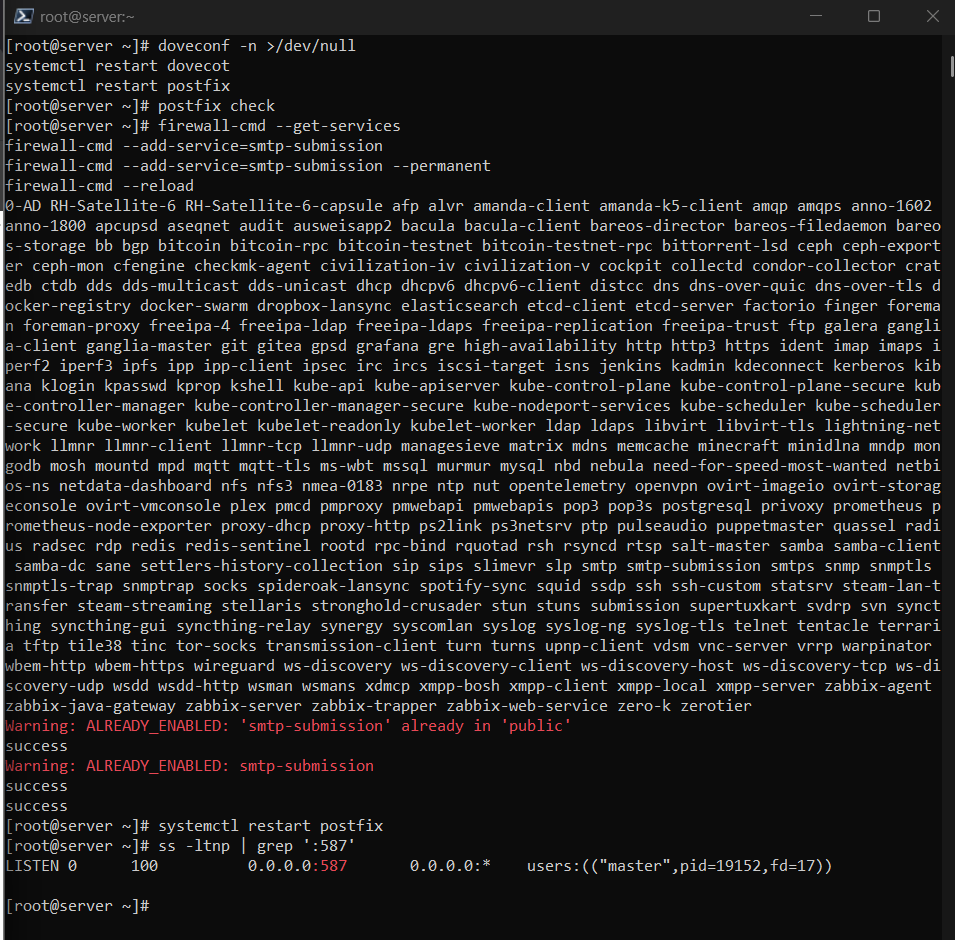

---
author:
  name: Баранов Никита Дмитриевич
  email: 1132242977@rudn.ru
  affiliation:
    - name: Российский университет дружбы народов им. Патриса Лумумбы
      city: Москва
      country: Российская Федерация
title: "Отчёт по лабораторной работе № 10"
subtitle: "Расширенная настройка SMTP-сервера"
license: CC BY
date: today
date-format: "YYYY-MM-DD"
---

# Цель работы

Настроить интеграцию Postfix с Dovecot, LMTP, SMTP AUTH и TLS.

# Задание

1. В Dovecot включён LMTP и сокет /var/spool/postfix/private/dovecot-lmtp.
2. Postfix переведён на доставку через LMTP; журнал показал status=sent.
3. Письмо LMTP появилось в Maildir пользователя.
4. В Dovecot настроен auth-сокет для Postfix.
5. В Postfix включены SASL, TLS, сертификаты Dovecot и submission-сервис на 587/tcp.
6. Проверка openssl s_client показала TLS-рукопожатие и SMTP AUTH LOGIN.
7. Сценарий advanced-mail-server успешно завершил настройку.

# Теоретические сведения

LMTP передаёт письма от MTA в локальное хранилище, SASL добавляет аутентификацию SMTP-клиента, а STARTTLS шифрует транспорт на порту 587.

# Выполнение работы

## Сокет Dovecot LMTP

На данном снимке Dovecot включён протокол LMTP и создан сокет внутри каталога Postfix. Через него MTA передаёт письма локальному агенту доставки.

LMTP работает как локальный транспорт доставки: Postfix принимает SMTP-сообщение, а затем передаёт его Dovecot через Unix-сокет. Размещение сокета внутри chroot-каталога Postfix и права пользователя postfix принципиальны: при неверном пути или владельце MTA не сможет подключиться к службе доставки.

{#fig-10-001 width=95%}

## Передача доставки в LMTP

На данном снимке main.cf Postfix параметр mailbox_transport переключён на dovecot-lmtp. Конфигурация связывает приём SMTP с хранением Dovecot.

Параметр mailbox_transport определяет дальнейший маршрут уже принятого письма. После изменения main.cf фактическое значение проверяется через postconf, потому что эта команда показывает применённую настройку с учётом всех файлов конфигурации.

{#fig-10-002 width=95%}

## Успешная LMTP-доставка

На данном снимке почтовом журнале для тестового сообщения указан status=sent и транспорт LMTP. Это подтверждает прохождение письма через новый маршрут.

Запись status=sent в журнале означает завершение передачи следующему компоненту, а упоминание dovecot-lmtp позволяет отличить новую схему от прямой локальной доставки Postfix. Одновременно идентификатор очереди связывает этапы обработки одного сообщения.

{#fig-10-003 width=95%}

## Письмо в Maildir

Файл доставленного сообщения появился в каталоге Maildir пользователя. Содержимое заголовков соответствует отправленному тесту.

Maildir хранит каждое сообщение отдельным файлом в каталогах new, cur и tmp. Появление файла в new подтверждает не только приём SMTP, но и успешную локальную доставку до почтового хранилища пользователя.

{#fig-10-004 width=95%}

## Auth-сокет для Postfix

Dovecot создаёт private/auth с правами пользователя postfix. Этот сокет используется SMTP-сервером для проверки имени и пароля.

SMTP AUTH в данной схеме использует механизм SASL Dovecot. Postfix обращается к private/auth, поэтому аутентификация выполняется единым набором учётных данных, а запрет anonymous исключает подключение без проверки пользователя.

{#fig-10-005 width=95%}

## Включение SMTP AUTH

На данном снимке Postfix активирован SASL через Dovecot и запрещена анонимная аутентификация. postconf показывает выбранный тип и путь сокета.

TLS защищает учётные данные и содержимое SMTP-сеанса. Сертификат и закрытый ключ должны читаться службами, а STARTTLS переводит уже установленное соединение в шифрованный режим после соответствующей команды клиента.

{#fig-10-006 width=95%}

## TLS-сертификаты

Для SMTP указаны сертификат и закрытый ключ Dovecot, включён STARTTLS. Проверка конфигурации не выявила ошибок доступа к файлам.

Порт 587 предназначен для отправки почты аутентифицированными клиентами. Отдельные параметры submission позволяют потребовать SASL и шифрование, не меняя правила обмена между почтовыми серверами на порту 25.

{#fig-10-007 width=95%}

## Сервис submission

На данном снимке master.cf включён submission на порту 587 с обязательной аутентификацией. Firewalld разрешает подключение почтовых клиентов к этому порту.

openssl s_client показывает сертификат, согласованный протокол и ответы SMTP после EHLO. Код 235 указывает, что AUTH LOGIN завершён успешно; это более содержательная проверка, чем простое наличие открытого TCP-порта.

{#fig-10-008 width=95%}

## TLS-рукопожатие openssl

openssl s_client установил зашифрованное соединение и вывел сертификат сервера. Команда EHLO показывает поддержку STARTTLS и AUTH.

Provision-сценарий фиксирует пакеты, изменения конфигурации, правила firewalld и перезапуски служб. Повторный запуск должен оставлять систему в том же состоянии, что подтверждает воспроизводимость настройки.

{#fig-10-009 width=95%}

## Проверка AUTH LOGIN

На данном снимке тестовом SMTP-сеансе сервер принял корректные учётные данные. Ответ 235 означает успешную аутентификацию клиента.

Provision-сценарий фиксирует пакеты, изменения конфигурации, правила firewalld и перезапуски служб. Повторный запуск должен оставлять систему в том же состоянии, что подтверждает воспроизводимость настройки.

{#fig-10-010 width=95%}

## Автоматизация расширенной почты

Сценарий advanced-mail-server последовательно применяет LMTP, SASL, TLS и submission. Его завершение подтверждает воспроизводимость настройки.

Provision-сценарий фиксирует пакеты, изменения конфигурации, правила firewalld и перезапуски служб. Повторный запуск должен оставлять систему в том же состоянии, что подтверждает воспроизводимость настройки.

{#fig-10-011 width=95%}

# Выводы

Postfix и Dovecot объединены через LMTP и SASL, а submission защищён TLS. Проверка openssl подтверждает шифрованное SMTP-соединение и объявление AUTH.
