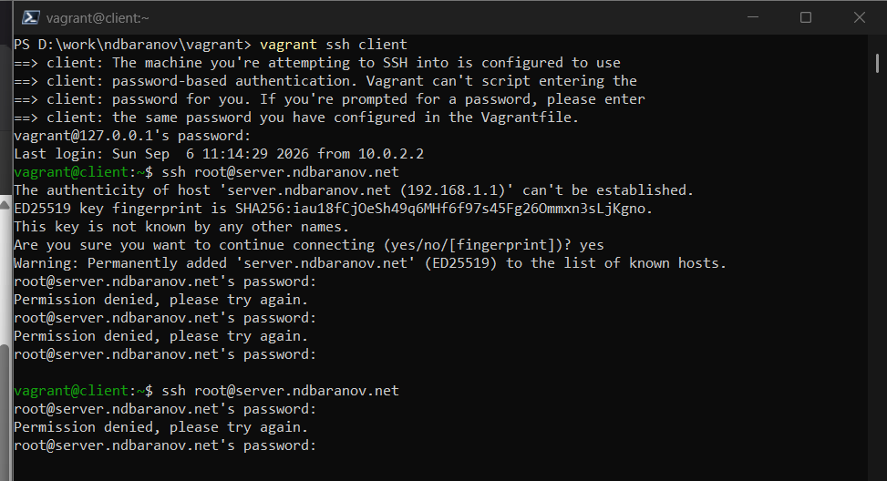
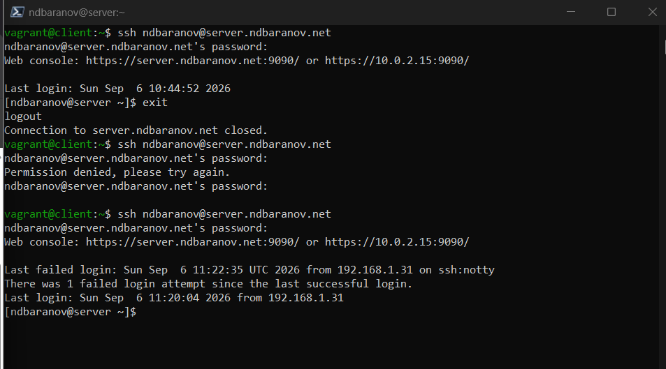
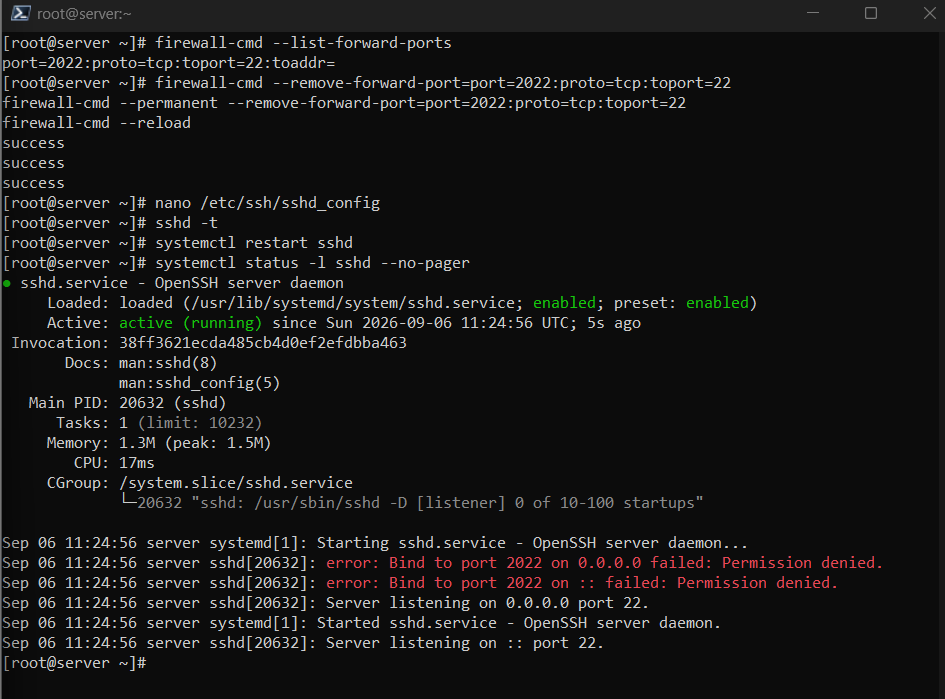
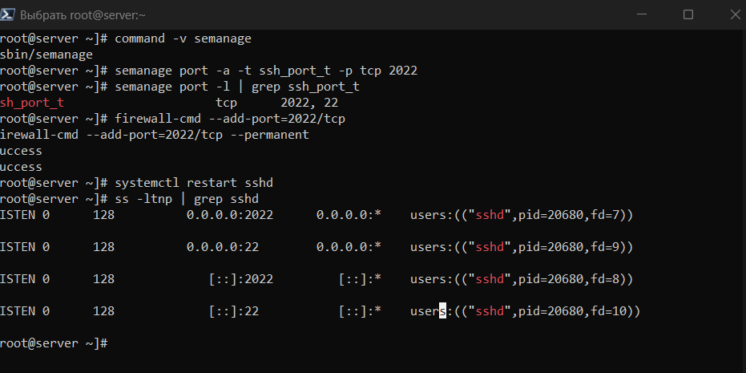
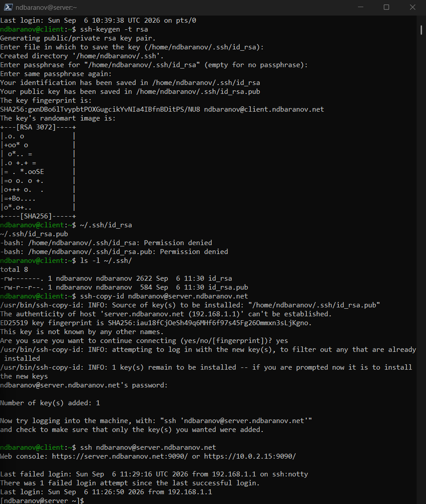
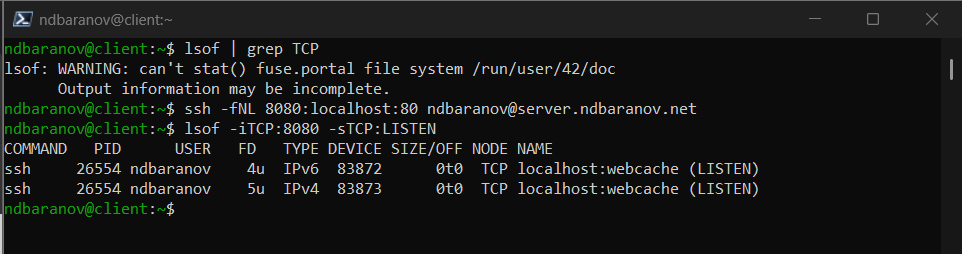
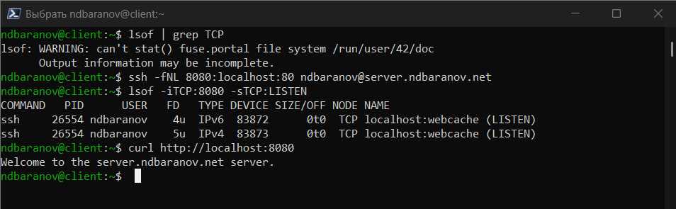
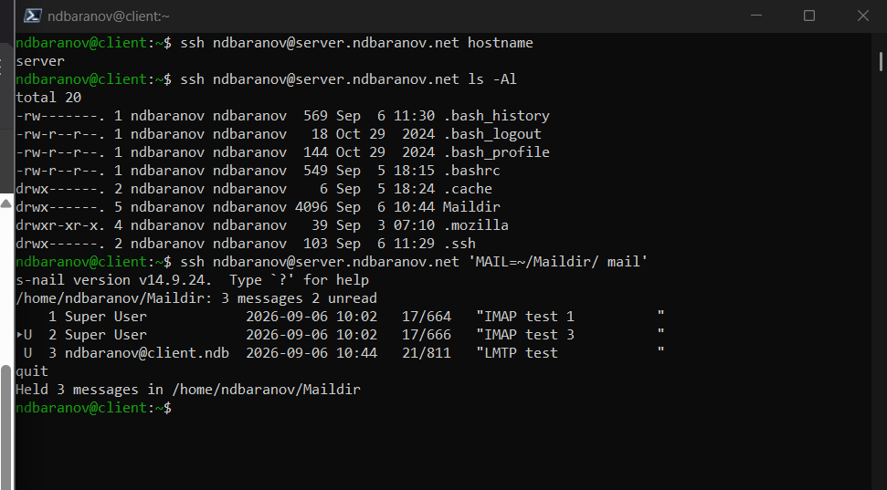
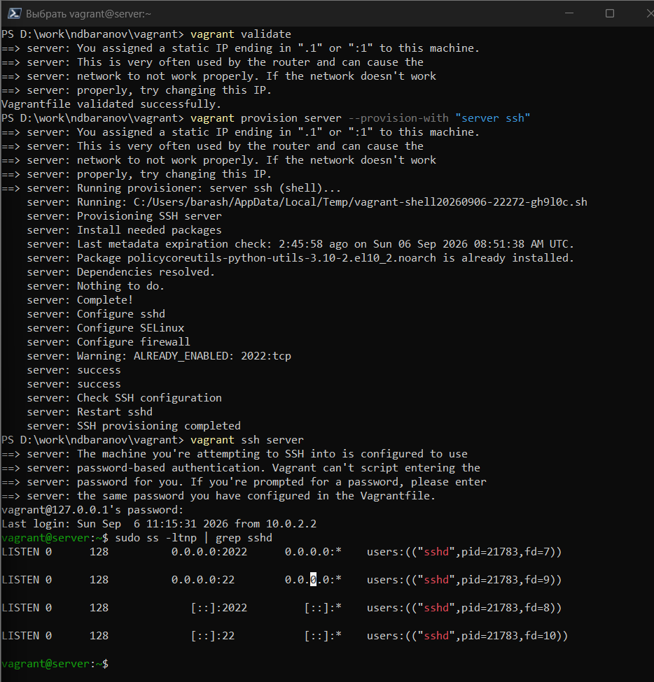

---
author:
  name: Баранов Никита Дмитриевич
  email: 1132242977@rudn.ru
  affiliation:
    - name: Российский университет дружбы народов им. Патриса Лумумбы
      city: Москва
      country: Российская Федерация
title: "Лабораторная работа № 11"
subtitle: "Настройка SSH-сервера"
license: CC BY
date: today
date-format: "YYYY-MM-DD"
---

# Информация

## Докладчик

:::::::::::::: {.columns align=center}
::: {.column width="70%"}

- Баранов Никита Дмитриевич
- Студент РУДН
- [1132242977@rudn.ru](mailto:1132242977@rudn.ru)

:::
::: {.column width="30%"}

:::
::::::::::::::

# Цель и задачи

## Цель работы

- Настроить безопасный удалённый доступ, ключевую аутентификацию и SSH-туннели.

## Основные этапы

- Проверены успешный и отклонённый входы по паролю.
- В sshd_config добавлен порт 2022; для SELinux порт помечен типом ssh_port_t.
- Порт 2022/tcp открыт в firewalld; ss подтвердил прослушивание 22 и 2022.
- Создана пара RSA-ключей; открытый ключ добавлен на сервер.
- Вход по ключу выполнен без запроса пароля.
- Локальный туннель 8080:localhost:80 дал клиенту доступ к веб-серверу.
- Vagrant provision воспроизвёл SSH-конфигурацию.

# Ход работы

## Успешный вход по паролю

- С client выполнено SSH-подключение к server с корректными учётными данными.

{width=88%}

## Отклонение неверного пароля

- Повторная попытка с ошибочным паролем завершается Permission denied.

{width=88%}

## Дополнительный порт sshd

- В sshd_config добавлен Port 2022 при сохранении стандартного порта 22.

{width=88%}

## Порт SSH в SELinux

- Командой semanage порт 2022 связан с типом ssh_port_t.

{width=88%}

## Правило firewalld

- TCP-порт 2022 разрешён в межсетевом экране.

{width=88%}

## Прослушивание портов

- Утилита ss показывает sshd на портах 22 и 2022.

{width=88%}

## Создание RSA-ключа

- На клиенте создана пара RSA-ключей.

{width=88%}

## Копирование открытого ключа

- ssh-copy-id добавил ключ в authorized_keys пользователя на server.

{width=88%}

## Вход без пароля

- Повторное подключение выполняется по открытому ключу без запроса пароля учётной записи.

{width=88%}

## Локальный SSH-туннель

- Создано перенаправление 8080:localhost:80 через SSH.

{width=88%}

## Проверка туннеля и provision

- Запрос к localhost:8080 возвращает страницу Apache, после чего provision-сценарий закрепляет SSH-настройки.

{width=88%}

# Результаты

## Итоги работы

- SSH принимает подключения на стандартном и дополнительном портах, поддерживает вход по ключу и локальное перенаправление портов к веб-службе.

## Спасибо за внимание
