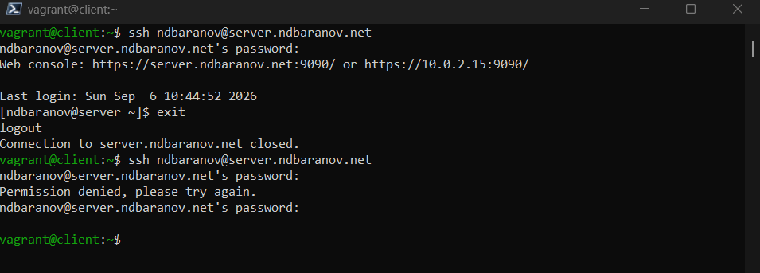
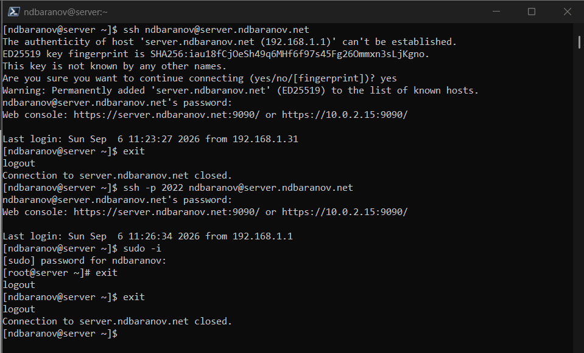

---
author:
  name: Баранов Никита Дмитриевич
  email: 1132242977@rudn.ru
  affiliation:
    - name: Российский университет дружбы народов им. Патриса Лумумбы
      city: Москва
      country: Российская Федерация
title: "Отчёт по лабораторной работе № 11"
subtitle: "Настройка SSH-сервера"
license: CC BY
date: today
date-format: "YYYY-MM-DD"
---

# Цель работы

Настроить безопасный удалённый доступ, ключевую аутентификацию и SSH-туннели.

# Задание

1. Проверены успешный и отклонённый входы по паролю.
2. В sshd_config добавлен порт 2022; для SELinux порт помечен типом ssh_port_t.
3. Порт 2022/tcp открыт в firewalld; ss подтвердил прослушивание 22 и 2022.
4. Создана пара RSA-ключей; открытый ключ добавлен на сервер.
5. Вход по ключу выполнен без запроса пароля.
6. Локальный туннель 8080:localhost:80 дал клиенту доступ к веб-серверу.
7. Vagrant provision воспроизвёл SSH-конфигурацию.

# Теоретические сведения

SSH обеспечивает шифрованный канал, контроль ключа хоста и аутентификацию паролем или ключом. Перенаправление портов переносит TCP-соединение через SSH-канал.

# Выполнение работы

## Успешный вход по паролю

С client выполнено SSH-подключение к server с корректными учётными данными. Приглашение оболочки подтверждает интерактивный вход.

SSH сначала проверяет ключ узла, затем создаёт шифрованный канал и только после этого выполняет аутентификацию пользователя. Получение приглашения удалённой оболочки означает, что все три стадии завершились успешно.

{#fig-11-001 width=95%}

## Отклонение неверного пароля

Повторная попытка входа с ошибочным паролем завершается Permission denied. Это показывает, что сервер не предоставляет доступ без аутентификации.

Отказ при неверном пароле является ожидаемой контрольной проверкой. Он показывает, что сервер не создаёт сеанс до успешной аутентификации и формирует событие, которое позднее может анализироваться средствами журналирования и Fail2ban.

{#fig-11-002 width=95%}

## Дополнительный порт sshd

На данном снимке sshd_config добавлен Port 2022 при сохранении стандартного порта 22. Проверка sshd -t подтверждает корректность файла.

sshd может одновременно прослушивать несколько директив Port. Перед перезапуском служебный режим sshd -t проверяет синтаксис и снижает риск потерять удалённый доступ из-за ошибочного файла.

{#fig-11-003 width=95%}

## Порт SSH в SELinux

Командой semanage порт 2022 связан с типом ssh_port_t. Без этого SELinux мог бы запретить sshd прослушивать нестандартный порт.

SELinux контролирует не только файлы, но и сетевые порты процессов. Назначение типа ssh_port_t разрешает домену sshd привязаться к 2022/tcp без отключения обязательного контроля доступа.

{#fig-11-004 width=95%}

## Правило firewalld

TCP-порт 2022 разрешён в межсетевом экране. Команда firewall-cmd выводит новое постоянное правило.

Разрешение порта в firewalld дополняет настройку sshd и SELinux. Рабочий сервис требует согласованности трёх уровней: процесс слушает сокет, политика SELinux допускает его, а межсетевой экран пропускает пакеты.

{#fig-11-005 width=95%}

## Прослушивание портов

Утилита ss показывает sshd на портах 22 и 2022. Таким образом подтверждена работа не только конфигурации, но и сетевого сокета.

Пара ключей состоит из закрытой и открытой частей. Закрытый ключ остаётся на клиенте, а authorized_keys на сервере хранит только открытую часть; сервер проверяет криптографическое доказательство владения закрытым ключом.

{#fig-11-006 width=95%}

## Создание RSA-ключа

На представленном снимке клиенте создана пара RSA-ключей. Закрытый ключ остаётся у пользователя, а открытая часть предназначена для сервера.

ssh-copy-id одновременно добавляет ключ и подготавливает корректные права ~/.ssh и authorized_keys. Слишком широкие права могут привести к отказу sshd использовать файл даже при верном содержимом.

{#fig-11-007 width=95%}

## Копирование открытого ключа

ssh-copy-id добавил ключ в authorized_keys пользователя на server. Права каталога .ssh сохранены безопасными.

При локальном перенаправлении параметр -L связывает локальный порт клиента с адресом и портом, доступными со стороны сервера. Поэтому запрос к localhost:8080 проходит внутри SSH-канала к HTTP-службе на порту 80.

{#fig-11-008 width=95%}

## Вход без пароля

Повторное подключение выполняется по открытому ключу без запроса пароля учётной записи. Сервер подтвердил владение соответствующим закрытым ключом.

При локальном перенаправлении параметр -L связывает локальный порт клиента с адресом и портом, доступными со стороны сервера. Поэтому запрос к localhost:8080 проходит внутри SSH-канала к HTTP-службе на порту 80.

{#fig-11-009 width=95%}

## Локальный SSH-туннель

Был создано перенаправление 8080:localhost:80 через SSH. Локальный порт клиента связан с HTTP-службой сервера внутри зашифрованного канала.

При локальном перенаправлении параметр -L связывает локальный порт клиента с адресом и портом, доступными со стороны сервера. Поэтому запрос к localhost:8080 проходит внутри SSH-канала к HTTP-службе на порту 80.

{#fig-11-010 width=95%}

## Проверка туннеля и provision

Запрос к localhost:8080 возвращает страницу Apache, после чего provision-сценарий закрепляет SSH-настройки. Туннель доказал практическую работу перенаправления.

При локальном перенаправлении параметр -L связывает локальный порт клиента с адресом и портом, доступными со стороны сервера. Поэтому запрос к localhost:8080 проходит внутри SSH-канала к HTTP-службе на порту 80.

{#fig-11-011 width=95%}

# Выводы

SSH принимает подключения на стандартном и дополнительном портах, поддерживает вход по ключу и локальное перенаправление портов к веб-службе.
