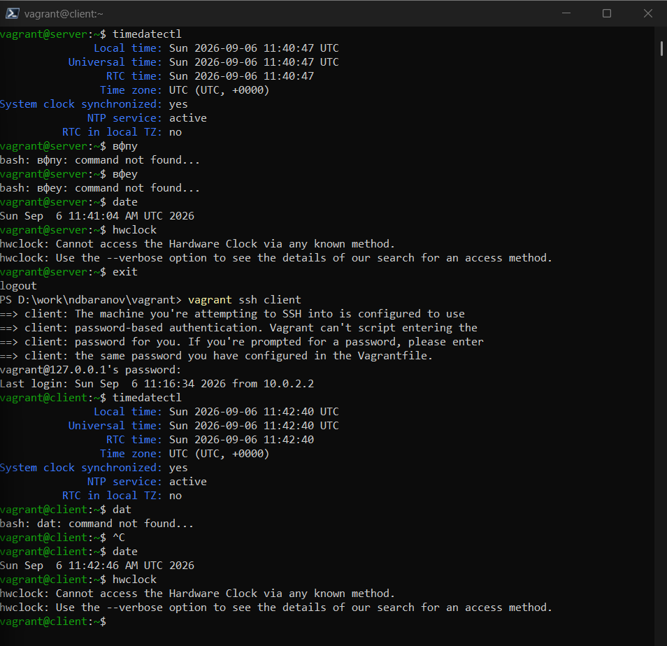
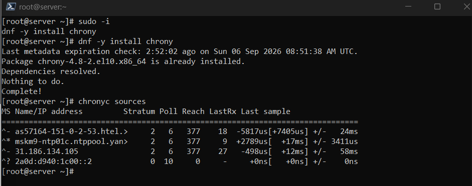
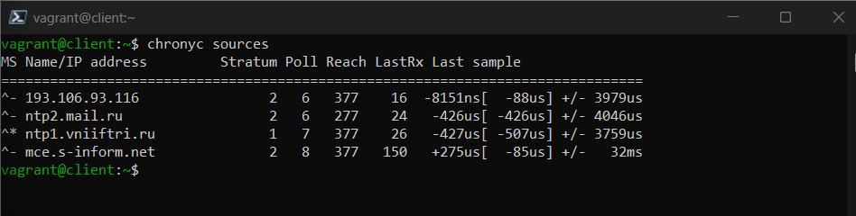
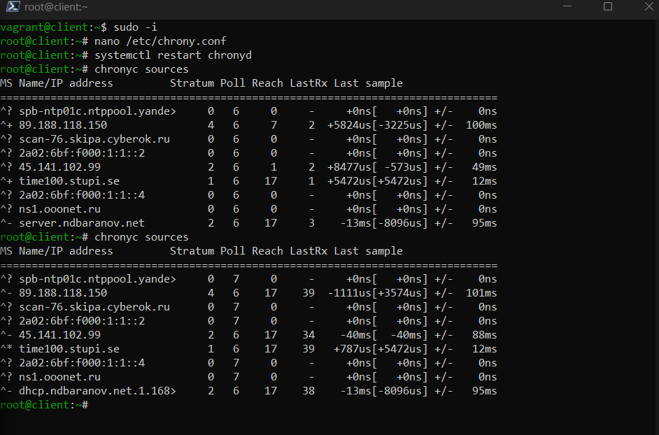
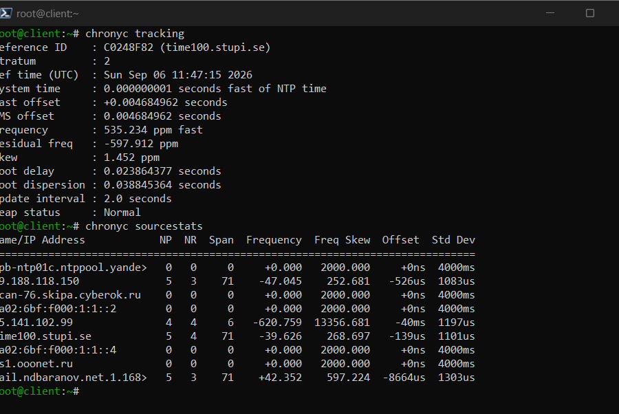
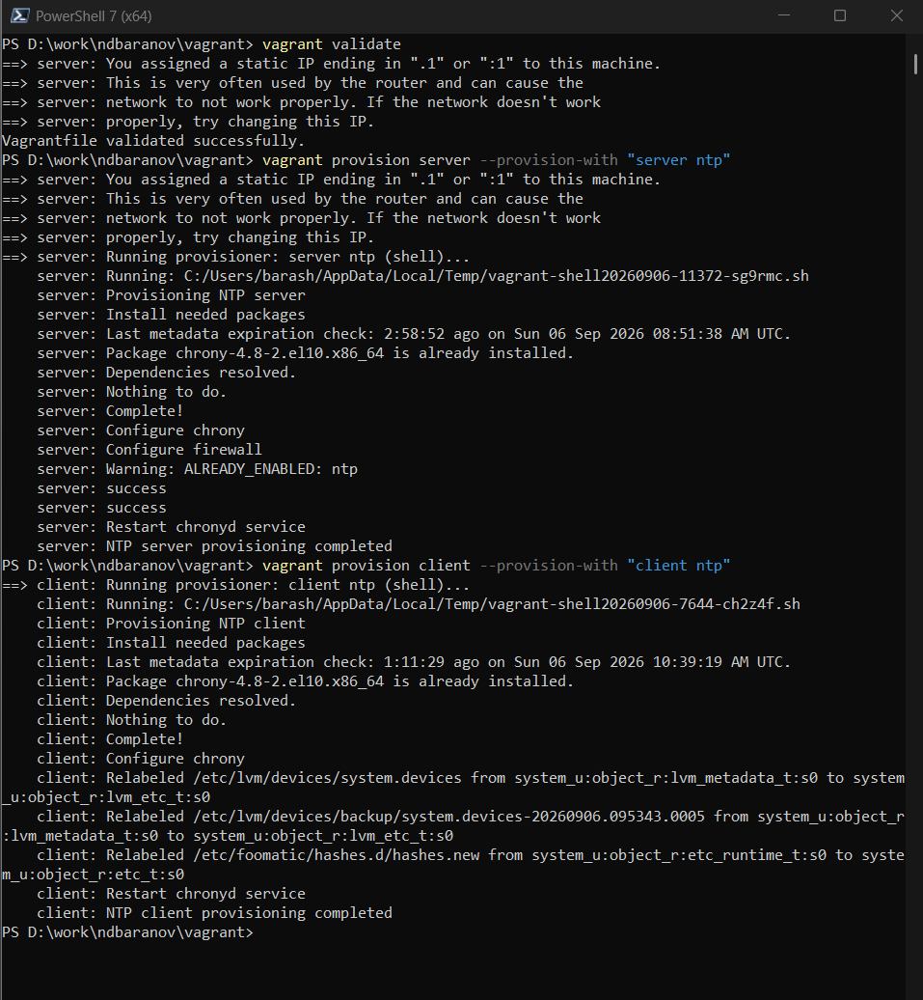

---
author:
  name: Баранов Никита Дмитриевич
  email: 1132242977@rudn.ru
  affiliation:
    - name: Российский университет дружбы народов им. Патриса Лумумбы
      city: Москва
      country: Российская Федерация
title: "Лабораторная работа № 12"
subtitle: "Настройка службы времени NTP"
license: CC BY
date: today
date-format: "YYYY-MM-DD"
---

# Информация

## Докладчик

:::::::::::::: {.columns align=center}
::: {.column width="70%"}

- Баранов Никита Дмитриевич
- Студент РУДН
- [1132242977@rudn.ru](mailto:1132242977@rudn.ru)

:::
::: {.column width="30%"}

:::
::::::::::::::

# Цель и задачи

## Цель работы

- Получить навыки синхронизации системного времени с помощью Chrony/NTP.

## Основные этапы

- Команды timedatectl и date подтвердили текущие часы и активность NTP.
- На server и client проверены источники chronyc sources.
- Сервер настроен на внешние пулы и раздачу времени внутренней сети; NTP открыт в firewalld.
- Клиент добавил server.ndbaranov.net как источник времени.
- chronyc tracking и sourcestats показали смещение, частотную поправку и статистику источников.
- Сценарии server-ntp и client-ntp успешно применены.

# Ход работы

## Исходное состояние времени

- Команды timedatectl и date показывают текущий часовой пояс, системное время и состояние синхронизации NTP на сервере.

{width=88%}

## Источники Chrony на сервере

- chronyc sources выводит доступные внешние серверы времени, их состояние и измеренное смещение.

{width=88%}

## Конфигурация NTP-сервера

- В chrony.conf заданы внешние источники и разрешена выдача времени лабораторной подсети.

{width=88%}

## Открытие NTP в firewalld

- В межсетевом экране разрешён сервис ntp.

{width=88%}

## Настройка клиента Chrony

- На client в качестве предпочтительного источника указан server.ndbaranov.net.

{width=88%}

## Проверка источника клиента

- chronyc sources на клиенте показывает лабораторный server среди активных источников.

{width=88%}

## Статистика синхронизации

- Команды tracking и sourcestats выводят смещение часов, частотную поправку и качество измерений.

{width=88%}

## Provision Chrony

- Сценарии server-ntp и client-ntp повторно применяют роли сервера и клиента.

{width=88%}

# Результаты

## Итоги работы

- Chrony синхронизирует часы сервера с внешними источниками и раздаёт время клиенту. Команды sources, tracking и sourcestats подтверждают выбор источника и величину поправки.

## Спасибо за внимание
