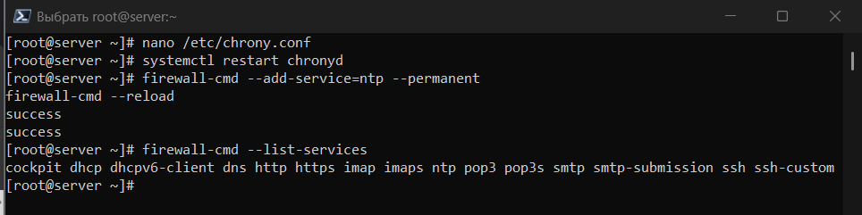
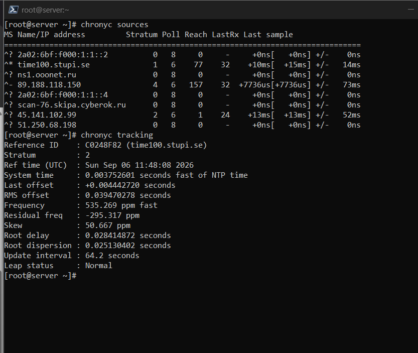

---
author:
  name: Баранов Никита Дмитриевич
  email: 1132242977@rudn.ru
  affiliation:
    - name: Российский университет дружбы народов им. Патриса Лумумбы
      city: Москва
      country: Российская Федерация
title: "Отчёт по лабораторной работе № 12"
subtitle: "Настройка службы времени NTP"
license: CC BY
date: today
date-format: "YYYY-MM-DD"
---

# Цель работы

Получить навыки синхронизации системного времени с помощью Chrony/NTP.

# Задание

1. Команды timedatectl и date подтвердили текущие часы и активность NTP.
2. На server и client проверены источники chronyc sources.
3. Сервер настроен на внешние пулы и раздачу времени внутренней сети; NTP открыт в firewalld.
4. Клиент добавил server.ndbaranov.net как источник времени.
5. chronyc tracking и sourcestats показали смещение, частотную поправку и статистику источников.
6. Сценарии server-ntp и client-ntp успешно применены.

# Теоретические сведения

NTP оценивает задержку и смещение часов по нескольким источникам. Chrony корректирует время плавно и может работать как клиент и сервер.

# Выполнение работы

## Исходное состояние времени

После выполнения команд timedatectl и date показывают текущий часовой пояс, системное время и состояние синхронизации NTP на сервере.

Системные часы, аппаратные часы, часовой пояс и статус синхронизации являются разными характеристиками. timedatectl объединяет их в одном выводе и позволяет убедиться, что служба NTP действительно управляет системным временем.

{#fig-12-001 width=95%}

## Источники Chrony на сервере

chronyc sources выводит доступные внешние серверы времени, их состояние и измеренное смещение. Выбранный источник отмечается символом ^*.

В chronyc sources символ ^ обозначает серверный источник, звёздочка отмечает выбранный источник, а знак вопроса — пока непригодный. Столбец Reach хранит восьмеричную историю ответов и помогает оценить устойчивость связи.

{#fig-12-002 width=95%}

## Конфигурация NTP-сервера

На данном снимке chrony.conf заданы внешние источники и разрешена выдача времени лабораторной подсети. Сервер может обслуживать client как локальный NTP-источник.

Директива allow ограничивает сети, которым сервер Chrony выдаёт время. Благодаря этому узел становится NTP-сервером для лабораторного сегмента, не открывая услугу произвольным внешним клиентам.

{#fig-12-003 width=95%}

## Открытие NTP в firewalld

На данном снимке межсетевом экране разрешён сервис ntp. После перезапуска chronyd сервер доступен по UDP-порту 123.

NTP использует UDP/123, поэтому разрешение именно сервиса ntp в firewalld должно присутствовать в активной зоне интерфейса. Перезагрузка правил делает постоянную настройку действующей немедленно.

{#fig-12-004 width=95%}

## Настройка клиента Chrony

На представленном снимке client в качестве предпочтительного источника указан server.ndbaranov.net. Старые внешние источники не мешают контролируемой проверке локального сервера.

На клиенте локальный server задаётся как источник времени, после чего chronyd выполняет несколько измерений задержки и смещения. Выбор источника происходит не мгновенно: службе нужна статистика, чтобы исключить нестабильные измерения.

{#fig-12-005 width=95%}

## Проверка источника клиента

chronyc sources на клиенте показывает лабораторный server среди активных источников. Значения reach подтверждают регулярный обмен пакетами.

tracking показывает текущую оценку смещения, частотную коррекцию и качество синхронизации, а sourcestats — накопленную статистику каждого источника. Эти команды подтверждают не только сетевую доступность, но и фактическую корректировку часов.

{#fig-12-006 width=95%}

## Статистика синхронизации

После выполнения команд tracking и sourcestats выводят смещение часов, частотную поправку и качество измерений. Малое смещение означает устойчивую синхронизацию.

Автоматизация разделена на серверную и клиентскую роли, поскольку их chrony.conf и правила firewalld различаются. Повторное применение проверяет запуск службы и итоговый набор источников.

{#fig-12-007 width=95%}

## Provision Chrony

Сценарии server-ntp и client-ntp повторно применяют роли сервера и клиента. Финальный вывод подтверждает запуск chronyd на обоих узлах.

Автоматизация разделена на серверную и клиентскую роли, поскольку их chrony.conf и правила firewalld различаются. Повторное применение проверяет запуск службы и итоговый набор источников.

{#fig-12-008 width=95%}

# Выводы

Chrony синхронизирует часы сервера с внешними источниками и раздаёт время клиенту. Команды sources, tracking и sourcestats подтверждают выбор источника и величину поправки.
