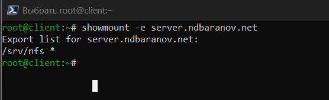
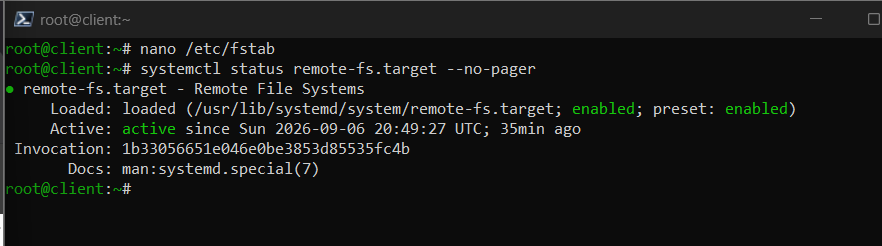
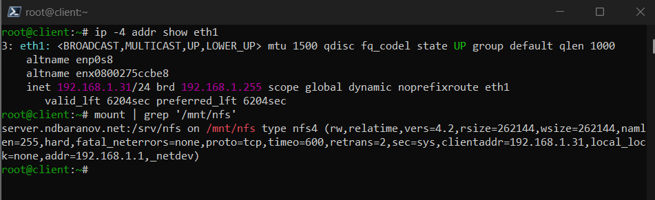
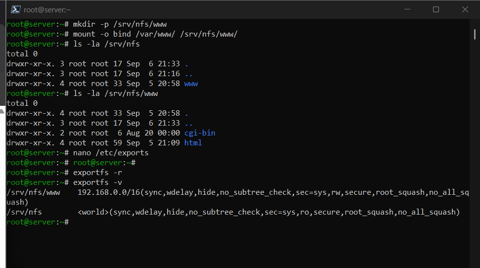
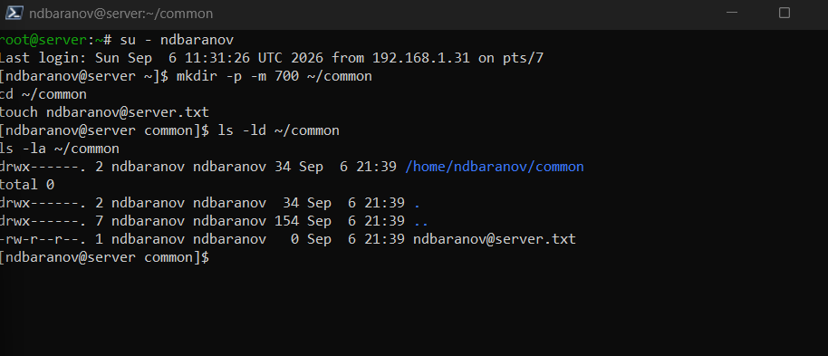
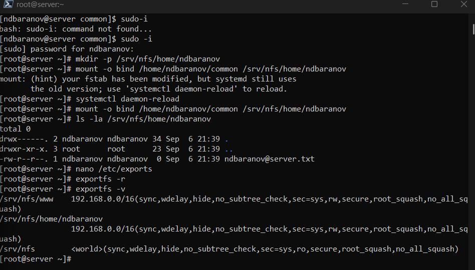
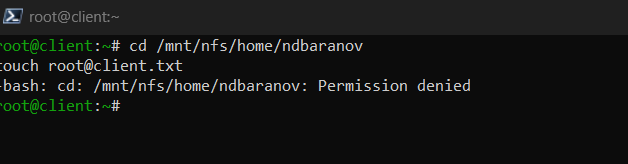
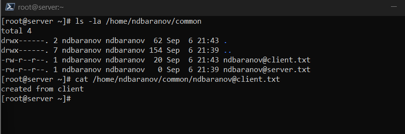

---
author:
  name: Баранов Никита Дмитриевич
  email: 1132242977@rudn.ru
  affiliation:
    - name: Российский университет дружбы народов им. Патриса Лумумбы
      city: Москва
      country: Российская Федерация
title: "Лабораторная работа № 13"
subtitle: "Настройка файловых служб NFS"
license: CC BY
date: today
date-format: "YYYY-MM-DD"
---

# Информация

## Докладчик

:::::::::::::: {.columns align=center}
::: {.column width="70%"}

- Баранов Никита Дмитриевич
- Студент РУДН
- [1132242977@rudn.ru](mailto:1132242977@rudn.ru)

:::
::: {.column width="30%"}

:::
::::::::::::::

# Цель и задачи

## Цель работы

- Настроить NFSv4, подключить общие каталоги и автоматизировать монтирование.

## Основные этапы

- Установлены nfs-utils, создан /srv/nfs, запущен nfs-server.
- Ресурс /srv/nfs экспортирован; showmount показал экспорт на клиенте.
- Клиент смонтировал server.ndbaranov.net:/srv/nfs в /mnt/nfs; mount показал NFSv4.
- Запись /etc/fstab обеспечила автоматическое монтирование.
- Каталог веб-сервера подключён к /srv/nfs/www и доступен клиенту.
- Домашний каталог common экспортирован с сохранением UID/GID; файлы создаются на обоих сторонах.
- Vagrant provision автоматизировал сервер и клиент NFS.

# Ход работы

## Установка NFS

- На server установлен nfs-utils, создан корневой каталог /srv/nfs и запущена служба nfs-server.

{width=88%}

## Первый экспорт

- Каталог /srv/nfs добавлен в /etc/exports для внутренней сети.

{width=88%}

## Просмотр экспортов

- На клиенте команда showmount -e server.ndbaranov.net выводит опубликованный каталог.

{width=88%}

## Ручное монтирование

- Удалённый ресурс подключён к /mnt/nfs.

{width=88%}

## Проверка общего файла

- Файл, созданный на одной стороне, виден на другой.

{width=88%}

## Автомонтирование через fstab

- В /etc/fstab добавлена запись NFS с сетевыми параметрами.

{width=88%}

## Проверка повторного подключения

- После размонтирования ресурс снова подключён средствами fstab.

{width=88%}

## Подключение веб-каталога

- Каталог контента Apache включён в дерево NFS с помощью bind mount.

{width=88%}

## Доступ к контенту Apache

- На клиенте через NFS открыт файл веб-страницы.

{width=88%}

## Общий домашний каталог

- Создан каталог common и согласованы UID/GID пользователя на server и client.

{width=88%}

## Экспорт домашнего каталога

- Домашний каталог добавлен в exports и опубликован.

{width=88%}

## Монтирование common

- Новый экспорт подключён на client.

{width=88%}

## Запись с серверной стороны

- Созданный на server файл немедленно отображается на client.

{width=88%}

## Отказ при записи от root клиента

- Попытка root на client перейти в экспортированный домашний каталог завершается Permission denied.

{width=88%}

## Проверка файла после записи пользователем

- На server видны файлы ndbaranov@server.txt и ndbaranov@client.txt, а содержимое клиентского файла успешно читается.

{width=88%}

## Автоматизация NFS

- Provision-сценарии настраивают экспорт, каталоги и fstab для обоих узлов.

{width=88%}

# Результаты

## Итоги работы

- NFSv4 предоставляет клиенту общий каталог, веб-контент и домашние данные. Проверены ручное и автоматическое монтирование, доступ и согласованность UID/GID.

## Спасибо за внимание
