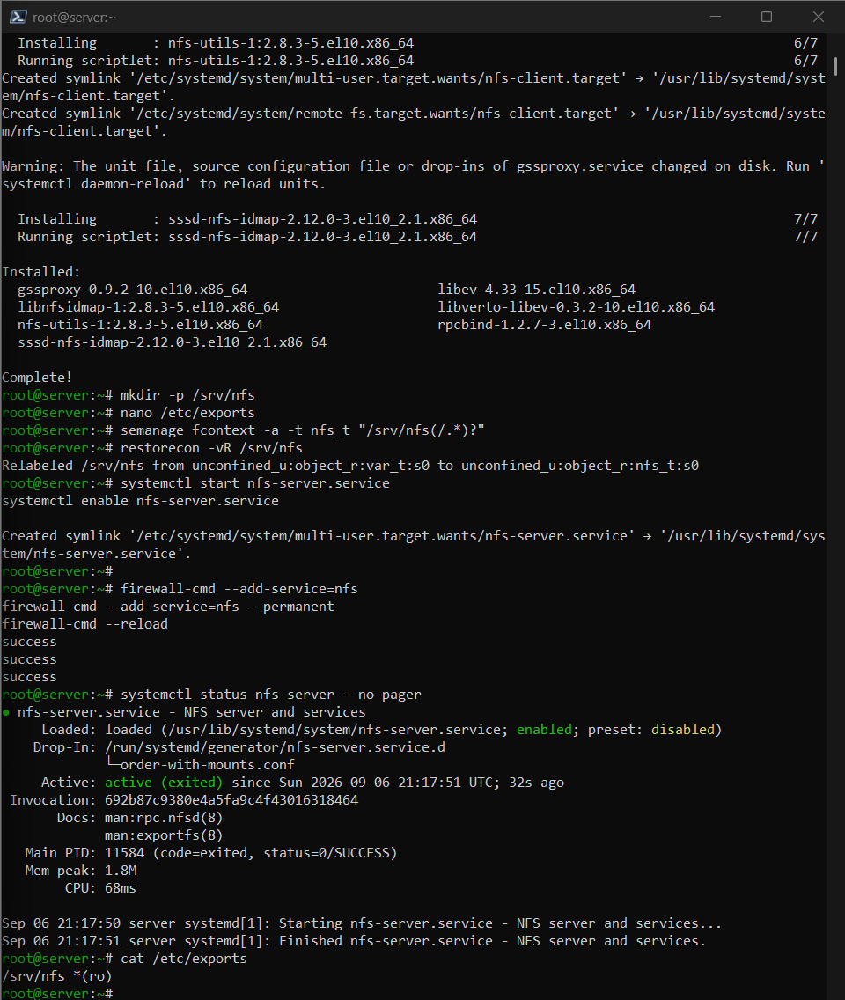
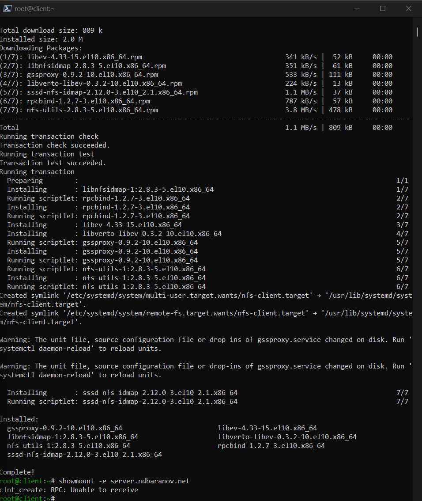
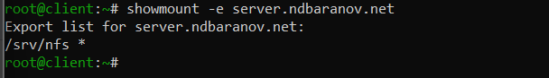
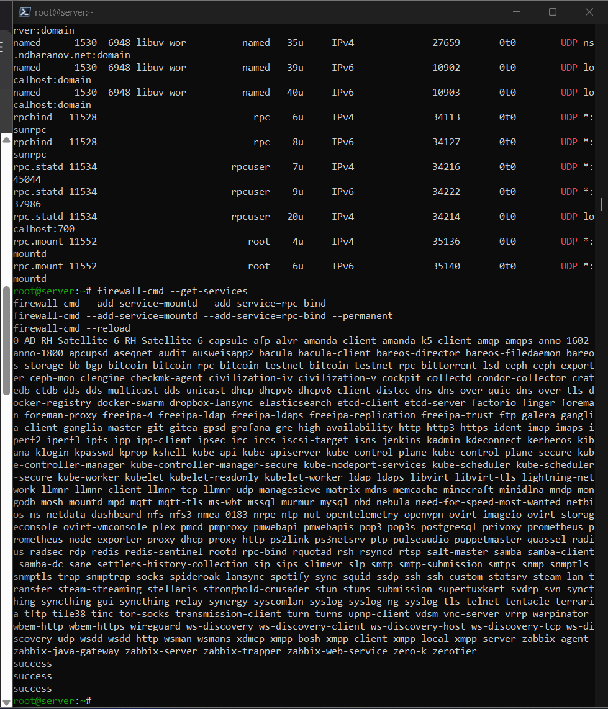
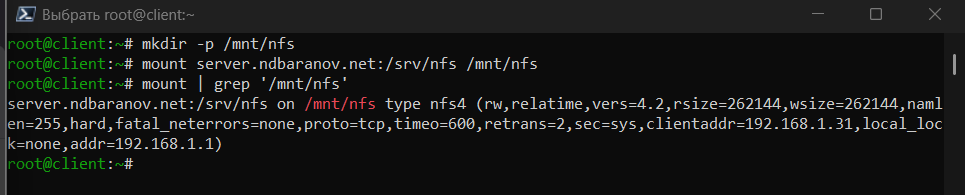
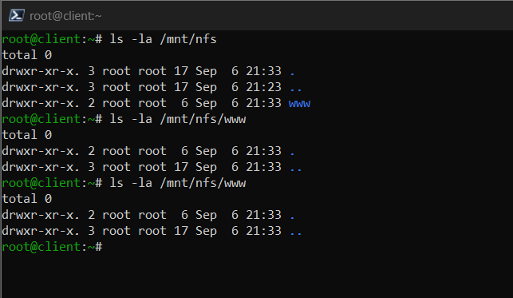
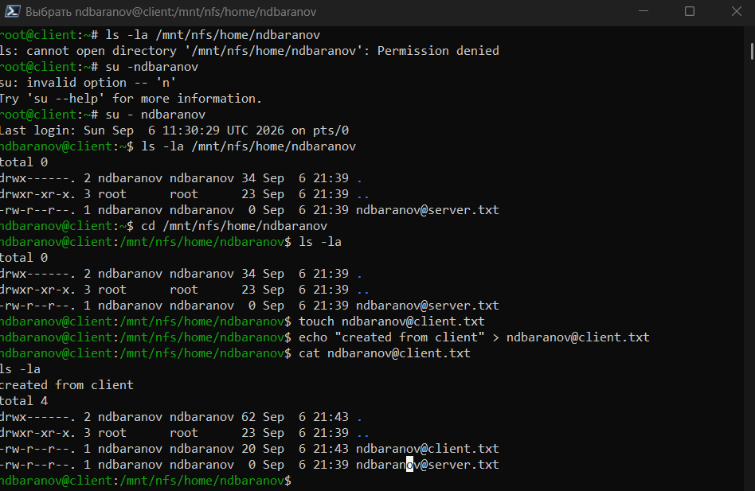
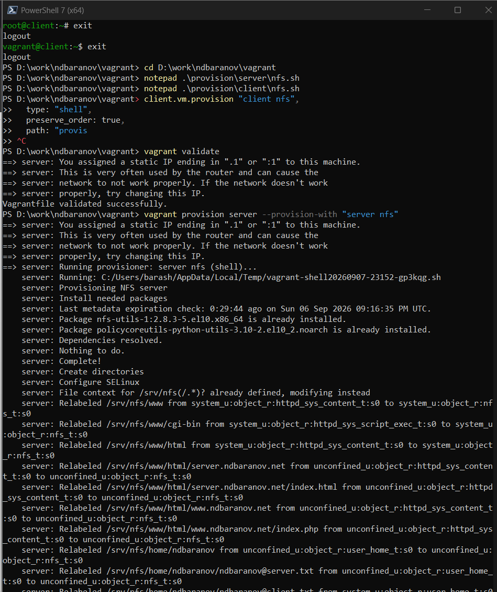

---
author:
  name: Баранов Никита Дмитриевич
  email: 1132242977@rudn.ru
  affiliation:
    - name: Российский университет дружбы народов им. Патриса Лумумбы
      city: Москва
      country: Российская Федерация
title: "Отчёт по лабораторной работе № 13"
subtitle: "Настройка файловых служб NFS"
license: CC BY
date: today
date-format: "YYYY-MM-DD"
---

# Цель работы

Настроить NFSv4, подключить общие каталоги и автоматизировать монтирование.

# Задание

1. Установлены nfs-utils, создан /srv/nfs, запущен nfs-server.
2. Ресурс /srv/nfs экспортирован; showmount показал экспорт на клиенте.
3. Клиент смонтировал server.ndbaranov.net:/srv/nfs в /mnt/nfs; mount показал NFSv4.
4. Запись /etc/fstab обеспечила автоматическое монтирование.
5. Каталог веб-сервера подключён к /srv/nfs/www и доступен клиенту.
6. Домашний каталог common экспортирован с сохранением UID/GID; файлы создаются на обоих сторонах.
7. Vagrant provision автоматизировал сервер и клиент NFS.

# Теоретические сведения

NFS даёт клиенту доступ к удалённому каталогу как к части локального дерева. /etc/exports задаёт пути, сети и права; bind mount включает уже существующий каталог в дерево экспорта.

# Выполнение работы

## Установка NFS

На представленном снимке server установлен nfs-utils, создан корневой каталог /srv/nfs и запущена служба nfs-server. systemctl подтверждает активное состояние.

NFS экспортирует каталог сервера как удалённую файловую систему. Пакет nfs-utils содержит серверные и клиентские утилиты, а nfs-server запускает необходимые RPC-компоненты и обработку запросов NFSv4.

{#fig-13-001 width=95%}

## Первый экспорт

Каталог /srv/nfs добавлен в /etc/exports для внутренней сети. exportfs применяет правило без перезагрузки сервера.

Файл /etc/exports задаёт путь, разрешённую сеть и параметры доступа. exportfs -ra перечитывает правила без перезагрузки ОС, а exportfs -v позволяет увидеть их итоговое представление.

{#fig-13-002 width=95%}

## Просмотр экспортов

На представленном снимке клиенте команда showmount -e server.ndbaranov.net выводит опубликованный каталог. Значит, клиент видит службу и разрешённый ресурс.

showmount проверяет публикацию ресурса до монтирования. Успешный список экспортов подтверждает разрешение имени, сетевую доступность сервера и наличие правила для клиентской сети.

{#fig-13-003 width=95%}

## Ручное монтирование

Удалённый ресурс подключён к /mnt/nfs. Команды mount и df показывают файловую систему NFS на клиентской точке монтирования.

После mount каталог /mnt/nfs становится точкой входа в удалённую файловую систему. Вывод mount или findmnt показывает адрес сервера, экспортированный путь, тип nfs4 и применённые параметры.

{#fig-13-004 width=95%}

## Проверка общего файла

Файл, созданный на одной стороне, виден на другой. Это подтверждает, что оба узла работают с одним экспортированным каталогом.

Общий файл используется как функциональная проверка: изменение выполняется на одном узле, а чтение — на другом. Это позволяет отличить реальное NFS-монтирование от случайной работы с локальным пустым каталогом.

{#fig-13-005 width=95%}

## Автомонтирование через fstab

На данном снимке /etc/fstab добавлена запись NFS с сетевыми параметрами. mount -a применяет её без ошибок и обеспечивает подключение после загрузки.

Запись в /etc/fstab делает подключение постоянным. Сетевые опции должны учитывать доступность сервера при загрузке, а mount -a позволяет проверить синтаксис записи до перезапуска машины.

{#fig-13-006 width=95%}

## Проверка повторного подключения

После размонтирования ресурс снова подключён средствами fstab. Список монтирований подтверждает правильность постоянной записи.

Bind mount включает каталог веб-сервера в экспортируемое дерево без копирования данных. Клиент получает те же файлы, которые Apache использует как DocumentRoot, поэтому изменения остаются согласованными.

{#fig-13-007 width=95%}

## Подключение веб-каталога

Каталог контента Apache включён в дерево NFS с помощью bind mount. Это позволяет отдавать клиенту те же файлы, которые использует веб-сервер.

NFS передаёт числовые UID и GID, а не имена пользователей. Совпадение идентификаторов на server и client необходимо, чтобы владелец и права отображались одинаково на обеих сторонах.

{#fig-13-008 width=95%}

## Доступ к контенту Apache

На представленном снимке клиенте через NFS открыт файл веб-страницы. Содержимое совпадает с контентом, доступным по HTTP.

Механизм root_squash преобразует удалённого root в непривилегированную учётную запись. Ожидаемый Permission denied подтверждает, что суперпользователь клиента не получил неограниченные права на серверный экспорт.

{#fig-13-009 width=95%}

## Общий домашний каталог

Был создан каталог common и согласованы UID/GID пользователя на server и client. Совпадение идентификаторов важно для корректного отображения владельца.

Проверка записи от обычного пользователя демонстрирует требуемую модель доступа: согласованный UID может создавать файлы, а удалённый root ограничен. Это одновременно подтверждает доступность, права и защитные параметры экспорта.

{#fig-13-010 width=95%}

## Экспорт домашнего каталога

Домашний каталог добавлен в exports и опубликован. Клиент видит новый ресурс в списке экспортов.

Provision-сценарии создают каталоги, exports и fstab в определённом порядке. Такой порядок важен: монтирование клиента выполняется только после публикации ресурса и запуска серверной службы.

{#fig-13-011 width=95%}

## Монтирование common

Новый экспорт подключён на client. Права каталога показывают ожидаемого пользователя и группу, а не неизвестные числовые идентификаторы.

Provision-сценарии создают каталоги, exports и fstab в определённом порядке. Такой порядок важен: монтирование клиента выполняется только после публикации ресурса и запуска серверной службы.

{#fig-13-012 width=95%}

## Запись с серверной стороны

Был созданный на server файл немедленно отображается на client. NFS передаёт изменения через общий каталог.

Provision-сценарии создают каталоги, exports и fstab в определённом порядке. Такой порядок важен: монтирование клиента выполняется только после публикации ресурса и запуска серверной службы.

{#fig-13-013 width=95%}

## Отказ при записи от root клиента

Попытка root на client перейти в экспортированный домашний каталог завершается Permission denied. Это ожидаемое проявление root_squash: удалённый root не получает права локального суперпользователя сервера.

Provision-сценарии создают каталоги, exports и fstab в определённом порядке. Такой порядок важен: монтирование клиента выполняется только после публикации ресурса и запуска серверной службы.

{#fig-13-014 width=95%}

## Проверка файла после записи пользователем

На представленном снимке server видны файлы ndbaranov@server.txt и ndbaranov@client.txt, а содержимое клиентского файла успешно читается. Значит, запись работает от согласованной учётной записи, тогда как удалённый root ограничен.

Provision-сценарии создают каталоги, exports и fstab в определённом порядке. Такой порядок важен: монтирование клиента выполняется только после публикации ресурса и запуска серверной службы.

{#fig-13-015 width=95%}

## Автоматизация NFS

Provision-сценарии настраивают экспорт, каталоги и fstab для обоих узлов. Последний запуск завершает воспроизводимое развёртывание файловой службы.

Provision-сценарии создают каталоги, exports и fstab в определённом порядке. Такой порядок важен: монтирование клиента выполняется только после публикации ресурса и запуска серверной службы.

{#fig-13-016 width=95%}

# Выводы

NFSv4 предоставляет клиенту общий каталог, веб-контент и домашние данные. Проверены ручное и автоматическое монтирование, доступ и согласованность UID/GID.
