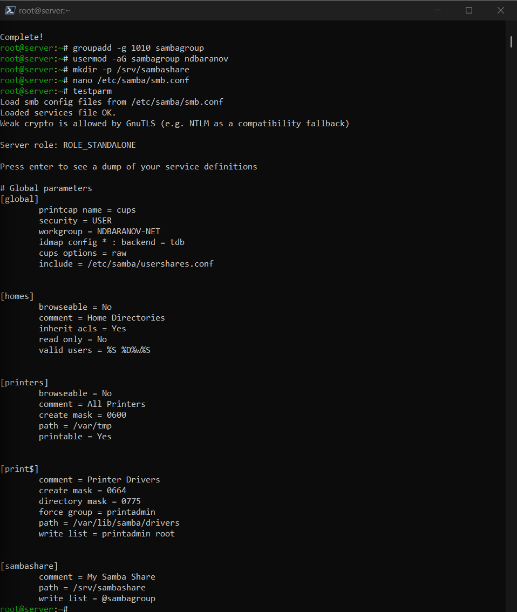
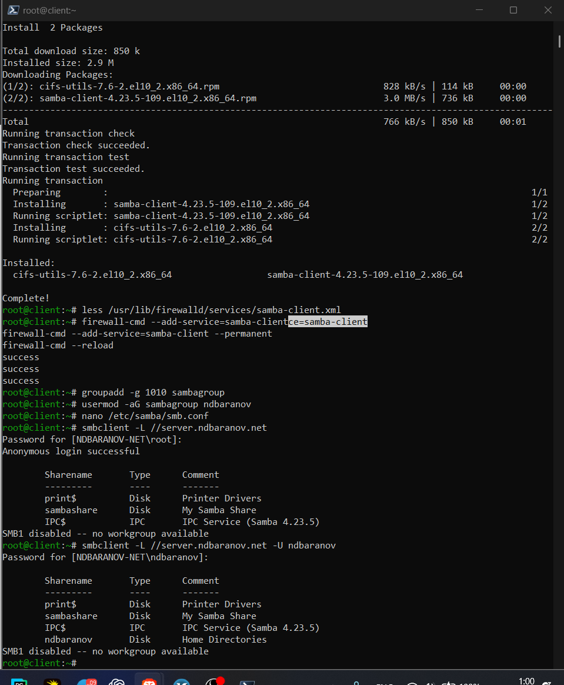
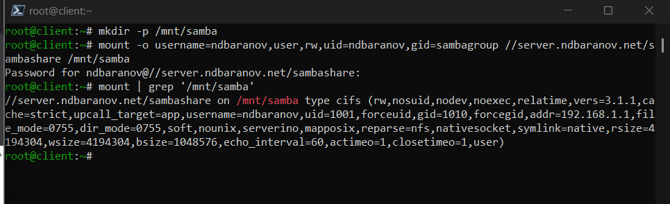

---
author:
  name: Баранов Никита Дмитриевич
  email: 1132242977@rudn.ru
  affiliation:
    - name: Российский университет дружбы народов им. Патриса Лумумбы
      city: Москва
      country: Российская Федерация
title: "Лабораторная работа № 14"
subtitle: "Настройка файловых служб Samba"
license: CC BY
date: today
date-format: "YYYY-MM-DD"
---

# Информация

## Докладчик

:::::::::::::: {.columns align=center}
::: {.column width="70%"}

- Баранов Никита Дмитриевич
- Студент РУДН
- [1132242977@rudn.ru](mailto:1132242977@rudn.ru)

:::
::: {.column width="30%"}

:::
::::::::::::::

# Цель и задачи

## Цель работы

- Получить навыки настройки группового доступа к общим ресурсам по SMB.

## Основные этапы

- Установлены samba, samba-client и cifs-utils; созданы sambagroup и пароль SMB.
- В smb.conf добавлен sambashare с записью для sambagroup.
- Служба smb запущена; testparm и smbclient -L подтвердили конфигурацию и видимость ресурса.
- Для firewalld открыты samba и samba-client, каталог получил группу и SELinux-контекст samba_share_t.
- Клиент смонтировал //server.ndbaranov.net/sambashare в /mnt/samba и создал тестовый файл.
- Учётные данны вынесены в файл credentials, а монтирование закреплено в /etc/fstab.
- Сценарии Samba для server и client успешно выполнены.

# Ход работы

## Установка Samba

- На server установлены samba, samba-client и cifs-utils, создана группа sambagroup.

{width=88%}

## Учётная запись Samba

- Пользователь добавлен в базу smbpasswd и включён для сетевой аутентификации.

{width=88%}

## Ресурс sambashare

- В smb.conf описан общий каталог sambashare с разрешением записи для нужной группы.

{width=88%}

## Запуск службы SMB

- Служба smb включена и запущена.

{width=88%}

## Обнаружение общих ресурсов

- smbclient -L выводит sambashare в списке доступных ресурсов.

{width=88%}

## SELinux и firewalld

- Каталог получил контекст samba_share_t, а в firewalld разрешён сервис samba.

{width=88%}

## Подключение CIFS

- Клиент смонтировал //server.ndbaranov.net/sambashare в /mnt/samba.

{width=88%}

## Проверка записи

- Через подключённый ресурс создан тестовый файл; он отображается и на сервере.

{width=88%}

## Credentials, fstab и provision

- Учётные данные вынесены в защищённый файл, монтирование добавлено в fstab, затем выполнены provision-сценарии Samba.

{width=88%}

# Результаты

## Итоги работы

- Samba предоставляет общий ресурс по SMB с групповой аутентификацией. CIFS-монтирование и создание файла подтверждают сетевую доступность и права на запись.

## Спасибо за внимание
