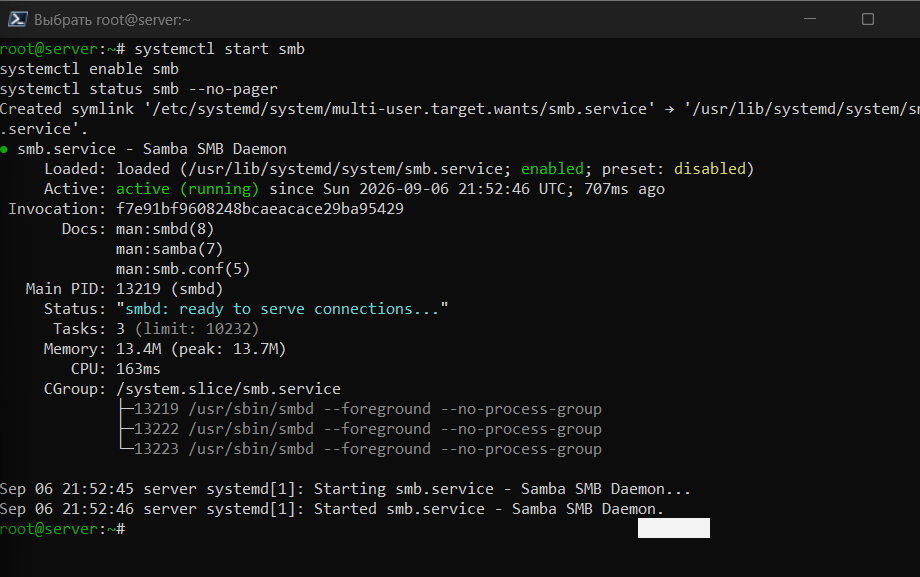
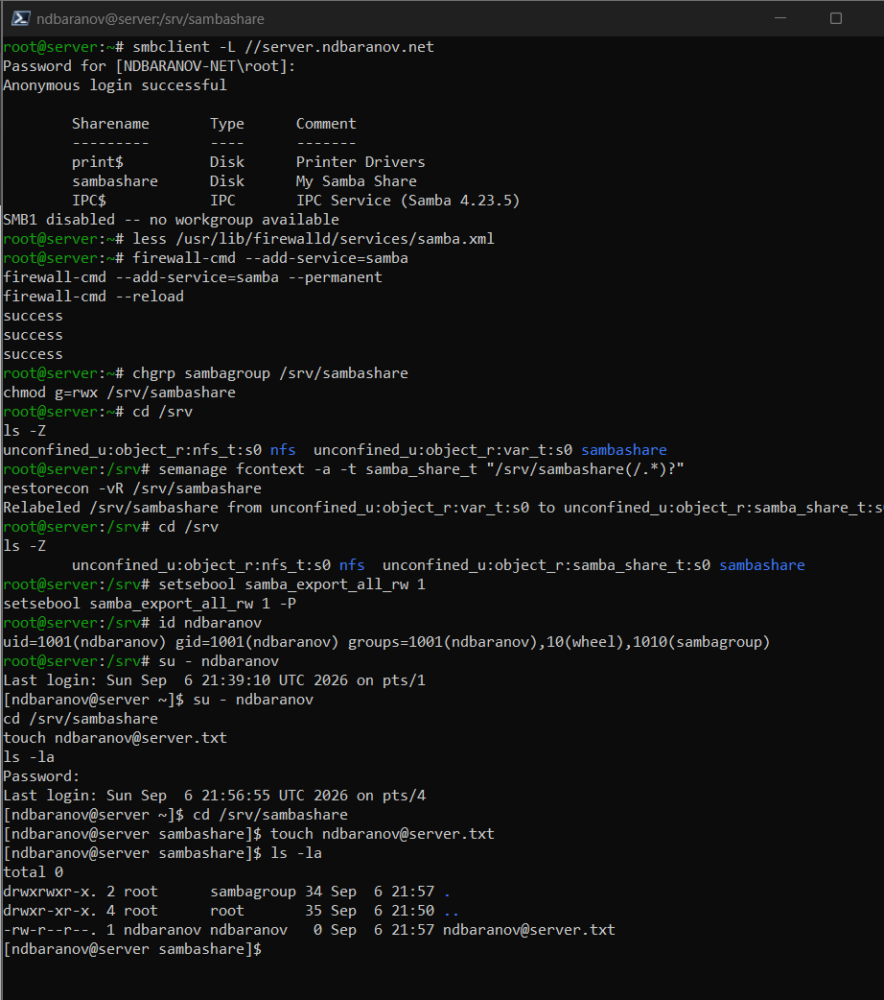
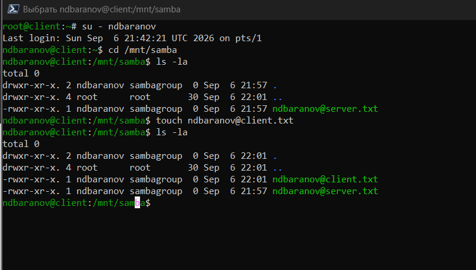
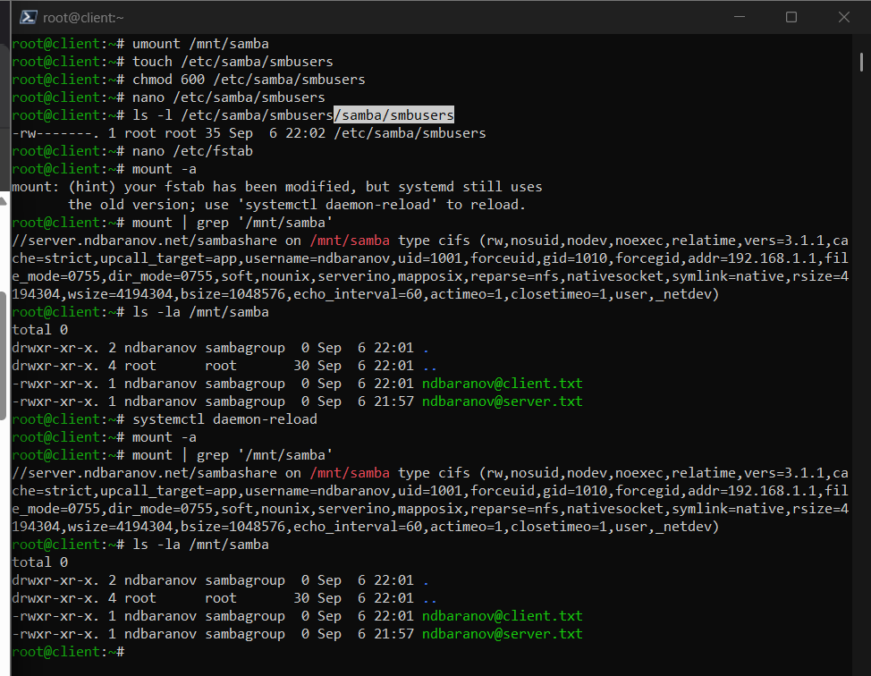
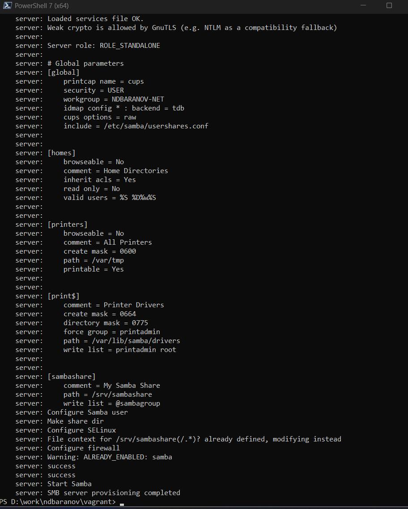
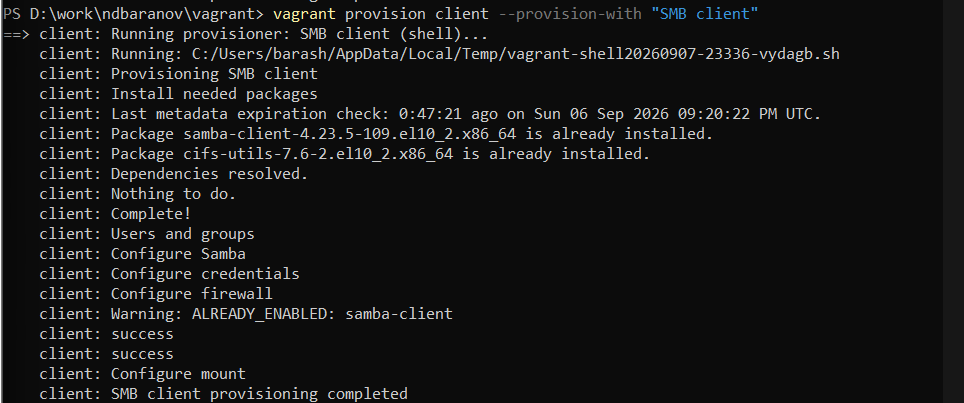

---
author:
  name: Баранов Никита Дмитриевич
  email: 1132242977@rudn.ru
  affiliation:
    - name: Российский университет дружбы народов им. Патриса Лумумбы
      city: Москва
      country: Российская Федерация
title: "Отчёт по лабораторной работе № 14"
subtitle: "Настройка файловых служб Samba"
license: CC BY
date: today
date-format: "YYYY-MM-DD"
---

# Цель работы

Получить навыки настройки группового доступа к общим ресурсам по SMB.

# Задание

1. Установлены samba, samba-client и cifs-utils; созданы sambagroup и пароль SMB.
2. В smb.conf добавлен sambashare с записью для sambagroup.
3. Служба smb запущена; testparm и smbclient -L подтвердили конфигурацию и видимость ресурса.
4. Для firewalld открыты samba и samba-client, каталог получил группу и SELinux-контекст samba_share_t.
5. Клиент смонтировал //server.ndbaranov.net/sambashare в /mnt/samba и создал тестовый файл.
6. Учётные данны вынесены в файл credentials, а монтирование закреплено в /etc/fstab.
7. Сценарии Samba для server и client успешно выполнены.

# Теоретические сведения

Samba реализует SMB/CIFS в Linux. smb.conf описывает глобальные параметры и разделяемые ресурсы, smbpasswd хранит SMB-учётные данные, а mount.cifs подключает ресурс на клиенте.

# Выполнение работы

## Установка Samba

На представленном снимке server установлены samba, samba-client и cifs-utils, создана группа sambagroup. Службы SMB подготовлены к запуску.

Samba реализует протокол SMB, а cifs-utils предоставляет клиентский драйвер mount.cifs. Установка серверных, диагностических и клиентских пакетов позволяет проверить всю цепочку в пределах лабораторного стенда.

{#fig-14-001 width=95%}

## Учётная запись Samba

Пользователь добавлен в базу smbpasswd и включён для сетевой аутентификации. Пароль Samba хранится отдельно от системного пароля.

Учётная запись Samba связана с существующим системным пользователем, но пароль хранится в собственной базе. Команда smbpasswd -a добавляет пользователя, а smbpasswd -e разрешает ему сетевую аутентификацию.

{#fig-14-002 width=95%}

## Ресурс sambashare

На данном снимке smb.conf описан общий каталог sambashare с разрешением записи для нужной группы. testparm проверяет синтаксис итоговой конфигурации.

Раздел ресурса в smb.conf задаёт путь, видимость, режим записи и допустимую группу. testparm разбирает файл и показывает эффективную конфигурацию до перезапуска службы.

{#fig-14-003 width=95%}

## Запуск службы SMB

Служба smb включена и запущена. В статусе systemd видно, что конфигурация принята и сервер готов обрабатывать подключения.

Активный процесс smb принимает запросы SMB и предоставляет опубликованные ресурсы. Проверка systemctl важна после каждой правки, поскольку синтаксическая ошибка может не позволить демону запуститься.

{#fig-14-004 width=95%}

## Обнаружение общих ресурсов

smbclient -L выводит sambashare в списке доступных ресурсов. Проверка выполнена с учётными данными созданного пользователя.

smbclient -L выполняет полноценное SMB-подключение и запрашивает список ресурсов. Поэтому появление sambashare подтверждает и доступность сервера, и успешную аутентификацию.

{#fig-14-005 width=95%}

## SELinux и firewalld

Каталог получил контекст samba_share_t, а в firewalld разрешён сервис samba. Эти настройки обеспечивают доступ на уровне политики и сети.

Контекст samba_share_t разрешает демону Samba обращаться к каталогу при включённом SELinux. Правило firewalld, файловые права группы и SELinux-контекст должны разрешать одну и ту же операцию.

{#fig-14-006 width=95%}

## Подключение CIFS

Клиент смонтировал //server.ndbaranov.net/sambashare в /mnt/samba. Список монтирований показывает файловую систему типа cifs.

mount.cifs подключает UNC-путь сервера к локальной точке /mnt/samba. В findmnt отображаются тип cifs и параметры монтирования, что подтверждает работу именно сетевого ресурса.

{#fig-14-007 width=95%}

## Проверка записи

Через подключённый ресурс создан тестовый файл; он отображается и на сервере. Это подтверждает права группы на запись.

Создание тестового файла проверяет разрешение write list и права каталога. Появление того же файла на сервере доказывает, что запись не осталась в локальной точке монтирования.

{#fig-14-008 width=95%}

## Credentials, fstab и provision

Учётные данные вынесены в защищённый файл, монтирование добавлено в fstab, затем выполнены provision-сценарии Samba. Настройка готова к автоматическому восстановлению.

Файл credentials позволяет не размещать пароль открытым текстом непосредственно в fstab; его права ограничиваются владельцем. Provision-сценарий затем воспроизводит серверную публикацию и клиентское монтирование.

{#fig-14-009 width=95%}

# Выводы

Samba предоставляет общий ресурс по SMB с групповой аутентификацией. CIFS-монтирование и создание файла подтверждают сетевую доступность и права на запись.
