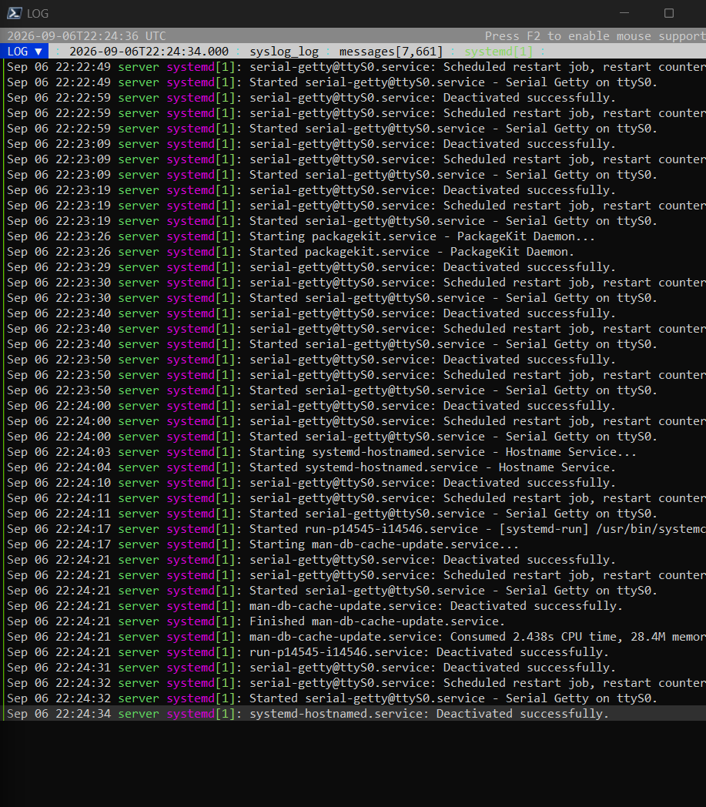
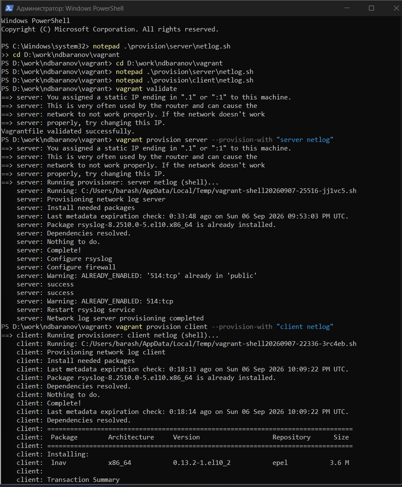

---
author:
  name: Баранов Никита Дмитриевич
  email: 1132242977@rudn.ru
  affiliation:
    - name: Российский университет дружбы народов им. Патриса Лумумбы
      city: Москва
      country: Российская Федерация
title: "Лабораторная работа № 15"
subtitle: "Настройка сетевого журналирования"
license: CC BY
date: today
date-format: "YYYY-MM-DD"
---

# Информация

## Докладчик

:::::::::::::: {.columns align=center}
::: {.column width="70%"}

- Баранов Никита Дмитриевич
- Студент РУДН
- [1132242977@rudn.ru](mailto:1132242977@rudn.ru)

:::
::: {.column width="30%"}

:::
::::::::::::::

# Цель и задачи

## Цель работы

- Получить навыки централизованного сбора и просмотра системных журналов.

## Основные этапы

- На server в netlog-server.conf включён imtcp и приём на TCP-порту 514.
- Прослушивание порта проверено lsof; порт 514/tcp открыт в firewalld.
- На client в netlog-client.conf задана пересылка *.* @@server.ndbaranov.net:514.
- После перезапуска rsyslog сообщения клиента появились в журнале сервера.
- Журналы просмотрены через tail/journalctl и графическое приложение Logs.
- server-netlog и client-netlog provisioners закрепили конфигурацию.

# Ход работы

## Приём rsyslog по TCP

- На server загружен модуль imtcp и включён приём сообщений на порту 514.

{width=88%}

## Правило firewalld для syslog

- TCP-порт 514 добавлен в постоянную конфигурацию firewalld.

{width=88%}

## Пересылка журналов с client

- В клиентском конфигурационном файле задана отправка *.* на @@server.ndbaranov.net:514.

{width=88%}

## Сообщения клиента на сервере

- После перезапуска rsyslog записи с hostname клиента появились в центральном журнале server.

{width=88%}

# Результаты

## Итоги работы

- rsyslog принимает сообщения клиента по TCP/514 и сохраняет их централизованно. Наличие записей с hostname client подтверждает работу пересылки.

## Спасибо за внимание
