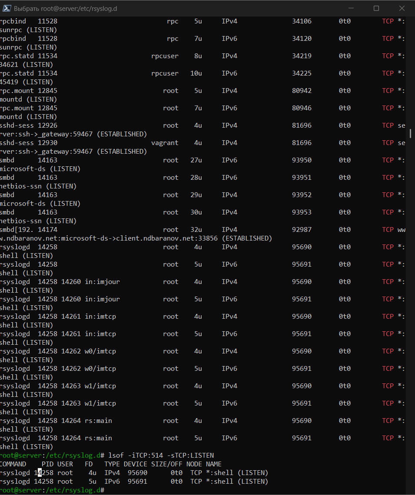
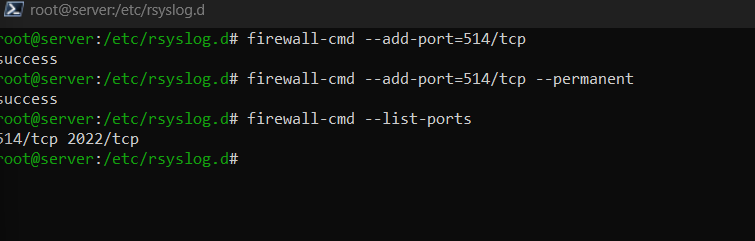

---
author:
  name: Баранов Никита Дмитриевич
  email: 1132242977@rudn.ru
  affiliation:
    - name: Российский университет дружбы народов им. Патриса Лумумбы
      city: Москва
      country: Российская Федерация
title: "Отчёт по лабораторной работе № 15"
subtitle: "Настройка сетевого журналирования"
license: CC BY
date: today
date-format: "YYYY-MM-DD"
---

# Цель работы

Получить навыки централизованного сбора и просмотра системных журналов.

# Задание

1. На server в netlog-server.conf включён imtcp и приём на TCP-порту 514.
2. Прослушивание порта проверено lsof; порт 514/tcp открыт в firewalld.
3. На client в netlog-client.conf задана пересылка *.* @@server.ndbaranov.net:514.
4. После перезапуска rsyslog сообщения клиента появились в журнале сервера.
5. Журналы просмотрены через tail/journalctl и графическое приложение Logs.
6. server-netlog и client-netlog provisioners закрепили конфигурацию.

# Теоретические сведения

rsyslog принимает сообщения syslog, фильтрует их по facility/severity и записывает в файлы или передаёт по сети. TCP даёт надёжную доставку на порт 514.

# Выполнение работы

## Приём rsyslog по TCP

На представленном снимке server загружен модуль imtcp и включён приём сообщений на порту 514. Проверка сокета показывает, что rsyslog действительно слушает TCP.

Модуль imtcp переводит rsyslog в режим сетевого приёмника, а input(type="imtcp" port="514") создаёт TCP-сокет. Проверка через ss или lsof подтверждает, что конфигурация привела к реальному прослушиванию порта.

{#fig-15-001 width=95%}

## Правило firewalld для syslog

TCP-порт 514 добавлен в постоянную конфигурацию firewalld. После reload правило присутствует в списке открытых портов.

Постоянное правило firewalld открывает 514/tcp в нужной зоне. Использование TCP соответствует двойному символу @@ на клиенте и обеспечивает подтверждаемую доставку сообщений.

{#fig-15-002 width=95%}

## Пересылка журналов с client

На данном снимке клиентском конфигурационном файле задана отправка *.* на @@server.ndbaranov.net:514. Двойной символ @ означает надёжную передачу по TCP.

Селектор *.* означает пересылку сообщений всех facility и severity. Имя server.ndbaranov.net разрешается локальной DNS-службой, поэтому конфигурация сохраняет читаемость и не зависит от ручного указания IP-адреса.

{#fig-15-003 width=95%}

## Сообщения клиента на сервере

После перезапуска rsyslog записи с hostname клиента появились в центральном журнале server. Provision-сценарии закрепляют настройки обеих сторон.

Hostname клиента в записи позволяет отличить удалённое событие от локального журнала сервера. Совместная проверка отправки, приёма и provision-сценариев подтверждает централизованный маршрут журналирования.

{#fig-15-004 width=95%}

# Выводы

rsyslog принимает сообщения клиента по TCP/514 и сохраняет их централизованно. Наличие записей с hostname client подтверждает работу пересылки.
